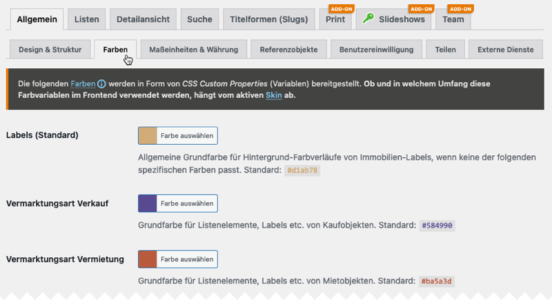

# Farben

Ab der Plugin-Version 1.9.50 werden die im [Standard-Skin](/anpassung-erweiterung/standard-skin) verwendeten Farben via [CSS Custom Properties](https://wiki.selfhtml.org/wiki/CSS/Custom_properties_(CSS-Variablen)) (Variablen) referenziert, deren Werte in den Plugin-Optionen unter ***immonex → Einstellungen → Allgemein → Farben*** angepasst werden können.

!> Bei Verwendung eines [Custom Skins](skins?id=custom-skins) auf Basis einer älteren Version des Standard-Skins (Kickstart < 1.9.50) haben Farbänderungen in den Plugin-Optionen keine direkten Auswirkungen.



Es wird zwischen regulären und *gedeckten* Farben unterschieden. Letztere sind für Hintergründe vorgesehen und (optional) teiltransparent. Die zugehörige Deckkraft kann ebenfalls im Tab *Farben* eingestellt werden.

Pro Grundfarbe werden zudem jeweils eine hellere und eine dunklere Variante bereitgestellt, in bestimmten Fällen auch passende Farbverläufe.

!> Die Werte der Grundfarben können alternativ auch per CSS überschrieben werden, in diesem Fall erfolgt allerdings **keine** automatische Anpassung der entsprechenden Varianten und Farbverläufe.

## Farbvariablen

| Variable (Grundfarbe/Verlauf) | Standardwert | Verwendung |
| ----------------------------- | ------------ | ---------- |
| `--inx-color-label-default`<br>`--inx-gradient-label-default` | <code style="color:#fff; background-color:#d1ab78">#d1ab78</code> | Hintergrund-Farbverläufe von Immobilien-Labels, wenn keine *spezifischere* Farbe (z. B. für eine bestimmte Vermarktungsart) zugeordnet werden kann |
| `--inx-color-marketing-type-sale`<br>`--inx-gradient-marketing-type-sale` | <code style="color:#fff; background-color:#584990">#584990</code> | Listenelemente, Links, Labels etc. von **Kaufobjekten** |
| `--inx-color-marketing-type-rent`<br>`--inx-gradient-marketing-type-rent` | <code style="color:#fff; background-color:#ba5a3d">#ba5a3d</code> | Listenelemente, Links, Labels etc. von **Mietobjekten** |
| `--inx-color-marketing-type-leasing`<br>`--inx-gradient-marketing-type-leasing` | <code style="color:#fff; background-color:#e78b00">#e78b00</code> | Listenelemente, Links, Labels etc. von **Leasing-Objekten** |
| `--inx-color-action-element`<br>`--inx-gradient-action-element` | <code style="color:#fff; background-color:#0a65bc">#0a65bc</code> | *pluginspezifische* Links und weitere Navigations-/Aktionselemente (z. B. Suchformular-Buttons/Icons, Tab-Navigation in Immobilien-Detailseiten etc.) |
| `--inx-color-action-element-inverted` | <code style="color:#000; background-color:#fbfbfb">#fbfbfb</code> | Links/Aktionselemente auf dunklen Hintergründen |
| `--inx-color-text-inverted-default` | <code style="color:#000; background-color:#f8f8f8">#f8f8f8</code> | regulärer Text in Frontend-Elementen mit dunklen Hintergründen |
| `--inx-color-demo`<br>`--inx-gradient-demo` |<code style="color:#fff; background-color:#6d115f">#6d115f</code> | Demo-Elemente (Labels, Hinweise etc.) |
| `--inx-color-bg-muted-default` | <code style="color:#000; background-color:#dcdcdc">#dcdcdc</code> | *gedeckte* Hintergrundfarbe (bspw. für das erweiterte Immobilien-Suchformular sowie die Header/Footer-Bereiche der Standard-Immobilien-Detailseiten) |

In eigenen [CSS-Regeln](css), die per *Customizer* oder in einer CSS-Datei (Child-Theme/[Custom Skin](skins?id=custom-skins)) ergänzt werden, können die Variablen wie folgt verwendet werden:

```css
/* Beispiel: Kaufobjekt-Links */

a.inx-oi--vermarktungsart--kauf {
	color: var(--inx-color-marketing-type-sale);
}
```

Die automatisch berechneten helleren und dunkleren Varianten können durch Anhängen von `--lighter` bzw. `--darker` an den Variablennamen referenziert werden, Beispiel:

```css
a.inx-oi--vermarktungsart--kauf:hover {
	color: var(--inx-color-marketing-type-sale-lighter);
}
```

In den Variablennamen der verfügbaren Hintergrund-Farbverläufe (siehe oben) ist `gradient` anstatt `color` (= zugehörige Grundfarbe) enthalten:

```css
/* Beispiel: Farbverlauf und Fallback-Hintergrundfarbe für Aktionselemente */

.inx-gradient--type--action {
	background-color: var(--inx-color-action-element);
	background: var(--inx-gradient-action-element);
}
```