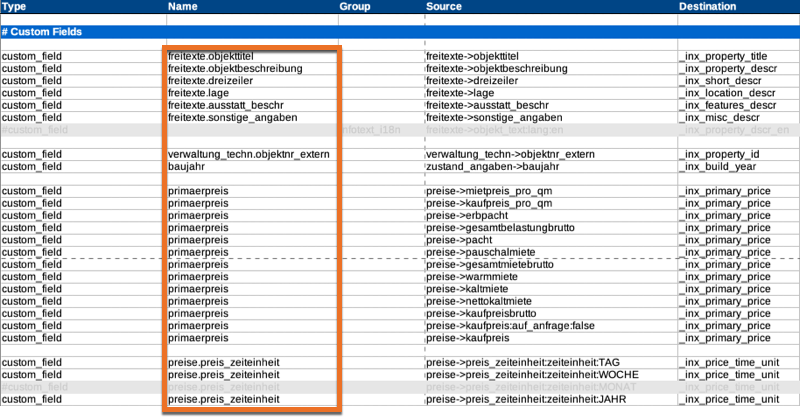

# inx_get_custom_field_value_by_name (Filter)

Dieser Filter Hook dient dem **Abrufen** des Werts eines bestimmten benuzterdefinierten Felds (*Custom Field*) einer Immobilie anhand des *Mapping-Namens* (Spalte *Name* der [Mapping-Tabelle für den OpenImmo-Import](/schnellstart/import)).



[](_info_add_on_hooks.md ':include')

## Parameter

| Name | Beschreibung |
| ---- | ------------ |
| **`$value`** (mixed) | leerer String bzw. leeres Array |
| `$mapping_name` (string) | Mapping-Name |
| `post_id` (string\|int\|bool) | ID des Immobilien-Beitrags (optional, Standard: automatische Ermittlung) |

## Rückgabewert

Custom-Field-Wert

## Code-Beispiele

```php
// [immonex Kickstart] Selbst vergebene Objektnummer der aktuellen Immobilie abrufen.

$objektnr = apply_filters( 'inx_get_custom_field_value_by_name', '', 'verwaltung_techn.objektnr_extern' );
```

[](_backlink.md ':include')