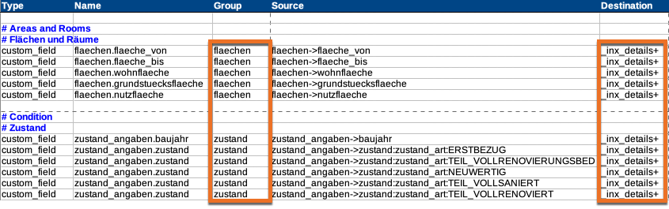

# inx_get_group_items (Filter)

Über diesen Filter Hook können alle Immobilien-Detailelemente des **übergebenen** `$details`-Arrays in einem "flachen" Array zurückgeliefert werden, die zu den angegebenen Gruppen-IDs (`$groups`) passen.

!> Bei diesem Hook werden die übergebenen Inhalte konvertiert, es werden **keine** Daten abgerufen.

*Immobiliendetails* bezeichnen Elemente, die im *Sammelfeld* (*Custom Field*) `_inx_details` gespeichert werden (→ Zuordnung über die Spalte *Destination* der [Mapping-Tabelle für den OpenImmo-Import](/schnellstart/import)).

Gruppen werden in der Spalte *Group* der Mapping-Tabelle definiert.



[](_info_add_on_hooks.md ':include')

## Parameter

| Name | Beschreibung |
| ---- | ------------ |
| **`$items`** (array) | leeres Array |
| `$details` (array) | alle Objektdetails |
| `$groups` (array) | Gruppen-IDs |

### Das Details-Array im Detail

`$details` enthält **alle** Detailelemente der darzustellenden Immobilie in **gruppierter Form**:

```php
[
	'flaechen' => [
		[
			'title' => 'Wohnfläche',
			'group' => 'flaechen',
			'name' => 'flaechen.wohnflaeche',
			'value' => '240 m²',
			'meta_json' => '{"mapping_source":"flaechen->wohnflaeche","value_before_filter":"240"}'
		],
		[
			'title' => 'Grundstücksfläche',
			'group' => 'flaechen',
			'name' => 'flaechen.grundstuecksflaeche'
			'value' => '1.800 m²'
			'meta_json' => '{"mapping_source":"flaechen->grundstuecksflaeche","value_before_filter":"1800"}'
		],
		...
	'zustand' => [ ... ],
	'epass' => [ ... ],
	'ausstattung' => [ ... ]
	'lage' => [
		[
			'title' => 'Ausblick',
			'group' => 'lage',
			'name' => 'infrastruktur.ausblick',
			'value' => 'Bergblick',
			'meta_json' => '{"mapping_source":"infrastruktur->ausblick:blick:BERGE","value_before_filter":"Bergblick"}'
		]
	],
	'kontakt' => [ ... ],
	'preise' => [ ... ],
	'infrastruktur' => [
		[
			'title' => 'Distanz zum Flughafen',
			'group' => 'infrastruktur',
			'name' => 'infrastruktur.distanzen.flughafen',
			'value' => '70,0 km',
			'meta_json' => '{"mapping_source":"infrastruktur->distanzen:distanz_zu:FLUGHAFEN","value_before_filter":"70"}'
		],
		[
			'title' => 'Distanz zur Autobahn',
			'group' => 'infrastruktur',
			'name' => 'infrastruktur.distanzen.autobahn',
			'value' => '14,0 km',
			'meta_json' => '{"mapping_source":"infrastruktur->distanzen:distanz_zu:AUTOBAHN","value_before_filter":"14"}'
		],
		[
			'title' => 'Distanz zum Kindergarten',
			'group' => 'infrastruktur',
			'name' => 'infrastruktur.distanzen.kindergaerten',
			'value' => '6,0 km',
			'meta_json' => '{"mapping_source":"infrastruktur->distanzen:distanz_zu:KINDERGAERTEN","value_before_filter":"6"}'
		],
		[
			'title' => 'Distanz zur Grundschule',
			'group' => 'infrastruktur',
			'name' => 'infrastruktur.distanzen.grundschule',
			'value' => '11,0 km',
			'meta_json' => '{"mapping_source":"infrastruktur->distanzen:distanz_zu:GRUNDSCHULE","value_before_filter":"11"}'
		],
		...
		[
			'title' => 'Distanz zum Naherholungsgebiet',
			'group' => 'infrastruktur',
			'name' => 'infrastruktur.distanzen_sport:naherholung',
			'value' => '18,0 km',
			'meta_json' => '{"mapping_source":"infrastruktur->distanzen_sport:distanz_zu_sport:NAHERHOLUNG","value_before_filter":"18"}'
		]
	],
	[sonstiges] => [ ... ]
]
```

## Rückgabewert

"Flaches" Array mit den Elementen der angegebenen Gruppen (siehe Beispiel unten)

## Code-Beispiele

```php
/**
 * [immonex Kickstart] Lage- und Infrastruktur-Details filtern.
 */

$filtered_details = apply_filters( 'inx_get_group_items', [], $details, [ 'lage', 'infrastruktur' ] );

// $filtered_details
[
    [
        'title' => 'Ausblick',
        'group' => 'lage',
        'name' => 'infrastruktur.ausblick',
        'value' => 'Bergblick',
        'meta_json' => '{"mapping_source":"infrastruktur->ausblick:blick:BERGE","value_before_filter":"Bergblick"}'
    ],
    [
        'title' => 'Distanz zum Flughafen',
        'group' => 'infrastruktur',
        'name' => 'infrastruktur.distanzen.flughafen',
        'value' => '70,0 km',
        'meta_json' => '{"mapping_source":"infrastruktur->distanzen:distanz_zu:FLUGHAFEN","value_before_filter":"70"}'
    ],
    [
        'title' => 'Distanz zur Autobahn',
        'group' => 'infrastruktur',
        'name' => 'infrastruktur.distanzen.autobahn',
        'value' => '14,0 km',
        'meta_json' => '{"mapping_source":"infrastruktur->distanzen:distanz_zu:AUTOBAHN","value_before_filter":"14"}'
    ],
    [
        'title' => 'Distanz zum Kindergarten',
        'group' => 'infrastruktur',
        'name' => 'infrastruktur.distanzen.kindergaerten',
        'value' => '6,0 km',
        'meta_json' => '{"mapping_source":"infrastruktur->distanzen:distanz_zu:KINDERGAERTEN","value_before_filter":"6"}'
    ],
    [
        'title' => 'Distanz zur Grundschule',
        'group' => 'infrastruktur',
        'name' => 'infrastruktur.distanzen.grundschule',
        'value' => '11,0 km',
        'meta_json' => '{"mapping_source":"infrastruktur->distanzen:distanz_zu:GRUNDSCHULE","value_before_filter":"11"}'
    ],
    ...
    [
        'title' => 'Distanz zum Naherholungsgebiet',
        'group' => 'infrastruktur',
        'name' => 'infrastruktur.distanzen_sport:naherholung',
        'value' => '18,0 km',
        'meta_json' => '{"mapping_source":"infrastruktur->distanzen_sport:distanz_zu_sport:NAHERHOLUNG","value_before_filter":"18"}'
    ]
]
```

## Siehe auch

- [inx_property_template_data_details](filter-inx-property-template-data-details) (Detaildaten einer Immobilie vor dem Rendern des Templates)
- [inx_property_detail_element_output](filter-inx-property-detail-element-output) (Anpassung der Ausgabe einzelner Detail-Elemente)

[](_backlink.md ':include')