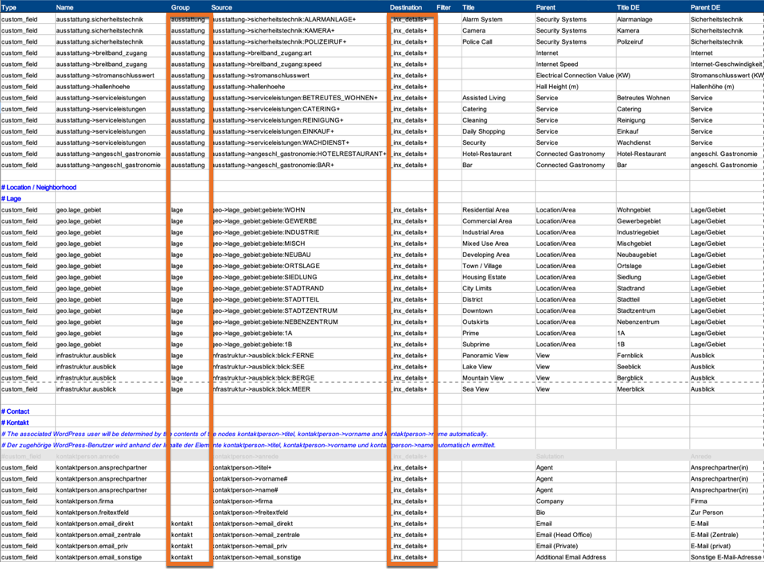

# inx_property_template_data_details (Filter)

Mit diesem Filter können **Detailangaben** angepasst werden, bevor diese beim Rendern eines Immobilien-Templates eingefügt werden.

Hierbei handelt es sich um die Daten, denen in der [Mapping-Tabelle für den OpenImmo-Import](../schnellstart/import) über die Spalte *Destination* das Ziel `_inx_details+` zugewiesen wurde.



## Parameter

| Name (Typ) | Beschreibung |
| ---------- | ------------ |
| **`$detail_groups`** (array) | gruppierte Immobilien-Detailangaben |
| `post_id` (int\|string) | ID des [Immobilien-Beitrags](/beitragsarten-taxonomien) |

### Das Detail-Groups-Array im Detail

Die Detailangaben werden in Form von Arrays übergeben, die anhand der Bezeichnungen in der Spalte *Group* der Mapping-Tabelle (siehe Screenshot) wiederum in einem übergeordneten Array gruppiert sind. Die Gruppennamen können bei Bedarf beliebig angepasst werden.

Details ohne Gruppenangabe werden anderweitig verarbeitet bzw. ausgegeben und unter "ungruppiert" zusammengefasst.

Für eine Anpassung der Ausgabe sind die Array-Elemente `title` und `value` relevant.

```php
[
	'flaechen' => [
		[
			'title' => 'Wohnfläche',
			'group' => 'flaechen',
			'name' => 'flaechen.wohnflaeche',
			'value' => '148 m²',
			'meta_json' => '"mapping_source":"flaechen->wohnflaeche","value_before_filter":"148.0"'
		],
		[
			'title' => 'Grundstücksfläche',
			'group' => 'flaechen',
			'name' => 'flaechen.grundstuecksflaeche',
			'value' => '820 m²',
			'meta_json' => '"mapping_source":"flaechen->grundstuecksflaeche","value_before_filter":"820.0"'
		],
		[
			'title' => 'Zimmer insgesamt',
			'group' => 'flaechen',
			'name' => 'flaechen.anzahl_zimmer',
			'value' => '6',
			'meta_json' => '"mapping_source":"flaechen->anzahl_zimmer","value_before_filter":"6.0"'
		],
		[
			'title' => 'Badezimmer',
			'group' => 'flaechen',
			'name' => 'flaechen.anzahl_badezimmer',
			'value' => '2',
			'meta_json' => '"mapping_source":"flaechen->anzahl_badezimmer","value_before_filter":"2"'
		]
	],
	'zustand' => [
		[
			'title' => 'Baujahr',
			'group' => 'zustand',
			'name' => 'zustand_angaben.baujahr',
			'value' => '2010',
			'meta_json' => '"mapping_source":"zustand_angaben->baujahr","value_before_filter":"2010"'
		]
	],
	'epass' => [
		[
			'title' => 'Energieausweis-Art',
			'group' => 'epass',
			'name' => 'zustand_angaben.energiepass.art',
			'value' => 'Bedarf',
			'meta_json' => '"mapping_source":"zustand_angaben->energiepass->art","value_before_filter":"BEDARF"'
		],
		[
			'title' => 'Endenergiebedarf',
			'group' => 'epass',
			'name' => 'zustand_angaben.energiepass.endenergiebedarf',
			'value' => '90 kWh/(m²*a)',
			'meta_json' => 'mapping_source":"zustand_angaben->energiepass->endenergiebedarf","value_before_filter":"90"'
		],
		[
			'title' => 'Energieeffizienzklasse',
			'group' => 'epass',
			'name' => 'zustand_angaben.epass_wertklasse',
			'value' => 'B',
			'meta_json' => '"mapping_source":"zustand_angaben->user_defined_simplefield:feldname:epass_wertklasse","value_before_filter":"B"'
		],
		[
			'title' => 'Baujahr (Energieausweis)',
			'group' => 'epass',
			'name' => 'zustand_angaben.epass_baujahr',
			'value' => '2010',
			'meta_json' => '"mapping_source":"zustand_angaben->user_defined_simplefield:feldname:epass_baujahr","value_before_filter":"2010"'
		],
		[
			'title' => 'Energieausweis-Ausstellungsdatum',
			'group' => 'epass',
			'name' => 'zustand_angaben.epass_ausstelldatum',
			'value' => '09.06.2014',
			'meta_json' => '"mapping_source":"zustand_angaben->user_defined_simplefield:feldname:epass_ausstelldatum","value_before_filter":"2014-06-09"'
		],
		[
			'title' => 'Energieausweis-Jahrgang',
			'group' => 'epass',
			'name' => 'zustand_angaben.epass_jahrgang',
			'value' => 'ab Mai 2014',
			'meta_json' => '"mapping_source":"zustand_angaben->user_defined_simplefield:feldname:epass_jahrgang","value_before_filter":"2014"'
		]
	],
	'ausstattung' => [
		[
			'title' => 'Sicherheitstechnik',
			'group' => 'ausstattung',
			'name' => 'ausstattung.sicherheitstechnik',
			'value' => 'Alarmanlage',
			'meta_json' => '"mapping_source":"ausstattung->sicherheitstechnik:ALARMANLAGE+","value_before_filter":"Alarmanlage"'
		]
	],
	'lage' => [
		[
			'title' => 'Ausblick',
			'group' => 'lage',
			'name' => 'infrastruktur.ausblick',
			'value' => 'Fernblick',
			'meta_json' => '"mapping_source":"infrastruktur->ausblick:blick:FERNE","value_before_filter":"Fernblick"'
		]
	],
	'ungruppiert' => [
		[
			'title' => 'Ansprechpartner(in)',
			'group' => 
			'name' => 'kontaktperson.ansprechpartner',
			'value' => 'Bettina Beispiel',
			'meta_json' => '"mapping_source":"kontaktperson->vorname#","value_before_filter":"Bettina Beispiel"',
		],
		[
			'title' => 'Adresse',
			'group' => 
			'name' => 'kontaktperson.adresse',
			'value' => 'Demo-Allee 1, 99999 Demostadt',
			'meta_json' => '"mapping_source":"kontaktperson->strasse+","value_before_filter":"Demo-Allee 1, 99999 Demostadt"'
		]
	],
	'kontakt' => [
		[
			'title' => 'E-Mail',
			'group' => 'kontakt',
			'name' => 'kontaktperson.email_direkt',
			'value' => 'bettina.beispiel@immonex.one',
			'meta_json' => '"mapping_source":"kontaktperson->email_direkt","value_before_filter":"bettina.beispiel@immonex.one"',
		],
		[
			'title' => 'E-Mail (Zentrale)',
			'group' => 'kontakt',
			'name' => 'kontaktperson.email_zentrale',
			'value' => 'demo@immonex.one',
			'meta_json' => '"mapping_source":"kontaktperson->email_zentrale","value_before_filter":"demo@immonex.one"'
		],
		[
			'title' => 'Telefon',
			'group' => 'kontakt',
			'name' => 'kontaktperson.tel_durchw',
			'value' => '0999 1234567',
			'meta_json' => '"mapping_source":"kontaktperson->tel_durchw","value_before_filter":"0999 1234567"'
		],
		[
			'title' => 'Telefon (Zentrale)',
			'group' => 'kontakt',
			'name' => 'kontaktperson.tel_zentrale',
			'value' => '0999 1234560',
			'meta_json' => '"mapping_source":"kontaktperson->tel_zentrale","value_before_filter":"0999 1234560"'
		]
	],
	'preise' => [
		[
			'title' => 'Kaufpreis',
			'group' => 'preise',
			'name' => 'preise.kaufpreis',
			'value' => '320.000 €',
			'meta_json' => '"mapping_source":"preise->kaufpreis","value_before_filter":"320000.0"'
		]
	],
	'sonstiges' => [
		[
			'title' => 'gewerbliche Nutzung möglich',
			'group' => 'sonstiges',
			'name' => 'verwaltung_objekt.gewerbliche_nutzung',
			'value' => 'ja',
			'meta_json' => '"mapping_source":"verwaltung_objekt->gewerbliche_nutzung","value_before_filter":true'
		]
	]
]
```

## Rückgabewert

angepasste Template-Detailinhalte

## Rahmenfunktion

[](_info-snippet-einbindung.md ':include')

```php
add_filter( 'inx_property_template_data_details', 'mysite_modify_property_template_details', 10, 2 );

function mysite_modify_property_template_details( $detail_groups, $post_id ) {
	if ( empty( $detail_groups['preise'] ) ) {
		return $detail_groups;
	}

	foreach ( $detail_groups['preise'] as $i => $element ) {
		if ( 'preise.nettokaltmiete' === $element['name'] ) {
			// Ausgabewert der Nettokaltmiete erweitern.
			$detail_groups['preise'][ $i ]['value'] .= ' (ohne Heiz- und Betriebskosten)';
			return $detail_groups;
		}
	}

	return $detail_groups;
} // mysite_modify_property_template_details
```

[](_backlink.md ':include')