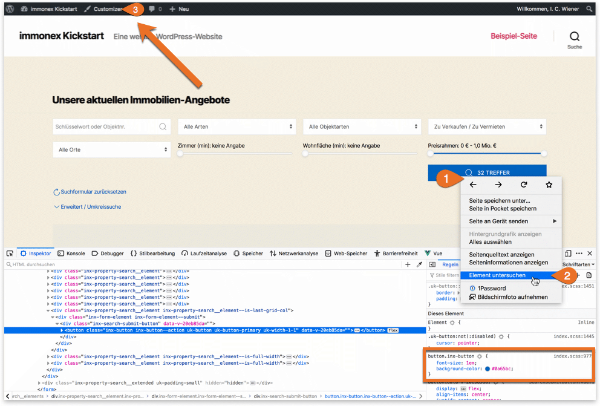
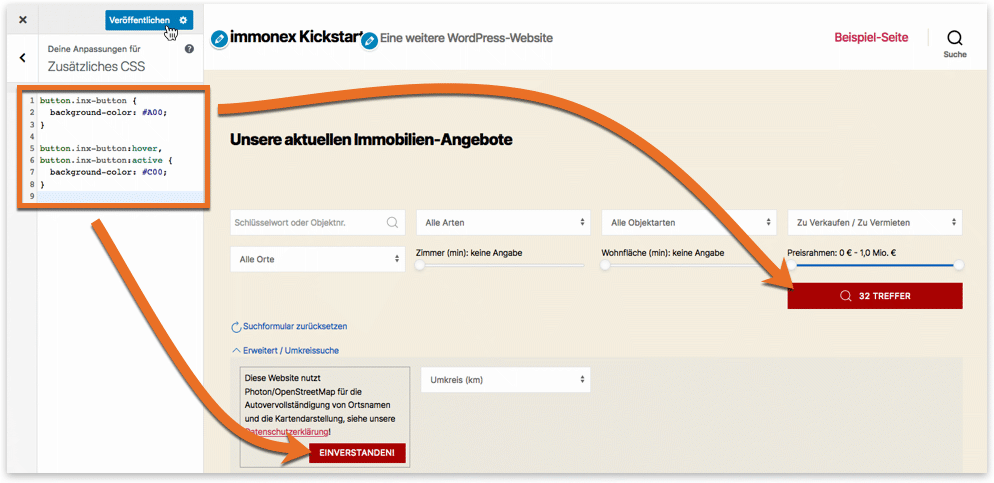

# CSS

Die einfachste Form der individuellen Anpassung stellt das Überschreiben bzw. Erweitern der vordefinierten CSS-Stile per **Customizer** dar. Die entsprechenden Klassennamen beginnen typischerweise mit dem Präfix `inx-`.

## Beispiel: Buttonfarbe anpassen

Die anzupassenden CSS-Klassen können z. B. via Browser-Entwickler-Konsole (Element-Inspektor) ermittelt werden, hier am Beispiel von Firefox:

Die CSS-Regeln zur Anpassung der Optik können entweder unter *Zusätzliches CSS* im Theme-Customizer oder in einer CSS-Datei (z. B. `style.css`) des **Child-Themes** hinterlegt werden. Der Customizer wird über den Link im Admin-Balken direkt auf der betreffenden Seite oder im WordPress-Backend über ***Design → Customizer*** aufgerufen.

