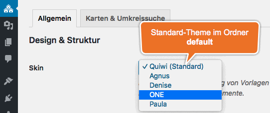

# Skins

Ein *Skin* ist - technisch gesehen - ein einfacher Ordner, der alle für die Darstellung im **Website-Frontend** maßgeblichen Ressourcen in (möglichst) einheitlicher, strukturierter Form enthält:

- Templates (PHP)
- JavaScript-Dateien
- CSS-Dateien
- Bilddateien
- Fonts

## Ordner

### Basis-Plugin

**Mitgelieferte** Kickstart-Skins sind im **Verzeichnis des Kickstart-Basis-Plugins** unter `skins` zu finden:

`.../wp-content/plugins/immonex-kickstart/skins/`

Aktuell ist hier nur der Ordner des [Standard-Skins](standard-skin) enthalten (`default`):

`.../wp-content/plugins/immonex-kickstart/skins/default`

!> Die Ordnernamen sind unabhängig vom eigentlichen (angezeigten) Skin-Namen, der in der Datei `index.php` festgelegt wird.

### Add-ons

Analog zum Basis-Plugin befinden sich Skins installierter Add-ons im jeweiligen **Add-on-Plugin-Verzeichnis**:

`.../wp-content/plugins/ADD-ON-ORDNERNAME/skins/`

Beispiel [Team Add-on](https://de.wordpress.org/plugins/immonex-kickstart-team/):\
`.../wp-content/plugins/immonex-kickstart-team/skins/`

### Custom Skins

Der passende, *update-sichere* Ort für **eigene oder angepasste** Skins ist der Unterordner `immonex-kickstart` im **(Child-)Theme-Verzeichnis**:

`.../wp-content/themes/(CHILD-)THEME-NAME/immonex-kickstart/`

Für Custom **Add-on** Skins entsprechend:\
`.../wp-content/themes/(CHILD-)THEME-NAME/ADD-ON-ORDNERNAME/`\
Beispiel [Team Add-on](https://de.wordpress.org/plugins/immonex-kickstart-team/): `.../wp-content/themes/(CHILD-)THEME-NAME/immonex-kickstart-team/`

### Auswahl

 \
 [Skin-Auswahl](/schnellstart/einrichtung#skin) (Basis-Plugin) unter ***immonex → Einstellungen***

Die zugehörige Ordner-Struktur könnte so aussehen:

<pre class="tree">
.../wp-content/plugins/immonex-kickstart/skins
╷
├── /default
└── /one

.../wp-content/themes/(CHILD-)THEME-NAME/immonex-kickstart
╷
├── /agnus
├── /denise
└── /paula
</pre>

**Add-on-Skins** werden im zugehörigen Tab der Plugin-Optionen oder – je nach Einsatzbereich – auch auf alternativen Seiten ausgewählt.

## Aufbau

Der **grundlegende** Aufbau eines Kickstart-Skins ist denkbar einfach:

<pre class="tree">
skin-name
╷
├── /css
│   ╷
│   └── index.css
│
├── /js
│   ╷
│   └── index.js
│
└── index.php
</pre>

Die Dateien `index.css` und `index.js` des aktiven Skins werden im Frontend automatisch eingebunden. Das gilt auch für weitere Dateien mit den folgenden Namen, sofern vorhanden:

- `extend.css` / `extend.js`
- `custom.css` / `custom.js`
- `frontend.css` / `frontend.js`
- `skin.css` / `skin.js`

Je nach Umfang bietet es sich an, bei der Entwicklung mit mehreren Quelldateien zu arbeiten, die anschließend per Bundler bzw. Präprozessor à la [webpack](https://webpack.js.org/), [Sass](https://sass-lang.com/) & Co. kompiliert werden. Die kompilierten und/oder minimierten Varianten der Dateien können in diesem Fall auch im Ordner `assets` gespeichert werden:

<pre class="tree">
skin-name
╷
├── /assets
│   ╷
│   ├── index.css
│   └── index.js
…
</pre>

Auch die Aufteilung der CSS- und JS-Dateien in separate Unterordner ist hier möglich:

<pre class="tree">
…
├── /assets
│   ╷
│   ├── /css
│   │   ╷
│   │   ├── index.css
│   │   ├── custom.css
│   │   …
│   └── /js
│       ╷
│       ├── index.js
│       ├── extend.js
…       …
</pre>    

Jede der o. g. CSS/JSS-Dateien wird nur **einmalig** eingebunden. Sind mehrere Dateien gleichen Namens im Skin-Ordner enthalten, erfolgt die entsprechende Priorisierung anhand der **Unterordner** in dieser Reihenfolge:

- `assets/css/` / `assets/js/`
- `assets/`
- `css/` / `js/`

Ist also bspw. eine Datei `custom.css` in den Unterordnern `assets` **und** `css` enthalten, wird nur die Variante im Ordner `assets` im Website-Frontend geladen.

Die Datei `index.php` enthält aktuell nur den Namen des Skins für die Ausgabe:

```php
<?php
/**
 * Skin Name: Quiwi
 */

die( "Don't event think about it!" );
```

## Individuelle Anpassung

### Partiell

Ist ein mitgeliefertes Kickstart-Skin grundsätzlich passend und sollen nur geringfügige optische Anpassungen vorgenommen werden, ist in den meisten Fällen das [Überschreiben bzw. Ergänzen der betreffenden CSS-Stile](css) via Customizer ausreichend. Auch bei weitergehenden Änderungen muss aber **nicht** zwingend mit einem individuellen Skin mit vollem Dateiumfang ([Custom Skin](standard-skin)) gearbeitet werden.

Stattdessen besteht die Möglichkeit, nur die anzupassenden Dateien eines  vorhandenes Plugin-Skins im Child-Theme-Ordner zu überschreiben, dessen Name dem des Basis-Skin-Ordners (im Plugin-Verzeichnis) entspricht.

Sollen bspw. nur eigene Varianten der Dateien `index.css` und `single-property.php` zum Einsatz kommen, alles andere aber weiterhin vom [Standard-Skin](standard-skin) (Ordnername `default`) übernommen werden, ergibt sich die folgende Struktur:

#### Standard-Skin-Ordner (Plugin-Verzeichnis)

<pre class="tree">
.../wp-content/plugins/immonex-kickstart/skins
╷
└── /default
    ╷
    ├── /assets &larr; <em class="token important">Plugin-Version < 1.8: /css</em>
    │   ╷
    │   ├── index.css
    │   └── index.js
    │
    ├── /fonts
    ├── /images
    ├── /property-list
    ├── /property-search
    ├── /single-property
    ├── archive-property.php
    ├── index.php
    ├── property-search.php
    └── single-property.php
</pre>

#### Skin-Ordner mit angepassten Dateien (Theme/Child-Theme)

<pre class="tree">
.../wp-content/themes/(CHILD-)THEME-NAME/immonex-kickstart
╷
└── default
    ╷
    ├── /assets &larr; <em class="token important">Plugin-Version < 1.8: /css</em>
    │   ╷
    │   └── index.css
    │
    └── single-property.php
</pre>

### Komplett

Sollen umfangreiche Anpassungen oder einer ganz individuelle Darstellung umgesetzt werden, ist ein vollständig **benutzerdefiniertes Skin** ([Custom Skin](standard-skin)) die passende Wahl. Hier kann wiederum das [Standard-Skin](standard-skin) als Basis verwendet werden, die dann schrittweise angepasst wird.

Als Grundlage für die Entwicklung eignen sich die aktuellen [Quelldateien](https://github.com/immonex/kickstart/tree/master/src/skins/default) am besten, alternativ können hierfür aber die Inhalte des o. g. Ordners `default` im Basis-Plugin- bzw. Add-on-Skin-Ordner übernommen werden.

Das Custom Skin wird unter einem **eigenen Ordnernamen** in den Unterordner `immonex-kickstart` (bzw. Add-on-Plugin-Ordnername bei Add-on-Skins) des (Child-)Theme-Verzeichnisses hinterlegt:

#### Basis-Plugin Custom Skin

<pre class="tree">
.../wp-content/themes/(CHILD-)THEME-NAME/immonex-kickstart
╷
└── my-custom-skin
    ╷
    ├── /assets
    │   ╷
    │   ├── index.css
    │   └── index.js
    │
    ├── /fonts
    ├── /images
    ├── /property-list
    ├── /property-search
    ├── /single-property
    ├── archive-property.php
    ├── index.php
    ├── property-search.php
    └── single-property.php
</pre>

#### Add-on Custom Skin

<pre class="tree">
.../wp-content/themes/(CHILD-)THEME-NAME/ADD-ON-ORDNERNAME
╷
└── /my-custom-add-on-skin
    ╷
    ├── /css
    │   ╷
    │   └── index.css
    │
    ├── cpt-list
    ├── cpt-details
    ├── archive-cpt.php
    ├── single-cpt.php
    ├── index.php
    └── ...
</pre>

!> Dateien und Ordner, die nur für die Entwicklung relevant sind (Dev-Konfiguration, zu kompilierende SCSS- und JavaScript-Quelldaten etc.) sollten in der final veröffentlichten Version des Skins (Produktivserver/Live-Website) **nicht** enthalten sein.

#### Skin-Name

Der erste Schritt jeder Custom-Skin-Entwicklung ist die Anpassung des Namens in der Datei `index.php`:

```php
<?php
/**
 * Skin Name: CompoGlobalHyperMegaSkin
 */
```

Hier geht's weiter: [Standard-Skin im Detail](standard-skin)
