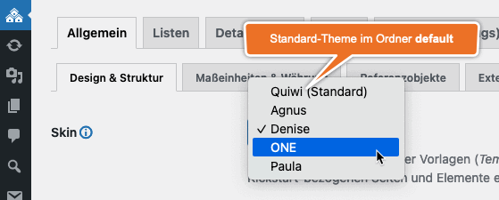

# Skins

Ein <i>Skin</i> ist - technisch gesehen - ein einfacher Ordner, der alle für die Darstellung im **Website-Frontend** maßgeblichen Ressourcen in (möglichst) einheitlicher, strukturierter Form enthält:

- Templates (PHP)
- JavaScript-Dateien
- CSS-Dateien
- Bilddateien
- Fonts

## Ordner

Es gibt zwei **Speicherorte** für Skin-Ordner:

- Mitgelieferte Skins sind im Kickstart-Plugin-Verzeichnis unter `skins` zu finden:
  `.../wp-content/plugins/immonex-kickstart/skins/`
- Der passende und *updatesichere* Ort für **eigene oder angepasste** Skins ist der Unterordner `immonex-kickstart` im **Child-Theme-Verzeichnis**:
  `.../wp-content/themes/CHILD-THEME-NAME/immonex-kickstart/`

Der Ordner des im Plugin enthaltenen [Standard-Skins](standard-skin.html) heißt `default` (unabhängig vom eigentlichen Skin-Namen), dieser muss immer vorhanden sein:

 `.../wp-content/plugins/immonex-kickstart/skins/default`

 
 [Skin-Auswahl](../schnellstart/einrichtung.html#Skin) unter ***immonex > Einstellungen***

Die zugehörige Ordner-Struktur könnte so aussehen:
```
.../wp-content/plugins/immonex-kickstart/skins
├── default
└── one

.../wp-content/themes/CHILD-THEME-NAME/immonex-kickstart
├── agnus
├── denise
└── paula
 ```

## Aufbau

Der **grundlegende** Aufbau eines Kickstart-Skins ist denkbar einfach:
```
skin-name
├── css
│   └── index.css
├── js
│   └── index.js
└── index.php
```

Die Dateien `index.css` und `index.js` des aktiven Skins werden im Frontend automatisch eingebunden. (Je nach Umfang bietet es sich an, bei der Entwicklung mit mehreren Quelldateien zu arbeiten, die anschließend per Bundler bzw. Präprozessor à la [webpack](https://webpack.js.org/), [Sass](https://sass-lang.com/) & Co. kompiliert werden.)

Die Datei `index.php` enthält aktuell nur den Namen des Skins für die Ausgabe:

```php
<?php
/**
 * Skin Name: Quiwi
 */

die( "Don't event think about it!" );
```

## Individuelle Anpassung

### Partiell

Ist ein mitgeliefertes Kickstart-Skin grundsätzlich passend und sollen nur geringfügige optische Anpassungen vorgenommen werden, ist in den meisten Fällen das [Überschreiben bzw. Ergänzen der betreffenden CSS-Stile](index.html) via Customizer ausreichend. Auch bei weitergehenden Änderungen muss aber **nicht** zwingend mit einem individuellen Skin mit vollem Dateiumfang ([Custom Skin](standard-skin.html)) gearbeitet werden.

Stattdessen besteht die Möglichkeit, nur die zu anzupassenden Dateien eines  vorhandenes Plugin-Skins im Child-Theme-Ordner zu überschreiben, dessen Name dem des Basis-Skin-Ordners (im Plugin-Verzeichnis) entspricht.

Sollen bspw. nur eigene Varianten der Dateien `index.css` und `single-property.php` zum Einsatz kommen, alles andere aber weiterhin vom [Standard-Skin](standard-skin.html) (Ordnername `default`) übernommen werden, ergibt sich die folgende Struktur.

```
.../wp-content/plugins/immonex-kickstart/skins
└── default
    ├── css
    │   └── index.css
    ├── fonts
    ├── images
    ├── js
    ├── property-list
    ├── property-search
    ├── scss
    ├── single-property
    ├── archive-property.php
    ├── index.php
    ├── property-search.php
    └── single-property.php

.../wp-content/themes/CHILD-THEME-NAME/immonex-kickstart
└── default
    ├── css
    │   └── index.css
    └── single-property.php
```

### Komplett

Sollen umfangreiche Anpassungen oder einer ganz individuelle Darstellung umgesetzt werden, ist ein vollständiges **benutzerdefiniertes Skin** ([Custom Skin](standard-skin.html)) die passende Wahl. Hier kann wiederum das [Standard-Skin](standard-skin.html) als Basis verwendet werden, die dann schrittweise angepasst wird.

Hierzu wird zunächst der Ordner `default` aus dem Plugin-Skins-Ordner unter einem **eigenen Namen** in das **Verzeichnis des Child-Themes** (Unterordner `immonex-kickstart`) kopiert.

```
.../wp-content/themes/CHILD-THEME-NAME/immonex-kickstart
└── my-custom-skin
    ├── css
    │   └── index.css
    ├── fonts
    ├── images
    ├── js
    ├── property-list
    ├── property-search
    ├── scss
    ├── single-property
    ├── archive-property.php
    ├── index.php
    ├── property-search.php
    └── single-property.php
```

Im nächsten Schritt wird noch der Skin-Name in der Datei `index.php` angepasst, bevor dann der eigentliche Spaß losgeht! 😉

```php
<?php
/**
 * Skin Name: My Awesome Custom Skin
 */
```

Hier geht's weiter: [Standard-Skin im Detail](standard-skin.html)
