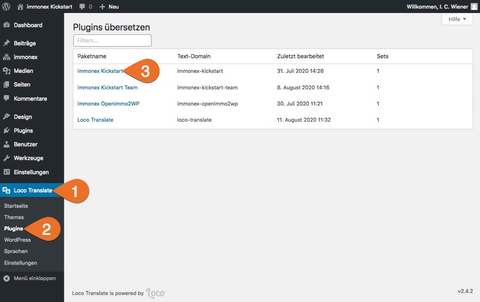
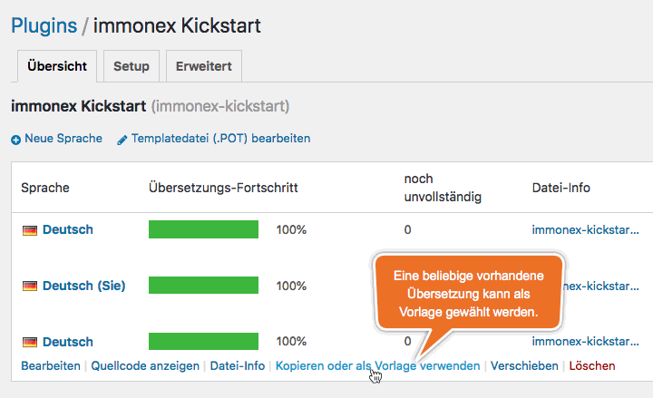
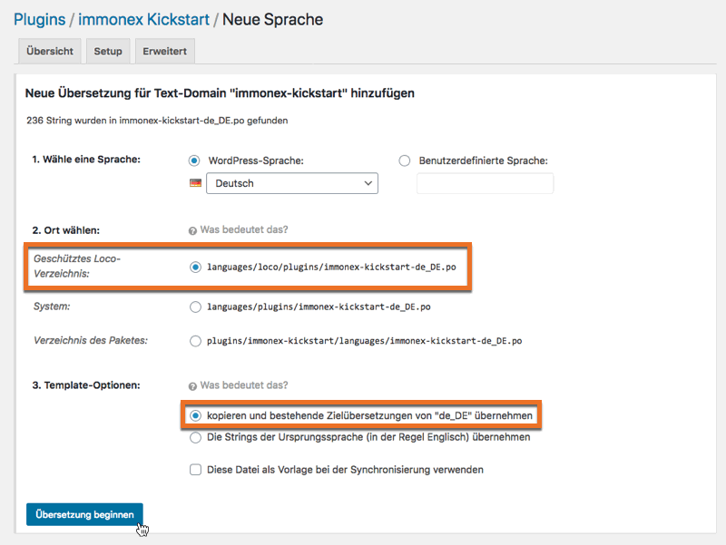
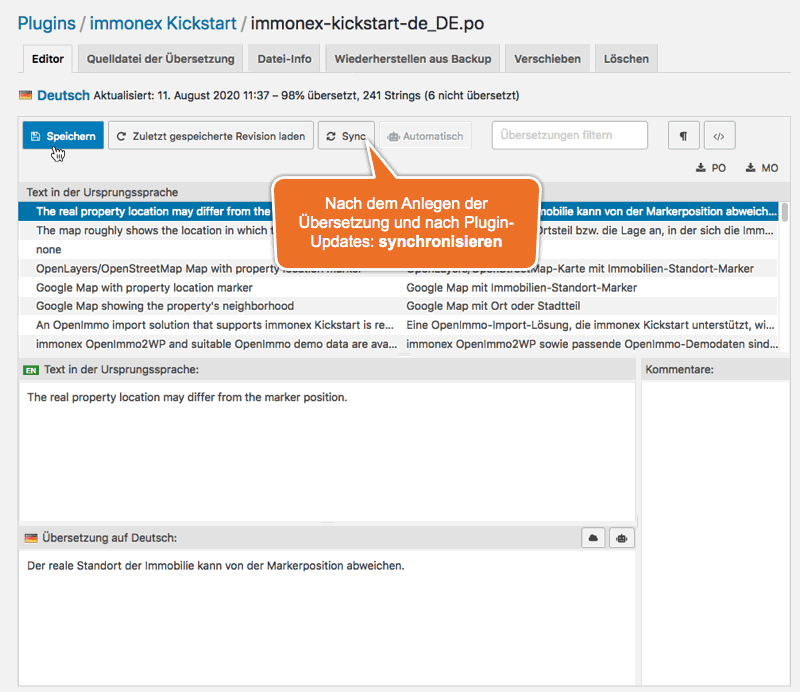

# Übersetzungen & Mehrsprachigkeit

immonex Kickstart ist vorrangig für die Umsetzung deutschsprachiger Websites ausgelegt. Nichtsdestotrotz sind die im Basis-Plugin und den Add-ons enthaltenen Texte in englischer Sprache hinterlegt, um eine WordPress-konforme Übersetzung zu ermöglichen.

## Offizielle Übersetzungen

Übersetzungen werden via [translate.wordpress.org (GlotPress)](https://translate.wordpress.org/projects/wp-plugins/immonex-kickstart/) bereitgestellt. Die Varianten *de_DE* (**informell/Du**) und *de_DE_formal* (**formell/Sie**) sind hier für die aktuellen Release-Versionen von Basis-Plugin und Add-ons immer vollständig verfügbar. Weitere Sprachen und länderspezifische Varianten können ebenfalls hierüber ergänzt werden (Infos zu Hintergrund und Vorgehensweise im offiziellen [Handbuch für Übersetzer](https://make.wordpress.org/polyglots/handbook/)).

Die Übersetzungen von translate.wordpress.org werden automatisch in den globalen WordPress-Übersetzungsordner `.../wp-content/languages/plugins` heruntergeladen, sofern diese für die unter ***Einstellungen → Allgemein*** eingestellte Website-Sprache verfügbar sind:

```
.../wp-content/languages/plugins
├── immonex-kickstart-de_DE_formal.po
└── immonex-kickstart-de_DE_formal.mo
```

In den jeweiligen Plugin-Ordnern (Kickstart und Add-ons) ist **zusätzlich** ein Ordner namens `languages` zu finden, der neben einer aktuellen <i>POT-Datei</i> (Vorlage für neue Übersetzungen) auch die folgenden PO- (Übersetzungs-Quelldatei) und MO-Versionen (kompilierte Übersetzungen) enthält:

```
.../wp-content/plugins/immonex-kickstart
└── languages
    ├── immonex-kickstart.pot
    ├── immonex-kickstart-de_DE.po
    ├── immonex-kickstart-de_DE.mo
    ├── immonex-kickstart-de_DE_formal.po
    └── immonex-kickstart-de_DE_formal.mo
```

> **ACHTUNG!** Die Übersetzungen im o. g. globalen WP-Sprachordner haben Priorität, die Dateien in den Plugin-Ordnern werden im Regelfall **nicht** eingebunden.

### Besonderheit bei Beta-Versionen

Der Nachteil des o. g. Systems zur Verteilung der Übersetzungen besteht darin, dass hierbei nur die **aktuelle Release-Version** berücksichtigt wird. Ist bspw. eine **aktuellere Beta-Version** eines Kickstart- oder Add-on-Plugins (von [immonex.dev](https://immonex.dev/)) im Einsatz, werden so nicht die hierzu passenden aktuellen Übersetzungen geladen, was sich in fehlenden oder nicht korrekt übersetzten Textfragmenten bemerkbar machen kann.

Abhilfe schafft hier **temporär** die manuelle Löschung der der o. g. PO/MO-Dateien aus dem globalen WP-Übersetzungsordner oder – sofern nötig – auch **dauerhaft** die im folgenden Abschnitt beschriebene Vorgehensweise.

## Lokale Übersetzungen / Anpassungen

Lokale oder individuell angepasste Übersetzungen sollten *update-sicher* mit [Loco Translate](https://de.wordpress.org/plugins/loco-translate/) erstellt und aktualisiert werden:



Angepasste Übersetzungen auf Basis eines vorhandenen Datensatzes erstellen:



Sprache und Speicherort "*Geschütztes Loco-Verzeichnis*" festlegen:



Direkt nach dem Anlegen einer neuen Übersetzung sowie nach jeder Aktualisierung des zugehörigen Plugins muss diese zunächst **synchronisiert** werden. Anschließend werden – sofern notwendig – fehlende Übersetzungen ergänzt und/oder die Übersetzungen geänderter Texte aktualisiert. Nach dem Speichern werden diese dann auch im Frontend der Website übernommen.



## Übersetzung von Plugin-Optionen

In **mehrsprachigen Websites** (mit Sprachumschalter im Frontend) sind im Regelfall auch Texte zu übersetzen, die in den [Plugin-Optionen](../schnellstart/einrichtung.html) im WordPress-Backend hinterlegt sind (z. B. die Hinweise zum Objektstandort).

Diese können mit einer Übersetzungslösung wie [Polylang](https://de.wordpress.org/plugins/polylang/) oder [WPML](https://wpml.org/) übersetzt werden (<i>String Translation</i>).
