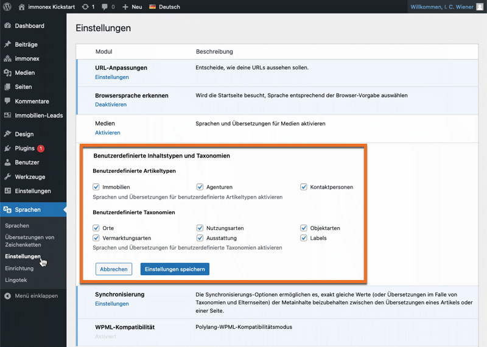

# Übersetzungen & Mehrsprachigkeit

immonex Kickstart ist vorrangig für die Umsetzung deutschsprachiger Websites ausgelegt. Nichtsdestotrotz sind die im Basis-Plugin und den Add-ons enthaltenen Texte in englischer Sprache hinterlegt, um eine WordPress-konforme Übersetzung zu ermöglichen.

## Offizielle Übersetzungen

Übersetzungen werden via [translate.wordpress.org (GlotPress)](https://translate.wordpress.org/projects/wp-plugins/immonex-kickstart/) bereitgestellt. Die Varianten *de_DE* (**informell/Du**) und *de_DE_formal* (**formell/Sie**) sind hier für die aktuellen Release-Versionen von Basis-Plugin und Add-ons immer vollständig verfügbar. Weitere Sprachen und länderspezifische Varianten können ebenfalls hierüber ergänzt werden (Infos zu Hintergrund und Vorgehensweise im offiziellen [Handbuch für Übersetzer](https://make.wordpress.org/polyglots/handbook/)).

Die Übersetzungen von translate.wordpress.org werden automatisch in den globalen WordPress-Übersetzungsordner `.../wp-content/languages/plugins` heruntergeladen, sofern diese für die unter ***Einstellungen → Allgemein*** eingestellte Website-Sprache verfügbar sind:

```
.../wp-content/languages/plugins
├── immonex-kickstart-de_DE_formal.po
└── immonex-kickstart-de_DE_formal.mo
```

In den jeweiligen Plugin-Ordnern (Kickstart und Add-ons) ist **zusätzlich** ein Ordner namens `languages` zu finden, der neben einer aktuellen <i>POT-Datei</i> (Vorlage für neue Übersetzungen) auch die folgenden PO- (Übersetzungs-Quelldatei) und MO-Versionen (kompilierte Übersetzungen) enthält:

```
.../wp-content/plugins/immonex-kickstart
└── languages
    ├── immonex-kickstart.pot
    ├── immonex-kickstart-de_DE.po
    ├── immonex-kickstart-de_DE.mo
    ├── immonex-kickstart-de_DE_formal.po
    └── immonex-kickstart-de_DE_formal.mo
```

> **ACHTUNG!** Die Übersetzungen im o. g. globalen WP-Sprachordner haben Priorität, die Dateien in den Plugin-Ordnern werden im Regelfall **nicht** eingebunden.

### Besonderheit bei Beta-Versionen

Der Nachteil des o. g. Systems zur Verteilung der Übersetzungen besteht darin, dass hierbei nur die **aktuelle Release-Version** berücksichtigt wird. Ist bspw. eine **aktuellere Beta-Version** eines Kickstart- oder Add-on-Plugins (von [immonex.dev](https://immonex.dev/)) im Einsatz, werden so nicht die hierzu passenden aktuellen Übersetzungen geladen, was sich in fehlenden oder nicht korrekt übersetzten Textfragmenten bemerkbar machen kann.

Abhilfe schafft hier **temporär** die manuelle Löschung der der o. g. PO/MO-Dateien aus dem globalen WP-Übersetzungsordner oder – sofern nötig – auch **dauerhaft** die im folgenden Abschnitt beschriebene Vorgehensweise.

## Lokale Übersetzungen / Anpassungen

Lokale oder individuell angepasste Übersetzungen sollten *update-sicher* mit [Loco Translate](https://de.wordpress.org/plugins/loco-translate/) erstellt und aktualisiert werden:


Angepasste Übersetzungen auf Basis eines vorhandenen Datensatzes erstellen:


Sprache und Speicherort "*Geschütztes Loco-Verzeichnis*" festlegen:


Direkt nach dem Anlegen einer neuen Übersetzung sowie nach jeder Aktualisierung des zugehörigen Plugins muss diese zunächst **synchronisiert** werden. Anschließend werden – sofern notwendig – fehlende Übersetzungen ergänzt und/oder die Übersetzungen geänderter Texte aktualisiert. Nach dem Speichern werden diese dann auch im Frontend der Website übernommen.


## Mehrsprachige Websites

Sollen eine WordPress-Website bzw. Teile hiervon **parallel** in mehreren Sprachen angeboten werden (mit Sprachumschalter im Frontend), kommt hierfür im Regelfall eine Erweiterung für das Übersetzungs-Management zum Einsatz. Kickstart unterstützt hier die beiden gängigen Lösungen [Polylang](https://de.wordpress.org/plugins/polylang/) und [WPML](https://wpml.org/).

### Beitragsarten und Taxonomien

Sind Polylang ([Pro](https://polylang.pro/)) oder WPML installiert und aktiv und sollen Immobilien-Angebote in unterschiedlichen Sprachen veröffentlicht werden, müssen zunächst die vom Kickstart-Plugin bzw. Add-ons bereitgestellten [Beitragsarten](../beitragsarten-taxonomien.html) sowie die zugehörigen [Taxonomien](../beitragsarten-taxonomien.html) in den Optionen der eingesetzten Übersetzungs-Lösung als "übersetzbar" gekennzeichnet werden.


Zu übersetzende Beitragsarten und Taxonomien auswählen am Beispiel von **Polylang**

Die Übersetzung der in den Kickstart-Optionen hinterlegten [Titelformen (Slugs)](../schnellstart/einrichtung.html#Titelformen-Slugs), die für die Generierung "suchmaschinenfreundlicher" URLs (Permalinks) maßgeblich sind, ist möglich und muss ebenfalls in den Polylang/WPML-Optionen aktiviert werden.

> Die Übersetzung von URL/Permalink-Slugs ist in der kostenlosen Standardversion von Polylang nicht enthalten, hierfür wird [Polylang Pro](https://polylang.pro/) benötigt.

Weitere Infos zum Thema URL-Slug-Übersetzung:

- [Polylang Pro](https://polylang.pro/doc/translating-urls-slugs/)
- [WPML](https://wpml.org/de/documentation-3/ratgeber-zum-loslegen/ubersetzung-von-seiten-slugs/)

### Texte in Plugin-Optionen

Inhalte, die in den [Plugin-Optionen](../schnellstart/einrichtung.html) hinterlegt sind (z. B. die Hinweise zum Objektstandort) können mit der <i>String-Translation-Funktion</i> der o. g. Sprachplugins übersetzt werden.

### Sonderfälle

#### Objekte nur in einer, Listen- und Detailseiten in mehreren Sprachen

Sind die Immobilienangebote grundsätzlich nur in **einer** Sprache verfügbar und wird für die Ausgabe eine **mehrsprachige** [Seite als Vorlage](../schnellstart/einrichtung.html#Immobilien-Detailseite) verwendet, entspricht die Sprache der Vorlage im Normalfall der der jeweiligen Immobilie.

Soll stattdessen die Sprache der Vorlagenseite der der (ebenfalls mehrsprachigen) Listenseite (z. B. die [Standard-Immobilien-Übersicht](../schnellstart/einrichtung.html#Immobilien-Ubersicht)) entsprechen, von der aus sie aufgerufen wurde, kann dies mit dem Attribut `force-lang` im Listen-Shortcode bewerkstelligt werden, das als Wert den entsprechenden Sprachcode (zweistellig) enthält:

`[inx-property-list force-lang="en"]`