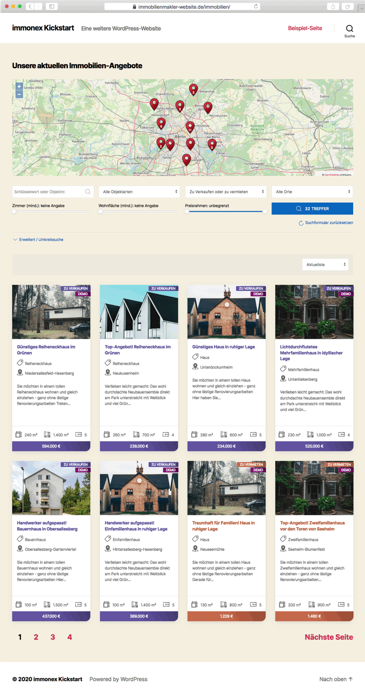

# Beitragsarten & Taxonomien

Für die Immobilienobjekte werden die benutzerdefinierte Beitragsart (<i>Custom Post Type</i>) **inx_property** sowie die folgenden zugehörigen Taxonomien registriert:

- **inx_location** (Orte)
- **inx_type_of_use** (Nutzungsarten)
- **inx_property_type** (Objektarten)
- **inx_marketing_type** (Vermarktungsarten)
- **inx_project** ([Projekt/Gruppe](referenzen-status-flags.html#Gruppierung), z. B. Bauvorhaben, Wohnanlagen oder Gewerbeimmobilien mit mehreren Einheiten)
- **inx_feature** (Ausstattungsmerkmale)
- **inx_label** (Labels, z. B. Neu! oder "Objekt der Woche")

> Optionale [Add-ons](add-ons.html) für Kickstart können weitere Beitragsarten und Taxonomien ergänzen.

## Custom Fields

Mit jedem Immobilien-Beitrag (**inx_property**) wird beim [Import](schnellstart/import.html) eine Reihe benutzerdefinierter Felder angelegt, die mit den Werten grundlegender OpenImmo-Angaben befüllt werden (sofern übermittelt).

| Feldname | Beschreibung |
| -------- | ------------ |
| `_openimmo_obid` | OpenImmo-Objekt-ID |
| `_inx_property_id` | von Anbieter vergebene **externe** Objektnummer |
| `_inx_build_year` | Baujahr |
| `_inx_primary_area` | **primäre Fläche** bezogen auf die Objektart (z. B. Wohnfläche bei Wohnobjekten oder Grundstücksfläche bei Grundstücken) |
| `_inx_plot_area` | Grundstücksfläche |
| `_inx_commercial_area` | Gewerbefläche |
| `_inx_retail_area` | Verkaufsfläche (Einzelhandel etc.) |
| `_inx_office_area` | Bürofläche |
| `_inx_gastronomy_area` | Gastronomiefläche |
| `_inx_storage_area` | Lagerfläche |
| `_inx_usable_area` | Nutzfläche allgemein |
| `_inx_living_area` | Wohnfläche |
| `_inx_basement_area` | Kellerfläche |
| `_inx_attic_area` | Dachbodenfläche |
| `_inx_misc_area` | sonstige Flächen |
| `_inx_garden_area` | Gartenfläche |
| `_inx_total_area` | Gesamtfläche |
| `_inx_primary_rooms` | **primäre Zimmer-/Raumanzahl** bezogen auf die Objektart bzw. die verfügbaren/übermittelten Daten (z. B. Zimmer-Gesamtanzahl oder Anzahl der Wohn-/Schlafzimmer bei Wohnobjekten) |
| `_inx_bedrooms` | Anzahl Schlafzimmer |
| `_inx_living_bedrooms` | Anzahl Wohn-/Schlafzimmer |
| `_inx_bathrooms` | Anzahl Badezimmer |
| `_inx_total_rooms` | Gesamtanzahl Zimmer/Räume |
| `_inx_primary_price` | **primäre Preisangabe** (z. B. Kaufpreis bei Kaufobjekten oder Kaltmiete bei Mietobjekten) |
| `_inx_price_time_unit` | Zeitrahmen der primären Preisangabe (nur bei Mietobjekten, bei denen sich die Mietangabe **nicht** auf einen Monat bezieht) |
| `_inx_primary_units` | primäre Anzahl der Einheiten (Wohnen/Gewerbe) bei größeren Objekten |
| `_inx_living_units` | Anzahl Wohnenheiten |
| `_inx_commercial_units` | Anzahl Gewerbeeinheiten |
| `_inx_zipcode` | PLZ |
| `_inx_city` | Ort/Stadt (für Abfragen; wird zusätzlich in der Taxonomie inx_location gespeichert) |
| `_inx_state` | Bundesland/Kanton |
| `_immonex_iso_country` | dreistelliger Ländercode ([ISO 3166 ALPHA-3](https://de.wikipedia.org/wiki/ISO-3166-1-Kodierliste)) |
| `_immonex_group_number` | **Gruppennummer** zur Gruppierung zusammengehöriger Objekte (bspw. Einheiten einer Wohnanlage) |
| `_immonex_group_id` | **Gruppenkennung**: alternatives [Gruppierungskriterium](referenzen-status-flags.html#Gruppierung) und - in Kombination mit `_immonex_group_master` - heutzutage gängigere Alternative zur <i>Gruppennummer</i>. Die Gruppenkennung wird beim [OpenImmo-Import](schnellstart/import.html) auch als Term der <i>Projekt-Taxonomie</i> (siehe oben) übernommen. |
| `_immonex_group_master` | Kennzeichnung von [Master-Objekten](referenzen-status-flags.html#Master-Objekte), bspw. dem Hauptobjekt einer Wohnanlage, dem mehrere Untereinheiten anhand der gleichen <i>Gruppenkennung</i> zugeordnet sind (*visible* = in der Website sichtbar, *invisible* = nicht sichtbar) |
| `_inx_is_sale` | <i>Kaufobjekt-Flag</i> (*0* oder *1*) |
| `_immonex_is_reference` | <i>Referenzobjekt-Flag</i> (*0* oder *1*) |
| `_immonex_is_available` | <i>Verfügbarkeits-Flag</i> (*1* wenn nicht verkauft/reserviert, ansonsten *0*) |
| `_immonex_is_sold` | <i>Verkauft-Flag</i> (*0* oder *1*) |
| `_immonex_is_reserved` | <i>Reserviert-Flag</i> (*0* oder *1*) |
| `_immonex_is_featured`1 | <i>Empfohlen-Flag</i> (*0* oder *1*) |
| `_immonex_is_front_page_offer`1 | <i>Startseiten-Angebot-Flag</i> (*0* oder *1*) |
| `_immonex_is_demo`1| <i>Demo-Objekt-Flag</i> (*0* oder *1*) |

## Archivseiten

### Immobilien-Beiträge

Sobald der erste [Import von OpenImmo-Daten](import.html) durchgeführt wurde, ist die **Standard-Archivseite** der Immobilienangebote unter `https://domain.tld/immobilien/`2 bzw. `.../properties/`2 bei nicht deutschsprachigen Websites abrufbar. Sie enthält neben der eigentlichen Listenansicht auch ein Suchformular, eine Auswahlbox für die Sortierung sowie eine Seitennavigation.

So sieht die Immobilien-Archivseite im Website-Frontend mit dem WordPress-Standard-Theme <i>Twenty Twenty</i> ohne Anpassungen aus:

### Taxonomie-Archive

Die **Archivseiten** der o. g. Plugin-Taxonomien können durch Anhängen der jeweiligen <i>Slugs</i>2 (Taxonomie und Taxonomie-Term) aufgerufen werden:

#### Stadt-/Ortsname

`.../immobilien/ort/TERM-SLUG/` (`.../properties/location/TERM-SLUG/`)

Beispiel: `.../immobilien/ort/trier-west/`

#### Nutzungsart

`.../immobilien/nutzungsart/TERM-SLUG/` (`.../properties/type-of-use/TERM-SLUG/`)

Beispiel: `.../immobilien/nutzungsart/wohnimmobilie`

#### Objektart

`.../immobilien/objektart/TERM-SLUG` (`.../properties/type/TERM-SLUG`)

Beispiel: `.../immobilien/objektart/einfamilienhaus/`

#### Vermarktungsart

`.../immobilien/kaufen-mieten/TERM-SLUG` (`.../properties/buy-rent/TERM-SLUG`)

Beispiel: `.../immobilien/kaufen-mieten/zu-verkaufen/`

#### Projekt (Objektgruppe)

`.../immobilien/projekt/TERM-SLUG` (`.../properties/project/TERM-SLUG`)

Beispiel: `.../immobilien/projekt/wohnanlage-123/`

#### Label

`.../immobilien/label/TERM-SLUG`

Beispiel: `.../immobilien/label/neu/`

---

1 Angabe ist nicht im regulären Umfang des OpenImmo-Standards enthalten und muss daher — abhängig vom Exportsystem (Maklersoftware) — individuell per [Mapping-Tabelle für den Import](schnellstart/import.html) definiert werden

2 abhängig von den in den Plugin-Optionen hinterlegten [Titelformen (Slugs)](../schnellstart/einrichtung.html#Titelformen-Slugs) und der aktuellen Website-Sprache (→ [Übersetzungen & Mehrsprachigkeit](../anpassung-erweiterung/uebersetzung-mehrsprachigkeit.html))