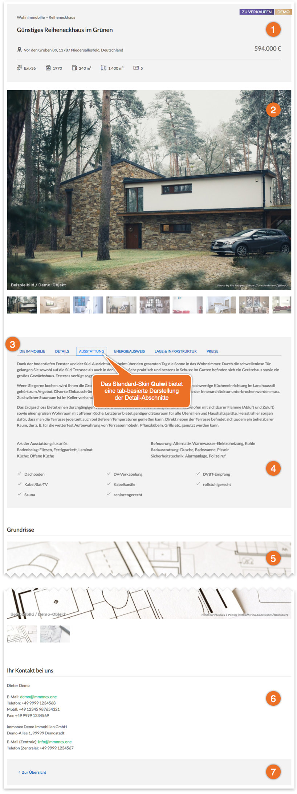
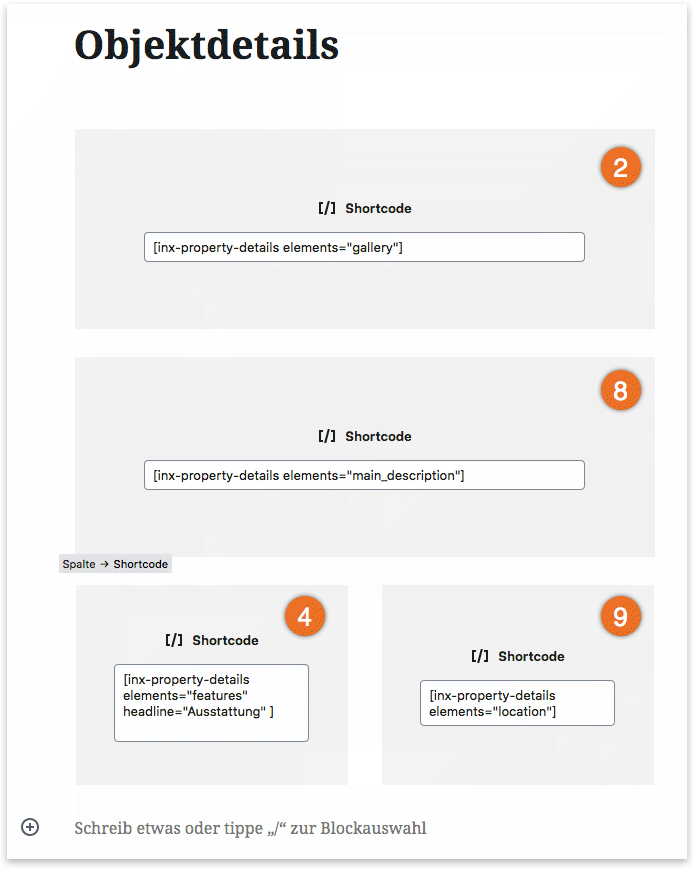
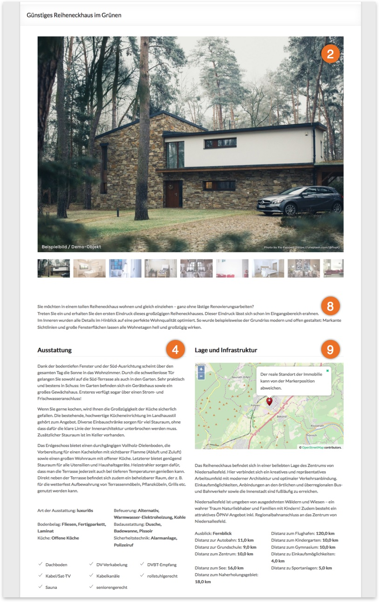
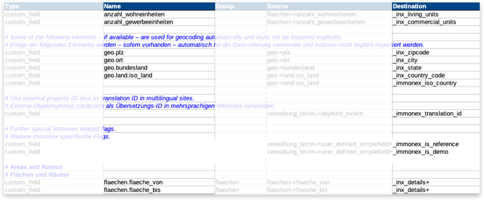

# Detailansicht

## Standard-Template

Kickstart bzw. die verfügbaren [Skins](../anpassung-erweiterung/skins.html) enthalten eine **Seitenvorlage** für den [Immobilien-Beitragstyp](../beitragsarten-taxonomien.html), die alle wesentlichen Inhalte umfasst (inkl. Foto- und Grundriss-Galerien, [Standortkarten](../schnellstart/einrichtung.html#Karten-amp-Umkreissuche), 360°-Panoramen, eingebundenen YouTube- oder Vimeo-Videos etc.). Hierfür ist keine weitergehende Konfiguration erforderlich.

> Die Standard-Detailansicht kann auch durch die Ergänzung von **Widgets** in der zugehörigen [Sidebar](../schnellstart/sidebars.html) erweitert werden.

## Seite als Vorlage

**Alternativ** kann eine beliebige Seite als Rahmenvorlage verwendet werden, die unter ***immonex → Einstellungen → Allgemein*** ausgewählt wird (Option [Immobilien-Detailseite](../schnellstart/einrichtung.html#Immobilien-Detailseite)).

Innerhalb dieser Vorlageseite können die gewünschten Immobiliendetails dann per **Shortcode** - entweder komplett, gruppiert oder einzeln - eingefügt werden. Die Einbindung in Form von Absätzen (gruppierte Daten) und einzelnen Werten ist vor allem dann relevant, wenn das Rahmenlayout auf Basis diverser Containerelemente mit [Gutenberg](https://de.wordpress.org/gutenberg/) oder einer anderen Page-Builder-Lösung (Elementor, WPBakery Page Builder etc.) aufbaut, die mit unterschiedlichen Objektdaten befüllt werden sollen.

Beispiel: Detailseiten-Layout mit Gutenberg

Gutenberg-Layout im Frontend

## Shortcodes

Die folgenden Shortcodes können mehrfach pro Seite verwendet werden.

### Detail-Abschnitte (gruppierte Angaben)

`[inx-property-details]`

Mit diesem Shortcode kann eine beliebige Anzahl [vordefinierter Abschnitte](#Elemente-Abschnitte) eingebunden werden, die jeweils thematisch gruppierte Import-Daten der Immobilie in einem hierzu passenden Layout enthalten. Ohne Angabe von Elementen per Attribut werden - analog zum Standard-Template - alle Detail-Abschnitte eingebunden.

#### Attribute

Sollen nur bestimmte Detail-Abschnitte eingebunden werden, kann der entsprechende Umfang mit den Attributen `elements` **oder** `exclude` festgelegt werden (einzeln oder als kommagetrennte Liste).

| Name | Beschreibung / Attributwerte |
| ---- | ---------------------------- |
| `elements` | Keys explizit **einzubindender** Detail-Abschnitte (optional) |
| `exclude` | Keys explizit **auszuschließender** Detail-Abschnitte (optional) |
| `enable-tabs` (3) | **tab-basierte Darstellung** der zentralen Info-Blöcke (siehe Screenshot), sofern vom gewählten Skin unterstützt (Umfang und Aufteilung können via Filter-Hook [inx_tabbed_content_elements](../anpassung-erweiterung/filter-inx-tabbed-content-elements.html) angepasst werden) |
| | *0* : deaktivieren (Standard bei Nutzung von `elements` oder `exclude`) |
| | *1* : aktivieren (Standard bei Einbindung aller Elemente) |

##### Template-Parameter per Attribut setzen

Eine Besonderheit stellt bei diesem Shortcode die Möglichkeit dar, **Template-Parameter** durch die Ergänzung beliebiger weiterer Attribute "durchzuschleifen". Das kann in **Sonderfällen** nützlich sein, bspw. wenn mit einem Element gleichzeitig eine **alternative** Überschrift (`headline`) für dessen Abschnitt übergeben werden soll.

Beispiel: Energieausweis-Daten mit Überschrift "Energieeffizienz" einbinden
`[inx-property-details elements="epass" headline="Energieeffizenz"]`

Die Angabe "Energieeffizienz" ist so bei der Ausgabe des betreffenden Templates der Energieausweis-Daten ([PHP-Datei im Skin](../anpassung-erweiterung/skins.html)) im Template-Daten-Array verfügbar, wobei der **Key dem Attributnamen entspricht**: `$template_data['headline']`

Werden mit einem Shortcode mehrere Elemente gleichzeitig eingebunden, für die jeweils eigene Template-Parameter übergeben werden sollen, enthält der jeweilige **Attributname** den zugehörigen **Elementnamen als Präfix**: `ELEMENTNAME-KEY`

Beispiel: Energieausweis-Daten mit Überschrift "Energieeffizienz" und Grundriss-Galerie mit Überschrift "Grundrisse" einbinden
`[inx-property-details elements="epass, floor_plans" epass-headline="Energieeffizenz" floor_plans-headline="Grundrisse"]`

(Eventuell vorhandene Standardwerte werden von den per Attribut übermittelten Angaben überschrieben.)

#### Elemente (Abschnitte)

Folgende Schlüssel können als **Attributwerte** für `elements` und `exclude` übernommen werden, wobei jeder <i>Key</i> für einen bestimmten Abschnitt steht.

| Key | Beschreibung |
| --- | ------------ |
| `head` (1) | Header mit Objekttitel, Nutzungs-/Objektart, Standort und Kerndaten |
| `gallery` (2) | primäre Fotogalerie, die standardmäßig auch Videos und virtuelle 360°-Touren enthält |
| `main_description` (8) | Haupt-Beschreibungstext |
| `prices` | Preise und Angaben zur Courtage etc. |
| `areas` | Flächenangaben |
| `condition` | Angaben zum Zustand der Immobilie |
| `epass` | Daten des Energieausweises |
| `epass_images` | übermittelte Bildanhänge, die zum Energieausweis gehören |
| `epass_energy_scale` | Energieskala (grafische Visualisierung der Energieklasse), sofern das Plugin [immonex Energy Scale Pro](../systemvoraussetzungen.html#Datenimport-amp-Energieskalen) installiert ist |
| `location_map` (9) | Standortkarte |
| `location_description` (9) | Standortbeschreibung und -details |
| `location` | Kombination von `location_map` und `location_description`: Standortbeschreibung/-details **und** Karte (**optionales Element \***) |
| `features` (4) | Ausstattung der Immobilie (Beschreibung, Merkmale etc.) |
| `floor_plans` (5) | Grundriss-Galerie |
| `misc` | sonstige Angaben |
| `downloads_links` | Downloads (z. B. PDF-Dateien) und Links zu externen Websites |
| `video` | Immobilien-Video (**optionales Element \***, normalerweise Bestandteil der Galerie, s. o.) |
| `virtual_tour` | Virtuelle 360°-Tour - im Regelfall von einem externen Anbieter per iFrame eingebunden (**optionales Element \***, normalerweise Bestandteil der Galerie, s. o.) |
| `contact_person` (6) | Kontaktinformationen (5) |
| `footer` (7) | Footer mit Link zur Übersichtsseite |

**\* Optionale Elemente** werden nur bei expliziter Nennung im Shortcode-Attribut `elements` eingebunden.

#### Beispiele

alle Abschnitte außer Header und Footer + tab-basierte Darstellung:
`[inx-property-details exclude="head, footer" enable-tabs=1]`

nur Energieausweis-Abschnitte:
`[inx-property-details elements="epass, epass_images, epass_energy_scale"]`

### Einzelne Angaben

`[inx-property-detail-element name="ELEMENT_ODER_FELDNAME"]`

Eine <i>granularere</i> Form der Einbindung der Immobilien-Details ist mit diesem Shortcode möglich. Die Auswahl des anzuzeigenden Wertes kann hierbei entweder auf Basis der von der [OpenImmo-Schnittstelle](../schnellstart/import.html) genutzten <i>Mapping-Tabelle</i> (Element- bzw. Custom-Field-Name) oder mit einer XML-Pfadangabe ([XPath](https://de.wikipedia.org/wiki/XPath)).

Ausschnitt aus der [OpenImmo2WP](https://plugins.inveris.de/shop/immonex-openimmo2wp/)-Mapping-Tabelle für Kickstart

#### Attribute

| Name | Beschreibung / Attributwerte |
| ---- | ---------------------------- |
| `name` | einzubindendes Detailelement als... |
| | **Mapping-Name**, z. B. <i>freitexte.objektbeschreibung</i> (Bezeichnung, die in der Spalte <i>Name</i> der <i>Mapping-Tabelle</i> hinterlegt ist, die für den [OpenImmo-Import](../schnellstart/import.html) eingesetzt wird) |
| | **Custom-Field-Name**, z. B. <i>\_inx_property_id</i> (Name des als Zielfeld in der Spalte <i>Destination</i> der Import-Mapping-Tabelle hinterlegten **Custom Fields**) |
| | [XPath-Angabe](https://de.wikipedia.org/wiki/XPath) zur Abfrage eines beliebigen Werts innerhalb des **Import-XML-Elements** `<immobilie>` des Objekts, z. B. <i>//zustand_angaben/baujahr</i> (beginnt immer mit `//`) |
| `group` | in der Mapping-Tabelle hinterlegte **Gruppenbezeichnung** als Ergänzung zum Elementnamen - wird nur in Sonderfällen benötigt (optional) |
| `template` | Vorlage für die Ausgabe, in der folgende Platzhalter verwendet werden können (optional) |
| | *{value}* : Wert des Elements |
| | *{value,number,2}* : Variante des Elementwerts, formatiert als Zahl mit der angegebenen Anzahl an Nachkommastellen |
| | *{title}* : Bezeichnung des Elements aus der entsprechenden <i>Title-Spalte</i> der Mapping-Tabelle, sofern vorhanden |
| | *{title,: }* : Variante der Bezeichnung mit einem Zusatztext (im Beispiel: <i>Doppelpunkt und Leerzeichen</i>), der angehangen wird, wenn ein Titel verfügbar ist |
| | *{currency}* : Standard-Währung, z. B. <i>EUR</i> (➞ [Plugin-Optionen](../schnellstart/einrichtung.html)) |
| | *{currency_symbol}* : Standard-Währungssymbol, z. B. <i>€</i> (➞ [Plugin-Optionen](../schnellstart/einrichtung.html)) |
| | *{area_unit}* : Standard-Flächeneinheit, im Regelfall <i>m²</i> (➞ [Plugin-Optionen](../schnellstart/einrichtung.html)) |
| `type` | Typ des Elements, mit dem ein **vordefiniertes** Template für die Ausgabe ausgewählt werden kann (optional) |
| | *price* : formatierte Preisangabe inkl. Währung, z. B. <i>350.000,00 €</i> (entspricht dem Template `{value,number,2} {currency_symbol}`) |
| | *area* : formatierte Flächenangabe, z. B. <i>814,00 m²</i> (entspricht dem Template `{value,number,2} {area_unit}`) |
| `if_empty` | auszugebender **Alternativtext**, falls das Element leer oder nicht verfügbar ist (optional) |

#### Beispiele

Wohnfläche anzeigen:
`[inx-property-detail-element name="wohnflaeche"]`

Primäre Preisangabe anhand des Custom-Field-Namens abrufen und formatiert anzeigen:
`[inx-property-detail-element name="_inx_primary_price" type="price"]`

Alternative Variante der Preiseinbindung mit identischer Ausgabe:
`[inx-property-detail-element name="primaerpreis" template="{value,number,2} {currency_symbol}"]`

Kaufpreis pro m² per [XPath](https://de.wikipedia.org/wiki/XPath)-Angabe ermitteln und Alternativtext anzeigen, falls nicht verfügbar:
`[inx-property-detail-element name="//preise/kaufpreis_pro_qm" if_empty="auf Anfrage"]`

## Erweiterte Anpassungen

- [Filter-Referenz](../anpassung-erweiterung/filters-actions.html#Detailansicht)
- [Templates](../anpassung-erweiterung/skins.html#Partiell)
- [Custom Skin](../anpassung-erweiterung/standard-skin.html#Detailansicht)
