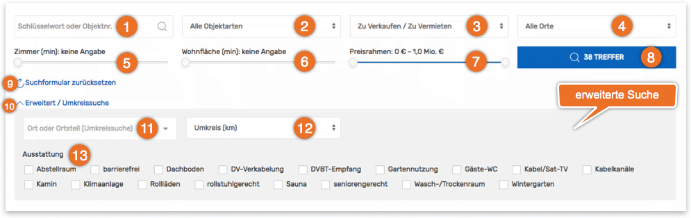
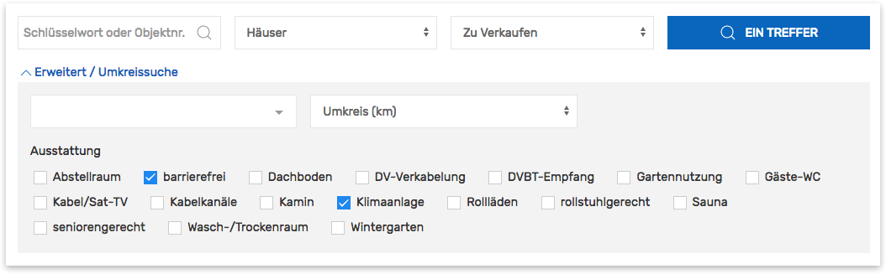
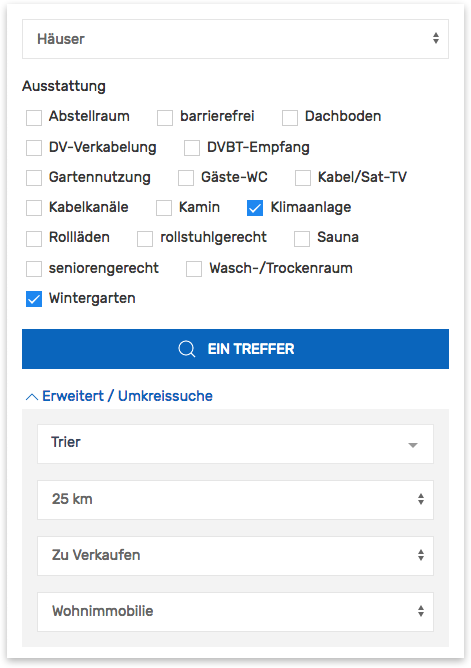

# Suchformular

Die **Immobiliensuche** ist eine zentrale Komponente des Kickstart-Plugins. Das Formular besteht aus einer beliebigen Kombination von Eingabe- und Auswahlelementen, wobei diese in einen *primären* (direkt sichtbaren) und einen *erweiterten Abschnitt* (aufklappbar) unterteilt sind. In der Standardkonfiguration enthält der erweiterte Abschnitt die Umkreissuche sowie eine Filtermöglichkeit nach Ausstattungsmerkmalen.

Standard-Suchformular (ohne Anpassungen)

## Shortcode

`[inx-search-form]`

### Attribute

| Name | Beschreibung |
| ---- | ------------ |
| `elements` | Umfang, Reihenfolge und Aufteilung der Elemente (optional) |
| `results-page-id` | ID der Seite für die Ausgabe der Suchergebnisse (**optional**, Standardvorgabe: aktuelle Seite, sofern der Listen-Shortcode `[inx-property-list]` enthalten ist, ansonsten Standardseite für Immbobilienlisten) |
| `references` | Angaben wie <i>verkauft</i> oder <i>vermietet</i> werden in der Auswahlliste des Elements **Vermarktungsart** (`marketing-type`) standardmäßig ausgefiltert. Mit *yes* als Attributwert kann diese Filterung **deaktiviert** werden (optional). |
| `force-location` | Auswahloptionen des Elements `locality` (Objektstandort) auf die **Hauptkategorien** (Terms der [Taxonomie inx_location](../beitragsarten-taxonomien.html)) mit den angegebenen **Slugs** begrenzen (einzeln oder als kommagetrennte Liste) |
| `force-type-of-use` | Auswahloptionen des Elements `type-of-use` (Nutzungsart) auf die **Hauptkategorien** (Terms der [Taxonomie inx_type_of_use](../beitragsarten-taxonomien.html)) mit den angegebenen **Slugs** begrenzen (einzeln oder als kommagetrennte Liste, z. B. *wohnimmobilien*) |
| `force-property-type` | Auswahloptionen des Elements `property-type` (Objektart) auf die **Hauptkategorien** (Terms der [Taxonomie inx_property_type](../beitragsarten-taxonomien.html)) mit den angegebenen **Slugs** begrenzen (einzeln oder als kommagetrennte Liste, z. B. *wohnungen, haeuser*) |
| `force-marketing-type` | Auswahloptionen des Elements `marketing-type` (Vermarktungsart) auf die **Hauptkategorien** (Terms der [Taxonomie inx_marketing_type](../beitragsarten-taxonomien.html)) mit den angegebenen **Slugs** begrenzen (einzeln oder als kommagetrennte Liste, z. B. *zu-verkaufen*) |
| `force-feature` | Auswahloptionen des Elements `features` (Ausstattungsmerkmale) auf die **Hauptkategorien** (Terms der [Taxonomie inx_feature](../beitragsarten-taxonomien.html)) mit den angegebenen **Slugs** begrenzen (einzeln oder als kommagetrennte Liste) |

#### Elemente

Die folgenden Schlüssel können als Werte des Attributs `elements` übernommen werden.

##### Primär (direkt sichtbar)

| Key | Beschreibung |
| --- | ------------ |
| `description` (1) | Textfeld zur Suche nach Schlüsselwörtern in Objekttiteln, Beschreibungstexten und weiteren Feldern (z. B. Objektnummer) |
| `type-of-use` | Dropdown-Einzelauswahl der **Nutzungsart** (Begriff bzw. <i>Term</i> der [Taxonomie inx_type_of_use](../beitragsarten-taxonomien.html)) |
| `property-type` (2) | Dropdown-Einzelauswahl der **Objektart** (Term der [Taxonomie inx_property_type](../beitragsarten-taxonomien.html)) |
| `marketing-type` (3) | Dropdown-Einzelauswahl der **Vermarktungsart** (Term der [Taxonomie inx_marketing_type](../beitragsarten-taxonomien.html)) |
| `locality` (4) | Dropdown-Einzelauswahl des **Objekt-Standorts** - Ort/Stadt oder Orts-/Stadtteil (Term der [Taxonomie inx_location](../beitragsarten-taxonomien.html)) |
| `min-rooms` (5) | Auswahlslider für die minimale Zimmer-/Raumanzahl ([Custom Field \_inx_primary_rooms](../beitragsarten-taxonomien.html#Custom-Fields)) |
| `min-area` (6) | Auswahlslider für die minimale Fläche ([Custom Field \_inx_primary_area](../beitragsarten-taxonomien.html#Custom-Fields)) |
| `price-range` (7) | Auswahlslider für den Preisrahmen ([Custom Field \_inx_primary_price](../beitragsarten-taxonomien.html#Custom-Fields); Maximalpreis wird anhand der vorhandenen Objekte automatisch ermittelt) |
| `submit` (8) | Absenden-Button (Objektanzahl wird anhand der aktuell ausgewählten Kriterien dynamisch aktualisiert) |
| `reset` (9) | Link zum Zurücksetzen des Formulars |
| `toggle-extended` (10) | Link zum Aufklappen des Abschnitts der erweiterten Suche |

##### Erweitert (aufklappbar)

| Key | Beschreibung |
| --- | ------------ |
| `distance-search-location` (11) | Ortssuche mit Autovervollständigung für die Umkreissuche |
| `distance-search-radius` (12) | Dropdown-Auswahl des Radius für die Umkreissuche |
| `features` (13) | Checkboxen zur Auswahl gewünschter Ausstattungsmerkmale (<i>Terms</i> der [Taxonomie inx_feature](../beitragsarten-taxonomien.html)) |

## Umfang/Aufteilung

Soll das Formular eine individuelle Auswahl an Elementen enthalten, wird diese mit dem **Shortcode-Attribut** `elements` in Form einer kommagetrennten Liste definiert:

`[inx-search-form elements="ELEMENT1, ELEMENT2, ELEMENT3..."]`

Beispiel: nur Objekt- und Vermarktungsart + Absenden-Button
`[inx-search-form elements="property-type, marketing-type, submit"]`

### Erweiterte Suche

Um den Abschnitt für die erweiterten Suchelemente verfügbar zu machen, muss das Element `toggle-extended` in der Elementliste enthalten sein:
`[inx-search-form elements="description, property-type, marketing-type, submit, toggle-extended, distance-search-location, distance-search-radius, features"]`

Formular mit Abschnitt für erweiterte Suchelemente

Wird ein *+* an den **Namen eines Elements** angehangen, wird dieses (unabhängig von dessen Standard-Konfiguration) der erweiterten Suche zugeordnet. Umgekehrt kann mit einem *-* ein normalerweise erweitertes Element dem Abschnitt der primären, direkt sichtbaren Suchelemente zugeordnet werden.

Beispiel: Ausstattungsliste (`features`) und Vermarktungs-/Nutzungsarten-Auswahl (`marketing-type` und `type-of-use`) in den jeweils anderen Abschnitt verschieben
`[inx-search-form elements="property-type, features-, submit, toggle-extended, distance-search-location, distance-search-radius, marketing-type+, type-of-use+"]`

Formular mit Ausstattungsmerkmalen im primären und Vermarktungs-/Nutzungsarten im erweiterten Abschnitt

## Erweiterte Anpassungen

- [Filter-Referenz](../anpassung-erweiterung/filters-actions.html#Suche)
- [Templates](../anpassung-erweiterung/skins.html#Partiell)
- [Custom Skin](../anpassung-erweiterung/standard-skin.html#Suchformular)
