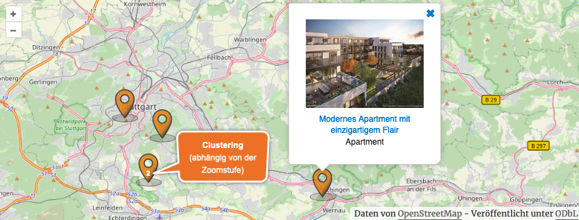

# Standortkarte

Kickstart stellt **ab Version 1.2.0** eine [OpenStreetMap-basierte](https://www.openstreetmap.org/) Kartenansicht bereit, die in der [Standard-Übersichtsseite](../beitragsarten-taxonomien.html#Immobilien-Beitrage) bereits enthalten ist. Die klickbaren Standortmarker der Immobilien werden hier – je nach Zoomstufe – "geclustert" dargestellt (inkl. Objektanzahl).

> In der [Detailansicht](detailansicht.html) ist ebenfalls eine Kartenansicht enthalten, die aber unabhängig von dieser Übersichtskarte gerendert wird.

Der Kartenausschnitt wird anhand der Koordinaten der vorhandenen Immobilien automatisch ermittelt. Ist dies nicht möglich, wird auf die in den [Plugin-Optionen](../schnellstart/einrichtung.html#Karten-in-Immobilien-Listenseiten) hinterlegten Standard-Koordinaten zurückgegriffen. Hier kann die Karte in der Immobilien-Übersicht ([Standard-Archivseite](../beitragsarten-taxonomien.html#Immobilien-Beitrage)) bei Bedarf auch deaktiviert werden.

Per Klick können Infofenster mit Thumbnails und Detail-Links der zum Marker gehörenden Immobilie(n) enthalten.

Auch bei den Karten auf den Übersichtsseiten ist eine (einmalige) Einwilligung bzgl. der Einbindung durch den Nutzer vorgeschaltet, sofern diese nicht bereits anderweitig erteilt wurde:

## Shortcode

`[inx-property-map]`

### Attribute

Die Attribute, mit denen Art und Umfang der in der Karte anzuzeigenden Immobilienmarker bestimmt werden können, entsprechen weitestgehend denen der [Listenansicht](liste.html).

Hinzu kommen die folgenden (**optionalen**) geospezifischen Angaben:

| Name | Beschreibung / Attributwerte |
| ---- | ----------------------------- |
| `lat` | Standard-Breitengrad des Karten-Mittelpunkts als **Float-Wert** (-90 bis 90), z. B. *49.8587840* \* |
| `lng` | Standard-Längengrad des Karten-Mittelpunkts als **Float-Wert** (-180 bis 180), z. B. *6.7854410* \* |
| `zoom` | Initial-Zoomstufe der Karte als **Ganzzahl** (8 bis 18) \* |

\* Mittelpunkt und Zoom der Karte werden normalerweise™ anhand der Koordinaten der enthaltenen Standortmarker automatisch ermittelt.

##### Beispiel

Karte mit Häusern und Initial-Zoomstufe 14:
`[inx-property-map property-type="haeuser" zoom=14]`

## Erweiterte Anpassungen

- [Templates](../anpassung-erweiterung/skins.html#Partiell)
- [Custom Skin](../anpassung-erweiterung/standard-skin.html#Archiv-amp-Listenansicht)
