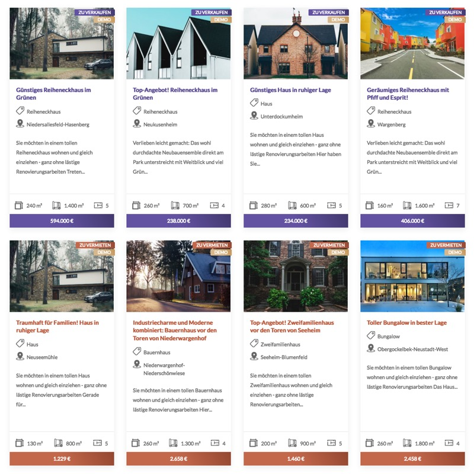

# Listenansicht

Immobilienlisten sind flexibel konfigurierbar und können grundsätzlich in beliebiger Anzahl eingebunden werden.

?> Ist der beliebte Page/Site Builder [Elementor](https://de.wordpress.org/plugins/elementor/) im Einsatz, können Listenansichten – alternativ zur nachfolgend beschriebenen Shortcode-Variante – auch per [Elementor-Widget](https://docs.immonex.de/kickstart-elementor/#/elementor-immobilien-widgets/liste-grid) eingebunden und konfiguriert werden. Voraussetzung hierfür ist das kostenfreie [Kickstart Elementor Add-on](https://immonex.dev/wordpress-immobilien-plugin/immonex-kickstart-elementor).

## Shortcode

`[inx-property-list]`

!> In der Standardkonfiguration werden **keine** Immobilien angezeigt, die als [Referenzobjekt](/referenzen-status-flags) markiert sind. Hierfür ist das [Shortcode-Attribut `references`](#custom-field-basiert) (oder alternativ der GET-Parameter `inx-references`) erforderlich.

### Attribute

Mit den folgenden Attributen können Art und Umfang der anzuzeigenden Immobilien festgelegt werden.

#### Taxonomiebasiert

| Name | Beschreibung |
| ---- | ------------ |
| `property-type` | Objektart(en) ([inx_property_type](/beitragsarten-taxonomien)) |
| `marketing-type` | Vermarktungsart(en) ([inx_marketing_type](/beitragsarten-taxonomien)) |
| `type-of-use` | Nutzungsart(en) ([inx_type_of_use](/beitragsarten-taxonomien)) |
| `project` | Projekt/Gruppe ([inx_project](/beitragsarten-taxonomien)) |
| `locality` | Ort(e) ([inx_location](/beitragsarten-taxonomien)) |
| `labels` | Label(s) ([inx_label](/beitragsarten-taxonomien)) |
| `features` | Ausstattungsmerkmale ([inx_feature](/beitragsarten-taxonomien)) |

Als Werte taxonomiebasierter Attribute werden immer die **Slugs** der jeweiligen Begriffe (*Terms*) verwendet, entweder einzeln oder in Form einer kommagetrennte Liste mehrerer Slugs.

Mit einem `-` vor dem Slug können auch Immobilien **ausgeschlossen** werden, denen der betreffende Term zugeordnet ist.

!> Ist neben der Listenansicht auch ein [Suchformular](suchformular) in der Seite enthalten, muss der Typ der zugehörigen Select-Elemente ggfls. per [Filterfunktion](suchformular?id=taxonomie-mehrfachauswahl) umgestellt werden, wenn bei bestimmten Taxonomien eine **Mehrfachauswahl** möglich sein soll.

##### Beispiele

Nur Einfamilienhäuser (Kaufobjekte):\
`[inx-property-list property-type="einfamilienhaus" marketing-type="zu-verkaufen"]`

Alle Häuser außer Einfamilienhäuser:\
`[inx-property-list property-type="haeuser, -einfamilienhaus"]`

Neue Bungalows, Villen und Kioske:\
`[inx-property-list property-type="bungalow, villa, kiosk" labels="neu"]`

Grundstücke (alle Unterkategorien) in Berlin:\
`[inx-property-list property-type="grundstuecke" locality="berlin"]`

#### Custom-Field-basiert

| Name | Beschreibung / Attributwerte |
| ---- | ----------------------------- |
| `min-rooms` | Mindestanzahl Zimmer/Räume als **Ganzzahl**, z. B. *4* ([\_inx_primary_rooms](/beitragsarten-taxonomien#custom-fields)) |
| `min-area` | Mindestfläche als **Ganzzahl** in m², z. B. *120* ([\_inx_primary_area](/beitragsarten-taxonomien#custom-fields)) |
| `price-range` | Preisrahmen als kommagetrennte Min/Max-Ganzzahlen, z. B. *200000,400000* ([\_inx_primary_price](/beitragsarten-taxonomien#custom-fields)) |
| `iso-country` | Auswahl per ISO3-Code auf ein bestimmte Länder beschränken, z. B. *DEU* oder *DEU,AUT,ESP* ([\_immonex_iso_country](/beitragsarten-taxonomien#custom-fields)) |
| `references` | Referenzobjekte berücksichtigen/anzeigen (*Flag* [\_immonex_is_reference](/beitragsarten-taxonomien#custom-fields)) |
| | *no* : nein (Standardvorgabe) |
| | *yes* : ja |
| | *only* : ausschließlich |
| `masters` | Gruppen-Master-Objekte berücksichtigen/anzeigen ([\_immonex_group_master](/beitragsarten-taxonomien#custom-fields)) |
| | *yes* : ja (Standardvorgabe) |
| | *no* : nein |
| | *only* : ausschließlich |
| `available` | Objekt-Verfügbarkeit **explizit** berücksichtigen (*Flag* [\_immonex_is_available](/beitragsarten-taxonomien#custom-fields)) |
| | *yes* : nur verfügbare Immobilien |
| | *no* : nur **nicht** verfügbare Immobilien |
| `reserved` | Reserviert-Status **explizit** berücksichtigen (*Flag* [\_immonex_is_reserved](/beitragsarten-taxonomien#custom-fields)) |
| | *yes* : nur reservierte Immobilien |
| | *no* : nur **nicht** reservierte Immobilien |
| `sold` | Verkauft/Vermietet-Status **explizit** berücksichtigen (*Flag* [\_immonex_is_sold](/beitragsarten-taxonomien#custom-fields)) |
| | *yes* : nur verkaufte/vermietete Immobilien |
| | *no* : nur **nicht** verkaufte/vermietete Immobilien |
| `featured` | Empfohlen-Status **explizit** berücksichtigen (*Flag* [\_immonex_is_featured](/beitragsarten-taxonomien#custom-fields)) |
| | *yes* : nur empfohlene Immobilien |
| | *no* : nur **nicht** empfohlene Immobilien |
| `front-page-offer` | Startseiten-Angebote **explizit** berücksichtigen (*Flag* [\_immonex_is_front_page_offer](/beitragsarten-taxonomien#custom-fields)) |
| | *yes* : nur Startseiten-Angebote |
| | *no* : nur **nicht** als Startseiten-Angebote markierte Immobilien |
| `disable_links` | Detailseiten-Verlinkung anhand des Objektstatus **deaktivieren** |
| | *all* : alle Links deaktivieren |
| | *unavailable* : nicht mehr verfügbare Immobilien (reserviert, verkauft etc.) nicht verlinken |
| | *references* : Referenzobjekte nicht verlinken |

##### Beispiele

Häuser ab 120 m² Wohnfläche mit mindestens vier Zimmern:\
`[inx-property-list property-type="haeuser" min-rooms=4 min-area=120]`

Alle [Referenzobjekte](/referenzen-status-flags):\
`[inx-property-list references="only"]`

Nur [Master-Objekte](/referenzen-status-flags#master-objekte):\
`[inx-property-list masters="only"]`

#### Allgemein

Mit den folgenden Attributen kann die Auswahl der Immobilien weiter eingegrenzt sowie die Sortierung und Darstellung angepasst werden.

| Name | Beschreibung / Attributwerte |
| ---- | ---------------------------- |
| `cid` | individuelle **HTML-DOM-ID** des Containerelements der Komponente (optional, Standard: *inx-property-list*, bei Mehrfacheinbindung zus. Instanzen inkl. laufender Nummer *inx-property-list-2*, *-3*...) |
| `author` | Objekte nach **Autor(en)** filtern (kommagetrennte Liste von **Benutzer-IDs** oder **Login-Namen**; **Minus zum Ausschließen** bestimmter Benutzer, z. B. *128,264*, *maklerx,agentur-y,dieter.demo* oder *-1,-2,-10*) |
| `limit` | **Gesamtanzahl** der anzuzeigenden Objekte begrenzen |
| `limit-page` | Anzahl der Objekte **pro Seite** begrenzen (Standardvorgabe: ***immonex → Einstellungen → Design & Struktur → Immobilien pro Seite***  bzw. die unter ***Einstellungen → Lesen*** hinterlegte max. Beitragsanzahl für Blogseiten bei Kickstart < 1.8) |
| `sort` | Sortierung der Liste anhand eines oder mehrerer [Sortierungs-Keys](sortierung#standard-optionen) (Mehrfachangaben als kommagetrennte Liste) |
| `force-lang` | Sprachcode, um in [Sonderfällen (mehrsprachige Websites)](/anpassung-erweiterung/uebersetzung-mehrsprachigkeit#sonderfälle) eine bestimmte Sprache für die verlinkten Immobilien-Detailseiten festzulegen (z. B. *de*, *en*...) |
| `no_results_text` | **eigener bzw. alternativer** Text, der anstatt der Standardmeldung (***immonex → Einstellungen → Immobiliensuche → Keine-Ergebnisse-Meldung***) angezeigt werden soll, wenn keine zu den Auswahl-/Suchkriterien passenden Immobilienangebote vorhanden sind (leerer String = keine Meldung) |
| `template` | alternative/benutzerdefinierte **Template-Datei** im Skin-Ordner zum Rendern der Inhalte verwenden (Dateiname ohne .php, z. B. *property-list/slider*) |

##### Beispiele

Maximal vier Objekte des Benutzers *Dieter Demo*, sortiert nach Preis aufsteigend und anschließend nach Aktualisierungsdatum absteigend:\
`[inx-property-list author="dieter.demo" limit=4 sort="price_asc, date_desc"]`

Liste mit benutzerdefinierter Meldung, falls keine passenden Immobilien vorhanden sind:\
`[inx-property-list no_results_text="Oh nein, nichts gefunden! 🤬"]`

Immobilienliste als *Slider* (Karussell) anzeigen:\
`[inx-property-list template="property-list/slider"]`

## Dynamische Aktualisierung

Die Inhalte von Listenansichten können **optional** anhand der aktuellen Kriterien eines in der gleichen Seite enthaltenen [Immobilien-Suchformulars](suchformular) dynamisch (ohne Neuladen der Seite) aktualisiert werden. Diese Funktion kann entweder global (für alle Komponenten auf allen Seiten) in den Plugin-Optionen unter ***immonex → Einstellungen → Immobiliensuche*** oder per Attribut `dynamic-update` des [Suchformular-Shortcodes](suchformular#dynamische-listen-amp-karten) aktiviert werden.

## Erweiterte Anpassungen

- [Templates](/anpassung-erweiterung/skins#partiell)
- [Custom Skin](/anpassung-erweiterung/standard-skin#archiv-amp-listenansicht)
