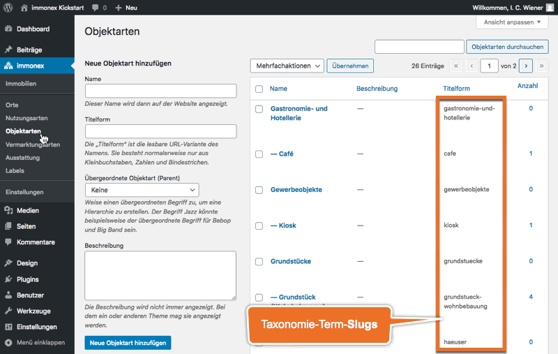

# Listenansicht

Immobilienlisten sind flexibel konfigurierbar und können grundsätzlich in beliebiger Anzahl eingebunden werden.

## Shortcode

`[inx-property-list]`

> In der Standardkonfiguration werden **keine** Immobilien angezeigt, die als [Referenzobjekt](../schnellstart/import.html#Referenzobjekte) markiert sind. Hierfür ist das [Shortcode-Attribut `references`](#Custom-Field-basiert) (oder alternativ der GET-Parameter `inx-references`) erforderlich.

### Attribute

Mit den folgenden Attributen können Art und Umfang der anzuzeigenden Immobilien festgelegt werden.

#### Taxonomienbasiert

| Name | Beschreibung |
| ---- | ------------ |
| `property-type` | Objektart(en) ([inx_property_type](../beitragsarten-taxonomien.html)) |
| `marketing-type` | Vermarktungsart(en) ([inx_marketing_type](../beitragsarten-taxonomien.html)) |
| `type-of-use` | Nutzungsart(en) ([inx_type_of_use](../beitragsarten-taxonomien.html)) |
| `locality` | Ort(e) ([inx_location](../beitragsarten-taxonomien.html)) |
| `labels` | Label(s) ([inx_label](../beitragsarten-taxonomien.html)) |
| `features` | Ausstattungsmerkmale ([inx_feature](../beitragsarten-taxonomien.html)) |

Als Werte taxonomiebasierter Attribute werden immer die **Slugs** der jeweiligen Begriffe (<i>Terms</i>) verwendet (einzeln oder mehrfach als kommagetrennte Liste).

##### Beispiele

Nur Einfamilienhäuser (Kaufobjekte):
`[inx-property-list property-type="einfamilienhaus" marketing-type="zu-verkaufen"]`

Neue Bungalows, Villen und Kioske:
`[inx-property-list property-type="bungalow, villa, kiosk" labels="neu"]`

Grundstücke (alle Unterkategorien) in Berlin:
`[inx-property-list property-type="grundstuecke" locality="berlin"]`

#### Custom-Field-basiert

| Name | Beschreibung / Attributwerte |
| ---- | ----------------------------- |
| `min-rooms` | Mindestanzahl Zimmer/Räume als **Ganzzahl**, z. B. *4* ([\_inx_primary_rooms](../beitragsarten-taxonomien.html#Custom-Fields)) |
| `min-area` | Mindestfläche als **Ganzzahl** in m², z. B. *120* ([\_inx_primary_area](../beitragsarten-taxonomien.html#Custom-Fields)) |
| `price-range` | Preisrahmen als kommagetrennte Min/Max-Ganzzahlen, z. B. *200000,400000* ([\_inx_primary_price](../beitragsarten-taxonomien.html#Custom-Fields)) |
| `iso-country` | Auswahl per ISO3-Code auf ein bestimmte Länder beschränken, z. B. *DEU* oder *DEU,AUT,ESP* ([\_immonex_iso_country](../beitragsarten-taxonomien.html#Custom-Fields)) |
| `references` | Referenzobjekte berücksichtigen/anzeigen (<i>Flag</i> [\_immonex_is_reference](../beitragsarten-taxonomien.html#Custom-Fields)) |
| | *no* : nein (Standardvorgabe) |
| | *yes* : ja |
| | *only* : ausschließlich |
| `available` | Objekt-Verfügbarkeit **explizit** berücksichtigen (<i>Flag</i> [\_immonex_is_available](../beitragsarten-taxonomien.html#Custom-Fields)) |
| | *yes* : nur verfügbare Immobilien |
| | *no* : nur **nicht** verfügbare Immobilien |
| `reserved` | Reserviert-Status **explizit** berücksichtigen (<i>Flag</i> [\_immonex_is_reserved](../beitragsarten-taxonomien.html#Custom-Fields)) |
| | *yes* : nur reservierte Immobilien |
| | *no* : nur **nicht** reservierte Immobilien |
| `sold` | Verkauft/Vermietet-Status **explizit** berücksichtigen (<i>Flag</i> [\_immonex_is_sold](../beitragsarten-taxonomien.html#Custom-Fields)) |
| | *yes* : nur verkaufte/vermietete Immobilien |
| | *no* : nur **nicht** verkaufte/vermietete Immobilien |
| `featured` | Empfohlen-Status **explizit** berücksichtigen (<i>Flag</i> [\_immonex_is_featured](../beitragsarten-taxonomien.html#Custom-Fields)) |
| | *yes* : nur empfohlene Immobilien |
| | *no* : nur **nicht** empfohlene Immobilien |
| `front-page-offer` | Startseiten-Angebote **explizit** berücksichtigen (<i>Flag</i> [\_immonex_is_front_page_offer](../beitragsarten-taxonomien.html#Custom-Fields)) |
| | *yes* : nur Startseiten-Angebote |
| | *no* : nur **nicht** als Startseiten-Angebote markierte Immobilien |
| `disable_links` | Detailseiten-Verlinkung anhand des Objektstatus **deaktivieren** |
| | *all* : alle Links deaktivieren |
| | *unavailable* : nicht mehr verfügbare Immobilien (reserviert, verkauft etc.) nicht verlinken |
| | *references* : Referenzobjekte nicht verlinken |

##### Beispiele

Häuser ab 120 m² Wohnfläche mit mindestens vier Zimmern:
`[inx-property-list property-type="haeuser" min-rooms=4 min-area=120]`

Alle Referenzobjekte:
`[inx-property-list references="only"]`

#### Allgemein

Mit den folgenden Attributen kann die Anzahl der einzubindenden Immobilien begrenzt und die Sortierung angepasst werden.

| Name | Beschreibung / Attributwerte |
| ---- | ---------------------------- |
| `author` | Objekte nach **Autor(en)** filtern (kommagetrennte Liste von **Benutzer-IDs** oder **Login-Namen**; **Minus zum Ausschließen** bestimmter Benutzer, z. B. *128,264*, *maklerx,agentur-y,dieter.demo* oder *-1,-2,-10*) |
| `limit` | **Gesamtanzahl** der anzuzeigenden Objekte begrenzen |
| `limit-page` | Anzahl der Objekte **pro Seite** begrenzen (Standardvorgabe: unter ***Einstellungen → Lesen*** hinterlegte max. Beitragsanzahl für Blogseiten) |
| `sort` | Sortierung der Liste anhand eines oder mehrerer [Sortierungs-Keys](sortierung.html#Standard-Optionen) (Mehrfachangaben als kommagetrennte Liste) |
| `force-lang` | Sprachcode, um in [**Sonderfällen** (mehrsprachige Websites)](../anpassung-erweiterung/uebersetzung-mehrsprachigkeit.html#Sonderfalle) eine bestimmte Sprache für die verlinkten Immobilien-Detailseiten festzulegen (z. B. *de*, *en*...) |

##### Beispiel

Maximal vier Objekte des Benutzers *Dieter Demo*, sortiert nach Preis aufsteigend und anschließend nach Aktualisierungsdatum absteigend:
`[inx-property-list author="dieter.demo" limit=4 sort="price_asc, date_desc"]`

## Erweiterte Anpassungen

- [Templates](../anpassung-erweiterung/skins.html#Partiell)
- [Custom Skin](../anpassung-erweiterung/standard-skin.html#Archiv-amp-Listenansicht)
