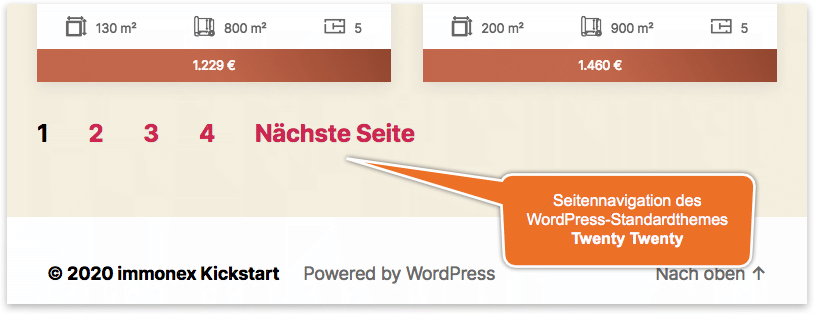

# Seitennavigation

Wie die Auswahl der Sortierreihenfolge wird auch die Seitennavigation immer in Kombination mit einer [Immobilien-Listenansicht](liste.html) eingebunden. Sofern die entsprechende Template-Datei des ausgewählten [Skins](../anpassung-erweiterung/skins.html) keine andere Ausgabeform vorsieht, entsprechen Layout und Optik der Vorgabe des **aktiven Themes**.

Seitennavigation des WordPress-Standard-Themes <i>Twenty Twenty</i>

## Shortcode

`[inx-pagination]`

## Erweiterte Anpassungen

- [Templates](../anpassung-erweiterung/skins.html#Partiell)
- [Custom Skin](../anpassung-erweiterung/standard-skin.html#Archiv-amp-Listenansicht)
