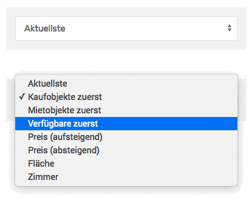

# Sortierung

Soll eine [Immobilien-Listenansicht](liste) sortierbar gemacht werden, wird hierfür typischerweise eine Dropdown-Box mit den verfügbaren Optionen darüber eingebunden.

Sortieroptionen für Immobilienlisten

## Shortcode

`[inx-filters-sort]`

### Attribute

| Name | Beschreibung |
| ---- | ------------ |
| `cid` | individuelle **HTML-DOM-ID** des Containerelements der Komponente (optional, Standard: *inx-property-filters*) |
| `elements` | Umfang und Reihenfolge der Sortieroptionen in der Liste (optional) |
| `exclude` | Bestimmte Sortieroptionen explizit ausschließend (optional) |
| `default` | Key der standardmäßig ausgewählten Sortieroption (optional) |
| `template` | alternative/benutzerdefinierte **Template-Datei** im Skin-Ordner zum Rendern der Inhalte verwenden (Dateiname ohne .php, z. B. *property-list/foobar*) |

Via `elements` und `exclude` können kommagetrennte Listen der u. g. Elementnamen (Keys) übergeben werden.

Das Attribut `default` wird nur dann benötigt, wenn die Standardsortierung **nicht** per [GET-Parameter](/schnellstart/einbindung.html#get-parameter) `inx-sort` oder [Filterfunktion](/anpassung-erweiterung/filter-inx-default-sort-key) definiert wird bzw. die Standarsortierung **nicht** dem ersten Eintrag entspricht.

> Der Wert des `default` Attributs hat **keinen** direkten Einfluss auf die eigentliche Sortierung einer Immobilienliste auf der gleichen Seite. **Ohne** die Definition via GET-Parameter oder Filterfunktion muss eine abweichende Standardsortierung hier ebenfalls per Shortcode-Attribut gesetzt werden.

### Beispiele

nur Preis auf- oder absteigend (Standard) als Sortieroptionen\
`[inx-filters-sort elements="price_asc, price_desc" default="price_desc"]`

Fläche und Zimmeranzahl aus der Optionsliste entfernen\
`[inx-filters-sort exclude="area_asc, rooms_asc"]`

## Standard-Optionen

Die Auswahlbox enthält die folgenden Optionen. Die zugehörigen **Keys** können auch als Wert für das Sortierattribut des [Listenansicht-Shortcodes](liste#shortcode) verwendet werden.

| Name (Key) | Sortierung |
| ---------- | ---------- |
| Aktuellste (`date_desc`) | Beitragsdatum absteigend (entspricht dem Datum der letzten Objekt-Aktualisierung in der Maklersoftware) |
| Kaufobjekte zuerst (`marketing_type_desc`) | Objekte mit *Verkauft-Flag* (*1* im Custom Field `_inx_is_sale`) oben |
| Mietobjekte zuerst (`marketing_type_asc`) | Objekte ohne *Verkauft-Flag* (*0* im Custom Field `_inx_is_sale`) oben |
| Verfügbare zuerst (`availability_desc`) | Objekte mit *Verfügbarkeits-Flag* (*1* im Custom Field `_immonex_is_available`) oben |
| Preis aufsteigend (`price_asc`) | Primärpreis (Custom Field `_inx_primary_price`) aufsteigend |
| Preis absteigend (`price_desc`) | Primärpreis (Custom Field `_inx_primary_price`) absteigend |
| Fläche aufsteigend (`area_asc`) | Primärfläche (Custom Field `_inx_primary_area`) aufsteigend |
| Zimmer aufsteigend (`rooms_asc`) | Primäranzahl Zimmer/Räume (Custom Field `_inx_primary_rooms`) aufsteigend |
| Distanz (`distance`) | **bei aktiver Umkreissuche:** Distanz zum ausgewählten Standort aufsteigend |

## Erweiterte Anpassungen

- [Filter-Referenz](/anpassung-erweiterung/filters-actions#sortierung)
- [Template](/anpassung-erweiterung/skins#partiell)
- [Custom Skin](/anpassung-erweiterung/standard-skin#archiv-amp-listenansicht)
