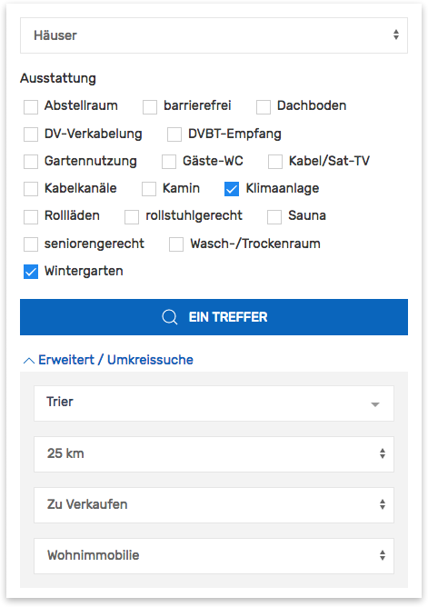

# Suchformular

Die **Immobiliensuche** ist eine zentrale Komponente des Kickstart-Plugins. Das Formular besteht aus einer beliebigen Kombination von Eingabe- und Auswahlelementen, wobei diese in einen *primären* (direkt sichtbaren) und einen *erweiterten Abschnitt* (aufklappbar) unterteilt sind. In der Standardkonfiguration enthält der erweiterte Abschnitt die Umkreissuche sowie eine Filtermöglichkeit nach Ausstattungsmerkmalen.

\
Standard-Suchformular (ohne Anpassungen)

## Shortcode

`[inx-search-form]`

### Attribute

| Name | Beschreibung |
| ---- | ------------ |
| `cid` | individuelle **HTML-DOM-ID** des Containerelements der Komponente (optional, Standard: *inx-property-search*, bei Mehrfacheinbindung zus. Instanzen inkl. laufender Nummer *inx-property-search-2*, *-3*...) |
| `elements` | Umfang, Reihenfolge und Aufteilung der Elemente (kommagetrennte Liste, optional) |
| `exclude` | **Alternative** zu `elements`: Nur die angegebenen Elemente der Standardauswahl **nicht** einbinden (kommagetrennte Liste, optional) |
| `dynamic-update` | dynamische Aktualisierung der Inhalte von Immobilienlisten und Standort-Übersichtskarten auf der gleichen Seite (ohne Neuladen) bei Änderung der Suchparameter aktivieren (optional) |
| | *all* oder *1* : alle Listen- und Kartenkomponenten der Seite (inkl. Seitennavigation und Auswahl der Sortierreihenfolge) |
| | *inx-property-map, inx-property-list* (Beispiel): kommagetrennte Liste von **HTML-DOM-IDs** der zu aktualisierenden Komponenten (eigene IDs können per Attribut `cid` festgelegt werden) |
| `results-page-id` | ID der Seite für die Ausgabe der Suchergebnisse (**optional**, Standardvorgabe: aktuelle Seite, sofern der Listen-Shortcode `[inx-property-list]` enthalten ist, ansonsten Standardseite für Immbobilienlisten) |
| `references` | Angaben wie *verkauft* oder *vermietet* werden in der Auswahlliste des Elements **Vermarktungsart** (`marketing-type`) standardmäßig ausgefiltert. Mit *yes* als Attributwert kann diese Filterung **deaktiviert** werden (optional). |
| `top-level-only` | Auswahloptionen [hierarchischer Taxonomien](/beitragsarten-taxonomien) (z. B. Objektart) (optional) auf die **Hauptkategorien** der ersten Ebene beschränken (Attributwert *1*) |
| `force-location` | Auswahloptionen des Elements `locality` (Objektstandort) auf die **Hauptkategorien** (Terms der [Taxonomie inx_location](/beitragsarten-taxonomien)) mit den angegebenen **Slugs** begrenzen (einzeln oder als kommagetrennte Liste) |
| `force-type-of-use` | Auswahloptionen des Elements `type-of-use` (Nutzungsart) auf die **Hauptkategorien** (Terms der [Taxonomie inx_type_of_use](/beitragsarten-taxonomien)) mit den angegebenen **Slugs** begrenzen (einzeln oder als kommagetrennte Liste, z. B. *wohnimmobilie*) |
| `force-property-type` | Auswahloptionen des Elements `property-type` (Objektart) auf die **Hauptkategorien** (Terms der [Taxonomie inx_property_type](/beitragsarten-taxonomien)) mit den angegebenen **Slugs** begrenzen (einzeln oder als kommagetrennte Liste, z. B. *wohnungen, haeuser*) |
| `force-marketing-type` | Auswahloptionen des Elements `marketing-type` (Vermarktungsart) auf die **Hauptkategorien** (Terms der [Taxonomie inx_marketing_type](/beitragsarten-taxonomien)) mit den angegebenen **Slugs** begrenzen (einzeln oder als kommagetrennte Liste, z. B. *zu-verkaufen*) |
| `force-feature` | Auswahloptionen des Elements `features` (Ausstattungsmerkmale) auf die **Hauptkategorien** (Terms der [Taxonomie inx_feature](/beitragsarten-taxonomien)) mit den angegebenen **Slugs** begrenzen (einzeln oder als kommagetrennte Liste) |
| `autocomplete-countries` | kommagetrennte Liste von Codes gem. [ISO 3166-1 ALPHA-2](https://www.nationsonline.org/oneworld/countrycodes.htm) der Länder, die bei der Autovervollständigung von Ortsnamen des Elements `distance-search-location` (11) berücksichtigt werden sollen (Standard bei aktivierter [Photon](https://photon.komoot.io/)-Ortssuche: *de,at,ch,lu,be,fr,nl,dk,pl,es,pt,it,gr*, bei Nutzung der [Google-Places-API](https://developers.google.com/maps/documentation/places/web-service/autocomplete) (max. 5): *de,at,ch,be,nl* |
| `autocomplete-osm-place-tags` | kommagetrennte Liste von [OpenStreetMap-Place-Tags](https://wiki.openstreetmap.org/wiki/DE&colon;Key&colon;place) zur Filterung und Priorisierung der via [Photon](https://photon.komoot.io/) ermittelten Orte (Autovervollständigung) für das Element `distance-search-location` (11) der Umkreissuche (Standard: `city,town,village,borough,suburb`) |
| `template` | alternative/benutzerdefinierte **Template-Datei** im Skin-Ordner zum Rendern der Inhalte verwenden (Dateiname ohne .php, z. B. *property-search/foobar*) |

#### Elemente

Die folgenden Schlüssel können als Werte der Attribute `elements` und `exclude`übernommen werden.

##### Primär (direkt sichtbar)

| Key | Beschreibung |
| --- | ------------ |
| `title-desc` | Textfeld zur Suche nach Schlüsselwörtern in den *regulären* Titel- und Beschreibungsfeldern der [Immobilien-Beiträge](/beitragsarten-taxonomien) (nur für Sonderfälle, im Formular wird hierfür standardmäßig `description` verwendet) |
| `description` (1) | Textfeld zur Suche nach Schlüsselwörtern in Objekttiteln, Beschreibungstexten und weiteren Feldern (z. B. Objektnummer) |
| `type-of-use` | Dropdown-Einzelauswahl* der **Nutzungsart** (Begriff bzw. *Term* der [Taxonomie inx_type_of_use](/beitragsarten-taxonomien)) |
| `property-type` (2) | Dropdown-Einzelauswahl* der **Objektart** (Term der [Taxonomie inx_property_type](/beitragsarten-taxonomien)) |
| `marketing-type` (3) | Dropdown-Einzelauswahl* der **Vermarktungsart** (Term der [Taxonomie inx_marketing_type](/beitragsarten-taxonomien)) |
| `locality` (4) | Dropdown-Einzelauswahl* des **Objekt-Standorts** - Ort/Stadt oder Orts-/Stadtteil (Term der [Taxonomie inx_location](/beitragsarten-taxonomien)) |
| `project`** | Dropdown-Einzelauswahl* eines **Projekts** ([Objektgruppe](/referenzen-status-flags#gruppierung), Term der [Taxonomie inx_project](/beitragsarten-taxonomien)) |
| `min-rooms` (5) | Auswahlslider für die minimale Zimmer-/Raumanzahl ([Custom Field \_inx_primary_rooms](/beitragsarten-taxonomien#custom-fields)) |
| `min-area` (6) | Auswahlslider für die minimale Wohnfläche in m² ([Custom Field \_inx_living_area](/beitragsarten-taxonomien#custom-fields); Maximalwert wird anhand der vorhandenen Objekte automatisch ermittelt) |
| `price-range` (7) | Auswahlslider für den Preisrahmen ([Custom Field \_inx_primary_price](/beitragsarten-taxonomien#custom-fields); Maximalpreis wird anhand der vorhandenen Objekte automatisch ermittelt) |
| `submit` (8) | Absenden-Button (Objektanzahl wird anhand der aktuell ausgewählten Kriterien dynamisch aktualisiert) |
| `reset` (9) | Link zum Zurücksetzen des Formulars |
| `toggle-extended` (10) | Link zum Aufklappen des Abschnitts der erweiterten Suche |

\* Soll eine **Mehrfachauswahl** von Terms bestimmter Taxonomien möglich sein, kann der Typ der entsprechenden Select-Elemente per [Filterfunktion](#taxonomie-mehrfachauswahl) angepasst werden (siehe unten).

** Die Projektauswahl ist standardmäßig ausgeblendet und muss über das Attribut `elements` oder den Filter-Hook [inx_search_form_elements](/anpassung-erweiterung/filter-inx-search-form-elements) explizit eingeblendet werden.

##### Erweitert (aufklappbar)

| Key | Beschreibung |
| --- | ------------ |
| `distance-search-location` (11) | Ortsauswahl mit Autovervollständigung für die Umkreissuche (siehe Shortcode-Attribute `autocomplete-countries` und `autocomplete-osm-place-tags` oben) |
| `distance-search-radius` (12) | Dropdown-Auswahl des Radius für die Umkreissuche |
| `features` (13) | Checkboxen zur Auswahl gewünschter Ausstattungsmerkmale (*Terms* der [Taxonomie inx_feature](/beitragsarten-taxonomien)) |
| `labels` | Checkboxen zur Auswahl gewünschter Labels (*Terms* der [Taxonomie inx_label](/beitragsarten-taxonomien); **optional** - nur bei expliziter Einbindung per Attribut `elements`) |

##### Taxonomie-Mehrfachauswahl

In den meisten Fällen ist die Auswahl einzelner Taxonomie-Begriffe im Suchformular am sinnvollsten. Die Select-Elemente können aber bei Bedarf mit der folgenden Filterfunktion via Hook [inx_search_form_elements](/anpassung-erweiterung/filter-inx-search-form-elements) in **Mehrfachauswahl-Elemente** umgewandelt werden:

```php
/**
 * [immonex Kickstart] Taxonomie-Auswahlelemente des Suchformulars von Einzel- auf
 * Mehrfachauswahl umstellen.
 */

add_filter( 'inx_search_form_elements', 'mysite_adjust_property_search_form_tax_select_type' );

function mysite_adjust_property_search_form_tax_select_type( $elements ) {
	$elements['type-of-use']['multiple']    = true;
	$elements['property-type']['multiple']  = true;
	$elements['marketing-type']['multiple'] = true;
	$elements['locality']['multiple']       = true;
	$elements['project']['multiple']        = true;

	return $elements;
} // mysite_adjust_property_search_form_tax_select_type
```

Die Funktion kann entweder in der Datei `functions.php` des aktiven **Child-Themes** ergänzt oder per Code-Snippets-Plugin eingebunden werden.

## Umfang/Aufteilung

Soll das Formular eine individuelle Auswahl an Elementen enthalten, wird diese mit dem **Shortcode-Attribut** `elements` in Form einer kommagetrennten Liste definiert:

`[inx-search-form elements="ELEMENT1, ELEMENT2, ELEMENT3..."]`

Beispiel: nur Objekt- und Vermarktungsart + Absenden-Button\
`[inx-search-form elements="property-type, marketing-type, submit"]`


Mit dem Attribut `exclude` können **alternativ** auch bestimmte Elemente der Standardauswahl explizit von der Ausgabe ausgenommen werden:

`[inx-search-form exclude="ELEMENT1, ELEMENT2..."]`

Beispiel: Objekt- und Vermarktungsart fix vorgeben (keine Auswahlmöglichkeit)\
`[inx-search-form exclude="property-type, marketing-type" property-type="haeuser" marketing-type="zu-verkaufen"]`

### Erweiterte Suche

Um den Abschnitt für die erweiterten Suchelemente verfügbar zu machen, muss das Element `toggle-extended` in der Elementliste enthalten sein:\
`[inx-search-form elements="description, property-type, marketing-type, submit, toggle-extended, distance-search-location, distance-search-radius, features"]`

\
Formular mit Abschnitt für erweiterte Suchelemente

Wird ein *+* an den **Namen eines Elements** angehangen, wird dieses (unabhängig von dessen Standard-Konfiguration) der erweiterten Suche zugeordnet. Umgekehrt kann mit einem *-* ein normalerweise erweitertes Element dem Abschnitt der primären, direkt sichtbaren Suchelemente zugeordnet werden.

Beispiel: Ausstattungsliste (`features`) und Vermarktungs-/Nutzungsarten-Auswahl (`marketing-type` und `type-of-use`) in den jeweils anderen Abschnitt verschieben\
`[inx-search-form elements="property-type, features-, submit, toggle-extended, distance-search-location, distance-search-radius, marketing-type+, type-of-use+"]`

\
Formular mit Ausstattungsmerkmalen im primären und Vermarktungs-/Nutzungsarten im erweiterten Abschnitt

## Dynamische Listen & Karten

Bei Änderungen der Suchkriterien wird die Anzahl der Ergebnisse auf dem Absenden-Button (8) entsprechendend aktualisiert. Analog dazu ist es ab Kickstart Version 1.6.0 optional möglich, auch die Inhalte der [Immobilienlisten](liste) und/oder [Standort-Übersichtskarten](karte), die sich auf der gleichen Seite befinden, dynamisch (ohne Neuladen) zu aktualisieren. Diese Funktion kann global, d. h. für alle Komponenten auf allen Seiten, in den Plugin-Optionen unter ***immonex → Einstellungen → Immobiliensuche*** aktiviert werden:


Alternativ kann die dynamische Aktualisierung mit dem Shortcode-Attribut `dynamic-update` aber auch auf einzelne Seiten oder spezifische Komponenten beschränkt werden. Als Attributwert werden hierbei entweder die **HTML-DOM-IDs** der betr. Container-Elemente (einzeln bzw. als kommagetrennte Liste) oder *all* respektive *1* für alle Kickstart-Komponenten der gleichen **Seite** angegeben. (IDs zusätzlicher Elemente für die Seitennavigation oder die Filterung/Sortierung der Immobilienlisten müssen hier **nicht** aufgeführt werden, da diese automatisch mit aktualisiert werden.)

Beispiel: Listenansicht (DOM-ID *inx-property-list*) und Immobilienkarte (*inx-property-map*) dynamisch aktualisieren\
`[inx-search-form dynamic-update="inx-property-list, inx-property-map"]`

Bei paralleler Aktivierung der globalen Option hat die per Shortcode-Attribut definierte Angabe eine höhere Priorität. Im Beispiel sind die standardmäßig vergebenen DOM-IDs der Elemente für Listen- und Kartenansichten genannt, wobei hier bei einer Mehrfacheinbindung noch eine laufende Nummer angehangen wird: Bei zwei Listen in einer Seite erhalten diese bspw. die IDs *inx-property-list* und *inx-property-list-2*. Sollen stattdessen individuelle IDs vergeben werden, ist dies mit dem Attribut `cid` möglich:

Beispiel: Suchformular und Instanz einer Listenansicht mit der DOM-ID *immo-liste* einfügen, die bei Änderung der Suchkriterien aktualisiert wird\
`[inx-search-form dynamic-update="immo-liste"]`
`[inx-property-list cid="immo-liste"]`

## Erweiterte Anpassungen

- [Filter-Referenz](/anpassung-erweiterung/filters-actions#immobiliensuche-listen)
- [Templates](/anpassung-erweiterung/skins#partiell)
- [Custom Skin](/anpassung-erweiterung/standard-skin#suchformular)
