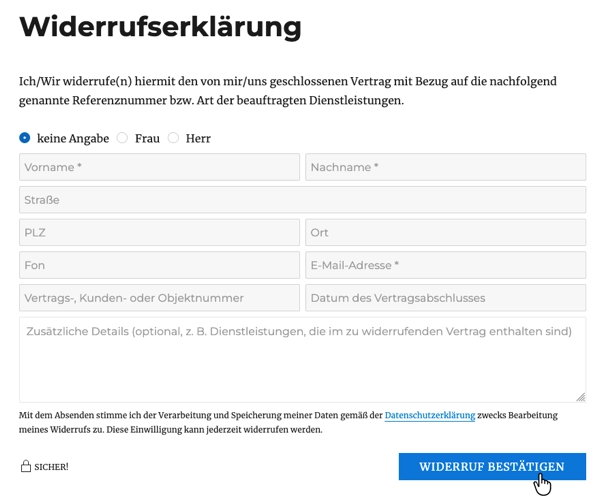
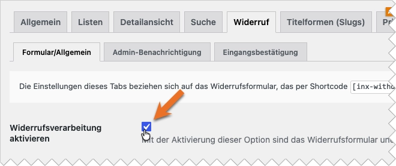
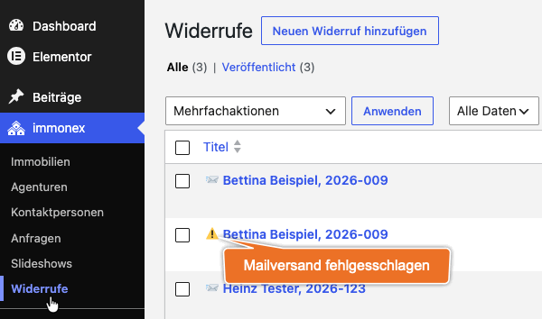

# Widerrufsformular

Seit dem 19.06.2026 muss in Maklerwebsites, die Immobilienangebote enthalten, ein digitaler Widerrufsprozess für hierüber geschlossene Verträge nach [§ 356a BGB](https://www.gesetze-im-internet.de/bgb/__356a.html) angeboten werden („*Widerrufsbutton*“).

Mit dem in Kickstart integrierten *Widerrufs-Workflow* werden Immobilienmakler dabei unterstützt, die gesetzlichen Anforderungen zu erfüllen: Neben einem einfachen und **leicht bedienbaren Formular**, über das ein Verbraucher alle für die Zuordnung seines Widerrufs benötigten Angaben übermitteln kann, gehört hierzu auch eine **automatisch versendete Eingangsbestätigung** (inkl. Datum und Uhrzeit des Eingangs).

?> In den Plugin-Optionen sollten unter [***Allgemein → Grundeinstellungen → E-Mail***](/schnellstart/einrichtung?id=e-mail) der vollständige Name des Unternehmens inkl. Rechtsform sowie die Adresse (Hauptsitz) hinterlegt werden. Diese Angaben werden automatisch in die Eingangsbestätigungen übernommen, sofern die entsprechenden *Twig-Variablen* nicht aus dem Mail-Template entfernt wurden.

## Aktivierung und Einbindung

Die Widerrufsverarbeitung ist **optional** und muss daher zunächst in den [Plugin-Optionen](/schnellstart/einrichtung?id=widerruf) aktiviert werden:

***immonex → Einstellungen → Widerruf → [Formular/Allgemein] Widerrufsverarbeitung aktivieren***

Im Anschluss sollte eine neue Seite (bspw. mit dem Titel „*Widerrufserklärung*“) angelegt und das Formular mit dem u. g. Shortcode eingefügt werden.

Diese Seite muss dann mit dem sog. *Widerrufsbutton* mit der Bezeichnung „**Vertrag widerrufen**“ verlinkt werden, der auf **jeder Seite** der Website – vorzugsweise im Kopf- oder Fußbereich – in **klar erkennbarer Form** verfügbar sein muss. Sprich, es muss sich nicht zwingend um eine Schaltfläche handeln, auch für einen Textlink o. ä. gilt aber, dass dieser sich optisch deutlich von den umgebenden Elementen abheben muss.

!> Neben der korrekten Verlinkung ist ggf. auch eine Anpassung bzw. Erweiterung der **Datenschutzerklärung** notwendig, sofern diese noch keinen Hinweis auf die Möglichkeit der Formularnutzung enthält.

### Shortcode

`[inx-withdrawal-form]`

### Spamschutz

Das Formular ist standardmäßig mit *Honeypot-Feldern* sowie einer *Zeitschwelle* gegen Spam und Bots abgesichert ([Allgemein → Grundeinstellungen → Formular-Spamschutz](/schnellstart/einrichtung?id=formular-spamschutz)). Bei Bedarf kann zusätzlich eine [Cloudflare-Turnstile-Integration](/schnellstart/einrichtung?id=cloudflare-turnstile) aktiviert werden.

## Speicherung

Die Daten eingegangener Widerrufserklärungen werden nicht nur per Mail versendet, sondern auch in der WP-Datenbank gespeichert. Hierfür wird ein dedizierter [individueller Beitragstyp](/beitragsarten) (`inx_withdrawals`) registriert.

Die Widerrufe sind im WordPress-Backend unter ***immonex → Widerrufe*** verfügbar.

?> Bei Einträgen, die in der Liste mit einem ⚠️ vor dem Titel markiert sind, ist ein Problem im Zusammenhang mit dem Mailversand aufgetreten, d. h. diese wurden möglicherweise nicht per Mail übermittelt.

## Einrichtung und erweiterte Anpassung

- [Plugin-Optionen: Widerruf](/schnellstart/einrichtung?id=widerruf)
- [Plugin-Optionen: Rechtliches](/schnellstart/einrichtung?id=rechtliches)
- [Plugin-Optionen: Formular-Spamschutz](/schnellstart/einrichtung?id=formular-spamschutz)
- [Plugin-Optionen: E-Mail](/schnellstart/einrichtung?id=e-mail)
- [Filter-Referenz](/anpassung-erweiterung/filters-actions?id=formular-widerrufsverarbeitung)
- [Templates](/anpassung-erweiterung/skins#partiell)
- [Custom Skin](/anpassung-erweiterung/standard-skin#widerrufsformular)