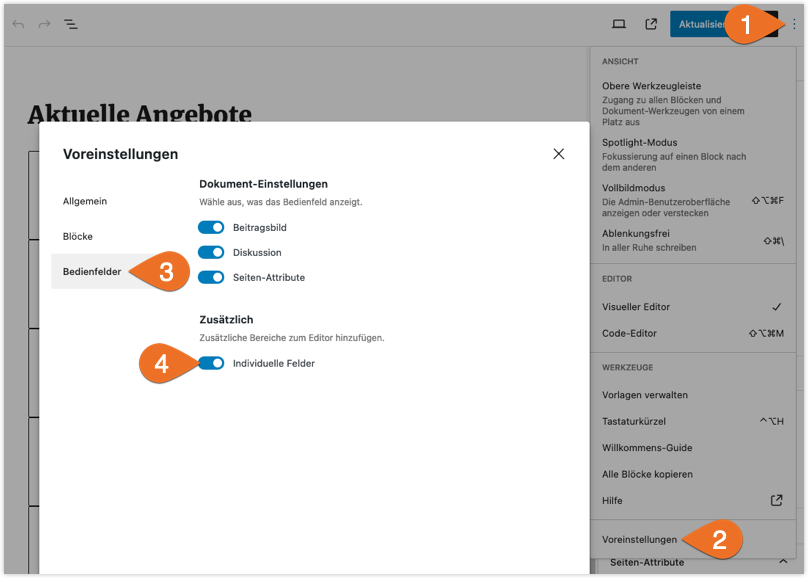
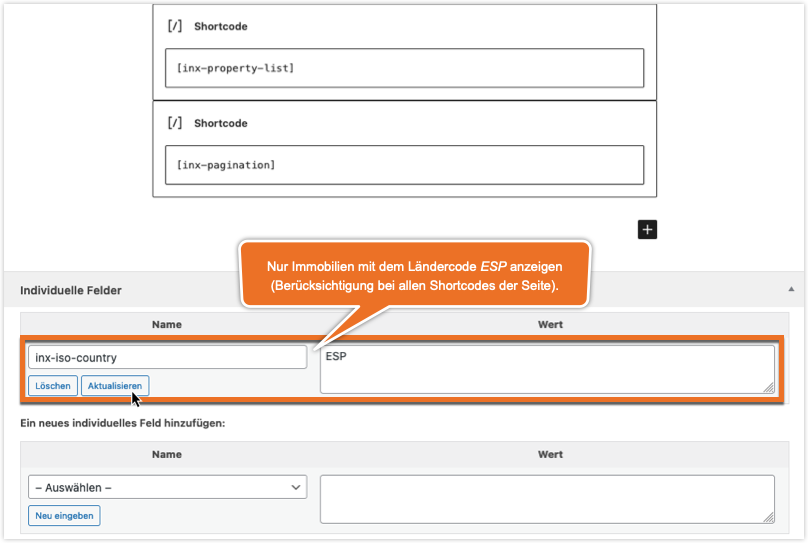

# Frontend-Komponenten

Mit Kickstart sind "out of the box" eine [Immobilien-Übersichtsseite](/beitragsarten-taxonomien#immobilien-beiträge) sowie eine vollständige [Detailansicht](/komponenten/detailansicht#standard-template) verfügbar – jeweils inkl. [Seitenleiste](sidebars) zur Ergänzung von Widgets. Die vom Plugin bereitgestellten Immobilien-Komponenten können aber auch mit den folgenden **Shortcodes** in beliebiger Anzahl und Kombination in Seiten oder andere Inhaltselemente eingefügt werden.

Die in der gleichen Seite eingebundenen Komponenten sind grundsätzlich unabhängig voneinander, beeinflussen sich also nicht **direkt** gegenseitig. So wirkt sich bspw. die Änderung einer Auswahl im Suchformular erst **nach dem Absenden** bzw. dem Aktualisieren der kompletten Seite auf eine Listenansicht aus. Auch die Konfiguration einer Komponente per **Shortcode-Attribut** wirkt sich **nicht** automatisch auf die anderen Komponenten der Seite aus.

?> Eine **komponentenübergreifende** Konfiguration ist aber mittels [globalen Parametern](#globale-abfrage-parameter) möglich.

## Suchformular

`[inx-search-form]`

Das Formular für die Suche nach Immobilien enthält in der Standardkonfiguration relativ umfangreiche Auswahlmöglichkeiten inkl. Umkreissuche etc. Mit den Attributen `elements` und `exclude` kann eine individuelle Auswahl an Elementen definiert werden.

### Beispiele

nur Nutzungsart, Objektart und Absenden-Button einbinden:
`[inx-search-form elements="type-of-use, property-type, submit"]`

Auswahl der Immobilien- und Vermarktungsart nicht einbinden:
`[inx-search-form exclude="property-type, marketing-type"]`

Details und vollständige Elementliste: [Komponenten → Suchformular](/komponenten/suchformular)

## Standortkarte

`[inx-property-map]`

Dieser Shortcode generiert eine Karte auf OpenStreetMap-Basis, die anklickbare Immobilien-Standortmarker inkl. zugehörigen Info-Overlays mit verlinkten Objektfotos und -bezeichnungen enthält.

Details: [Komponenten → Karte](/komponenten/karte)

## Sortierung

`[inx-filters-sort]`

Mit diesem Shortcode wird aktuell bei Verwendung des Standard-Skins ein Balken mit einer einzelnen Dropdown-Auswahlliste gängiger Sortiermöglichkeiten eingebunden. Hier könnten zukünftig weitere Optionen in Sachen Filterung ergänzt werden.

Für die explizite Festlegung der Elemente der Auswahlliste bzw. das Ausschließen bestimmter Elemente stehen die optionalen Shortcode-Attribute `elements` und `exclude` zur Verfügung, die jeweils kommagetrennte Listen von Element-Keys enthalten können. Ebenfalls optional ist das Attribut `default`, mit dem Standardsortierung festgelegt werden kann.

!> Die per Shortcode-Attribut übergebene Standardsortierung hat keinen direkten Einfluss auf die eigentliche Sortierung der in der gleichen Seite enthaltenen Immobilien-Liste. Diese Angabe kann "global" per [GET-Variable](#get-variablen), [Custom Field](#individuelle-felder) oder [Filterfunktion](/anpassung-erweiterung/filter-inx-default-sort-key) gesetzt werden oder alternativ auch im Listen-Shortcode hinterlegt werden. (Bei den GET-/Custom-Field- und Filter-Varianten wird das `default` Attribut nicht benötigt.)

### Beispiele

nur Preis auf- oder absteigend (Standard) als Sortieroptionen
`[inx-filters-sort elements="price_asc, price_desc" default="price_desc"]`

Fläche und Zimmeranzahl aus der Optionsliste entfernen
`[inx-filters-sort exclude="area_asc, rooms_asc"]`

Details: [Komponenten → Sortierung](/komponenten/sortierung)

## Listenansicht

`[inx-property-list]`

Umfang, Darstellungsart und Sortierung der angezeigten Immobilien können mit **Shortcode-Attributen** bestimmt werden, nachfolgend die gängigsten. Bei der [taxonomiebasierten Auswahl](/beitragsarten-taxonomien#Taxonomien) und der Sortierung sind auch mehrere, kommagetrennte Angaben möglich.

- **Objektart/en** (Taxonomie): `property-type="OBJEKTART-SLUG"` / `property-type="SLUG1, SLUG2, SLUG3"`\
  Beispiel: nur Einfamilienhäuser\
  `[inx-property-list property-type="einfamilienhaus"]`\
  Beispiel: Ein- und Mehrfamilienhäuser\
  `[inx-property-list property-type="einfamilienhaus, mehrfamilienhaus"]`

- **Vermarktungsart/en** (Taxonomie): `marketing-type="VERMARKTUNGSART-SLUG"` / `marketing-type="SLUG1, SLUG2, SLUG3..."`\
  Beispiel: nur Kaufobjekte\
  `[inx-property-list marketing-type="zu-verkaufen"]`

- **Ort/e** (Taxonomie): `locality="ORTSNAME-SLUG"` / `locality="SLUG1, SLUG2, SLUG3..."`\
  Beispiel: Immobilien in Trier-West und Berlin\
  `[inx-property-list locality="trier-west, berlin"]`

- **Label/s** (Taxonomie): `labels="LABEL-SLUG"` / `labels="SLUG1, SLUG2, SLUG3..."`\
  Beispiel: nur als "neu" gekennzeichnete Immobilien\
  `[inx-property-list labels="neu"]`

- **maximale Objektanzahl insgesamt/pro Seite:** `limit=ANZAHL` / `limit-page=ANZAHL`\
  Beispiel: max. vier Objekte anzeigen\
  `[inx-property-list limit=4]`

- **Sortierung:** `sort="SORTIERSCHLÜSSEL"` / `sort="KEY1, KEY2..."`\
  Beispiel: Kaufobjekte zuerst, anschließend nach Preis absteigend sortieren\
  `[inx-property-list sort="marketing_type_desc, price_desc"]`

- **Template-Datei:** `template="PFAD/DATEINAME RELATIV ZUM SKIN-ORDNER"`\
  Beispiel: Immobilienliste als *Slider* (Karussell) anzeigen\
  `[inx-property-list template="property-list/slider"]`

Details und weitere Attribute: [Komponenten → Listenansicht](/komponenten/liste)

## Seitennavigation

`[inx-pagination]`

Hiermit wird die Standard-Seitennavigation in der vom Theme vorgegebenen Optik eingebunden.

Details: [Komponenten → Seitennavigation](/komponenten/seitennavigation)

## Immobilien-Details

!> Die folgenden Shortcodes kommen nur dann zum Einsatz, wenn eine **[Seite](einrichtung#immobilien-detailseite)** als Rahmenvorlage für die Immobilien-Details verwendet wird. Bei der Nutzung des Standard-Templates des Immobilien-Beitragstyps werden sie nicht benötigt.

Wurde eine [Seite als Vorlage für die Detailansicht](einrichtung#immobilien-detailseite) ausgewählt, können hier per Shortcode die gewünschten Immobilien-Inhalte in die gewünschten Layout-Container-Elemente eingebettet werden - komplett, abschnittsweise oder bei Bedarf auch *granular* in Form einzelner Angaben.

### Alle Details oder bestimmte Abschnitte

`[inx-property-details]`

Der einfachste Anwendungsfall ist der Shortcode ohne Attribute: Hiermit werden alle verfügbaren Detailabschnitte eingebunden. Die Abschnitte enthalten jeweils thematisch gruppierte Daten in einem hierzu passenden Layout.

#### Elemente einbinden

`[inx-property-details elements="ELEMENT_KEY1, ELEMENT_KEY2..."]`

Mit dem Attribut `elements` kann explizit festgelegt werden, welche Abschnitte (Elemente) mit dem Shortcode **eingebunden** werden sollen. Als Attributwert wird hierbei ein einzelner [Element-Key](/komponenten/detailansicht#Elemente-Detail-Abschnitte) oder eine kommagetrennte Liste mehrerer Keys hinterlegt.

Jedem Element können zusätzliche Attribute (z. B. eine Absatzüberschrift) nach dem Schema `ELEMENT_KEY-attribut="ATTRIBUTWERT"` zugeordnet werden. Diese werden dann beim Rendern des zugehörigen Element-Templates berücksichtigt. (Wird nur ein einzelnes Element mit dem Shortcode eingebunden, kann das Präfix `ELEMENT_KEY-` weggelassen werden.)

##### Beispiele

Haupt-Beschreibungstext der Immobilie einfügen:
`[inx-property-details elements="main_description"]`

Abschnitt mit Preisangaben und Überschrift "Preise" einfügen:
`[inx-property-details elements="prices" headline="Preise"]`

Fotogalerie und Abschnitt für Ausstattungsmerkmale einfügen, letzterer mit Überschrift "Ausstattung":
`[inx-property-details elements="gallery, features" features-headline="Ausstattung"]`

#### Elemente ausschließen

`[inx-property-details exclude="ELEMENT_KEY1, ELEMENT_KEY2..."]`

**Alternativ** können mit `exclude` bestimmte Elemente von der Einbindung **ausgenommen** werden.

##### Beispiele

Alle Abschnitte **mit Ausnahme** von Header und Footer anzeigen:
`[inx-property-details exclude="head, footer"]`

### Einzelne Angaben

`[inx-property-detail-element name="ELEMENT_ODER_FELDNAME"]`

Mit diesem Shortcode können einzelne Werte, die per [WordPress-OpenImmo-Schnittstelle](https://plugins.inveris.de/shop/immonex-openimmo2wp/) importiert wurden, in die Immobilien-Detailseite eingefügt werden. Der per Attribut übergebene Elementname kann sich hierbei auf folgende Quellen beziehen:

- Bezeichnung in der Spalte <em>Name</em> der Import-Mapping-Tabelle
- Custom-Field-Name in der Spalte <em>Destination</em>
- XML-Pfad ([XPath](https://de.wikipedia.org/wiki/XPath)) zur Abfrage beliebiger Daten innerhalb des Objekt-Import-XML-Elements `<immobilie>`

\
Ausschnitt aus der [OpenImmo2WP](https://plugins.inveris.de/shop/immonex-openimmo2wp/)-Mapping-Tabelle für Kickstart

Mit weiteren Shortcode-Attributen, z. B. `type`, `template` und `if_empty` kann die Darstellung des Elements genauer definiert werden.

##### Beispiele

Grundstücksfläche anzeigen:
`[inx-property-detail-element name="flaechen.grundstuecksflaeche"]`

Primäre Preisangabe anhand des Custom-Field-Namens abrufen und formatiert anzeigen:
`[inx-property-detail-element name="_inx_primary_price" type="price"]`

Alternative Variante der Preiseinbindung mit identischer Ausgabe:
`[inx-property-detail-element name="primaerpreis" template="{value,number,2} {currency_symbol}"]`

Energieverbrauchskennwert per [XPath](https://de.wikipedia.org/wiki/XPath)-Angabe ermitteln und Alternativtext anzeigen, falls nicht verfügbar:
`[inx-property-detail-element name="//zustand_angaben/energiepass/energieverbrauchkennwert" if_empty="Energieausweis in Vorbereitung"]`

---

Details, weitere Optionen und vollständige Elementliste: [Komponenten → Detailansicht](/komponenten/detailansicht)

## Globale Abfrage-Parameter

*Globale* Parameter für die Abfrage/Filterung und Sortierung von Immobilienobjekten (aka *Query-Parameter*) wirken sich auf die Ausgabe **aller** Kickstart-Komponenten ([Immobilienlisten](/komponenten/liste), [Standort-Übersichtskarten](/komponenten/karte), [Suchformular](/komponenten/suchformular) etc.) aus, die per Shortcode in eine Seite eingebunden werden.

So können bspw. bestimmte Objektarten, Ländercodes für den Immobilienstandort und/oder eine Sortierung vorgegeben werden – entweder als [GET-Variablen](#get-variablen) oder in Form von [individuellen Feldern](#individuelle-felder) (*Custom Fields*).

Die möglichen Angaben entsprechen weitgehend denen, die nach dem Absenden des [Standard-Suchformulars](/komponenten/suchformular) in der URL der Ergebnisseite enthalten sind. Hinzu kommen die [Status-Flags](/referenzen-status-flags) für die Selektion von Referenzobjekten & Co. sowie weitere allgemeine Parameter (Ländercode, Objektanzahl, Sortierung etc.).

Die Namen der Parameter beginnen immer mit dem Präfix `inx-` (allgemein) oder `inx-search-` (suchspezifisch). Bei **taxonomiebasierten** Parametern werden die zugehörigen **Term-Slugs** als Werte übergeben (einzeln oder als kommagetrennte Liste).

### Allgemeine Parameter

| Parameter (Key) | Beschreibung / Werte |
| --------------- | -------------------- |
| `inx-author` | Objekte nach Autor(en) filtern (kommagetrennte Liste von Benutzer-IDs oder Login-Namen; Minus zum Ausschließen bestimmter Benutzer, z. B. *128,264*, *maklerx,agentur-y,dieter.demo* oder *-1,-2,-10*) |
| `inx-iso-country` | nur Objekte im Land mit den angegebenen [ISO3-Ländercodes](https://de.wikipedia.org/wiki/ISO-3166-1-Kodierliste) anzeigen (z. B. *DEU* oder *DEU* oder *DEU,AUT,ESP*) |
| `inx-references` | Referenzen anzeigen: *yes* = ja, *no* = nein (Standard), *only* = ausschließlich |
| `inx-masters` | [Master-Objekte](/referenzen-status-flags#master-objekte) ([Objektgruppen](/referenzen-status-flags#gruppierung)) anzeigen? (*yes* = ja (Standard), *no* = nein, *only* = ausschließlich) |
| `inx-available` | nur explizit **verfügbare** Objekte anzeigen: *yes* = ja, *no* = nein |
| `inx-reserved` | nur explizit **reservierte** Objekte anzeigen: *yes* = ja, *no* = nein |
| `inx-sold` | nur explizit **verkaufte/vermietete** Objekte anzeigen: *yes* = ja, *no* = nein |
| `inx-featured` | nur explizit **empfohlene** Objekte anzeigen: *yes* = ja, *no* = nein |
| `inx-front-page-offer` | nur explizit als **Startseiten-Angebot** markierte Objekte anzeigen: *yes* = ja, *no* = nein |
| `inx-demo` | **Beispiel-/Demo-Objekte** bei der Ausgabe berücksichtigen: *no* = nein, *only* = ausschließlich |
| `inx-limit` | **Gesamtanzahl** der anzuzeigenden Immobilien begrenzen (Ganzzahl) |
| `inx-limit-page` | Anzahl der anzuzeigenden Immobilien **pro Seite** begrenzen (Ganzzahl) |
| `inx-sort` | [Sortierschlüssel (Key)](/komponenten/sortierung#Standard-Optionen) |
| `inx-force-lang` | Sprachcode, mit dem in [Sonderfällen bei mehrsprachigen Umgebungen](/anpassung-erweiterung/uebersetzung-mehrsprachigkeit#sonderfälle) eine bestimmte Sprache vorgegeben werden kann (z. B. *de*, *en*...) |
| `inx-ref` | beliebiger, **benutzerdefinierter** Wert |

### Suchspezifische Parameter

| Parameter (Key) | Beschreibung / Werte |
| --------------- | -------------------- |
| `inx-search-title-desc` | Schlüsselwortsuche in Titeln und Beschreibungstexten – analog zum WP-Suchparameter `s` (nur für Sonderfälle, im Regelfall wird hierfür die erweiterte Variante `inx-search-description` verwendet) |
| `inx-search-description` | Schlüsselwortsuche in Titeln, Beschreibungstexten und weiteren Feldern (z. B. Objekt-ID) |
| `inx-search-type-of-use` | Nutzungsart (Term-Slugs der Taxonomie [inx_type_of_use](/beitragsarten-taxonomien)) |
| `inx-search-property-type` | Objektart (Term-Slugs der Taxonomie [inx_property_type](/beitragsarten-taxonomien)) |
| `inx-search-marketing-type` | Vermarktungsart (Term-Slugs der Taxonomie [inx_marketing_type](/beitragsarten-taxonomien)) |
| `inx-search-project` | [Projekt/Gruppe](/referenzen-status-flags#gruppierung) (Term-Slugs der Taxonomie [inx_project](/beitragsarten-taxonomien)) |
| `inx-search-locality` | Ort (Term-Slugs der Taxonomie [inx_location](/beitragsarten-taxonomien)) |
| `inx-search-features` | Ausstattung (Term-Slugs der Taxonomie [inx_features](/beitragsarten-taxonomien)) |
| `inx-search-labels` | Labels (Term-Slugs der Taxonomie [inx_labels](/beitragsarten-taxonomien)) |
| `inx-search-min-rooms` | Mindestanzahl Zimmer/Räume (Ganzzahl) |
| `inx-search-min-area` | Mindestfläche in m² (Ganzzahl) |
| `inx-search-price-range` | Preisrahmen (MIN,MAX, z. B. *200000,400000*) |

### GET-Variablen

*GET-Parameter* (aka *GET-Variablen*) werden im Format `name=wert` an die URL der Seite angehangen, die die Kickstart-Elemente (Shortcodes) enthält.

#### Beispiel-URLs

Nur zu verkaufende Einfamilienhäuser anzeigen:
`https://www.immobilienmakler-website.de/immobilien/?inx-search-property-type=einfamilienhaus&inx-search-marketing-type=zu-verkaufen`

Barrierefreie Immobilien mit Wintergarten anzeigen:
`https://www.immobilienmakler-website.de/immobilien/?inx-search-features=barrierefrei,wintergarten`

Maximal fünf Objekte nach Preis absteigend sortiert anzeigen:
`https://www.immobilienmakler-website.de/immobilien/?inx-limit=5&inx-sort=price_desc`

Nur Immobilien in Spanien (*ISO-Ländercode* `ESP`) anzeigen:
`https://www.immobilienmakler-website.de/immobilien/?inx-iso-country=ESP`

### Individuelle Felder

Voraussetzung für die Ergänzung von seitenbezogenen *Custom Fields* (auch *individuelle Felder* bzw. *Metadaten* genannt) im jeweiligen WP-Backend-Bearbeitungsformular unter ***Ansicht anpassen (⋮) → Voreinstellungen → Bedienfelder → [Zusätzlich] Individuelle Felder***.

Namen (*Keys*) und Werte der Parameter können dann in den entsprechenden Feldern hinterlegt werden. (Noch nicht in der Auswalliste enthaltene Parameter können per Klick auf den Button ***Neu eingeben*** hinzugefügt werden.)

