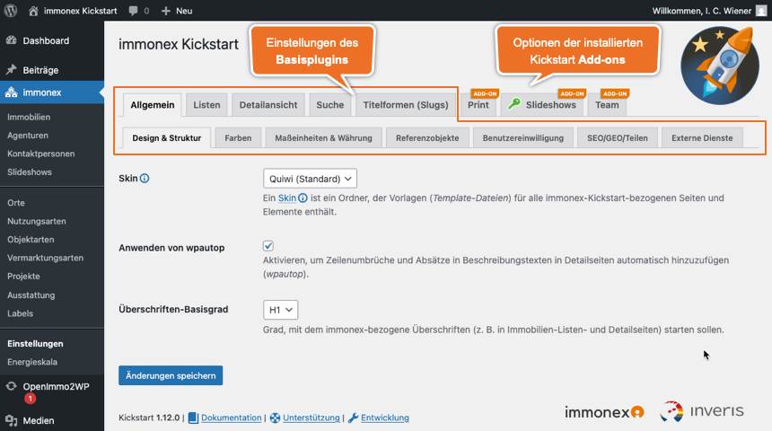

# Einrichtung

Bei aktiviertem Kickstart-Plugin sind die zugehörigen Inhalte und Optionen in der Hauptnavigation des WordPress-Admin-Backends unter ***immonex*** zusammengefasst.

Der hier enthaltene Link ***Einstellungen*** führt zur zentralen Optionsseite für das **Kickstart-Basisplugin** und - sofern installiert - hierauf aufbauende [Add-ons](/add-ons):

## Einstellungen

Die Einstellungsseite ist in mehrere Tabs mit thematisch gruppierten Optionen unterteilt, wobei die vorderen das Kickstart-Plugin selbst betreffen. Sind [Add-ons](/add-ons) installiert, folgt jeweils ein zusätzlicher Tab pro Erweiterung.

Die meisten Optionen sind selbsterklärend oder mit einer Beschreibung versehen. Hier einige ergänzende Details zu zentralen Einstellungsmöglichkeiten:

### Allgemein

#### Design & Struktur

##### Skin

Ein so genanntes [Skin](/anpassung-erweiterung/skins) bildet die Grundlage für individuelle Anpassungen und umfasst alle Dateien, die für die **Ausgabe und Darstellung** der vom Plugin bereitgestellten Komponenten im **Website-Frontend** maßgeblich sind (Layoutvorlagen, Stile, Ausgabelogik etc.).

Die Auswahl eines alternativen Skins kann also eine vollkommen andere Form der Ausgabe von Immobilienlisten und -detailseiten bewirken. Hierunter fällt nicht nur die grundlegende Optik, sondern u. a. auch der Umfang der angezeigten Daten sowie die Interaktionsmöglichkeiten der Website-Besucher.

Das aktuell mitgelieferte [Standard-Skin "Quiwi"](/anpassung-erweiterung/standard-skin) basiert auf dem optisch ansprechenden und "leichtgewichtigen" Frontend-Framework [UIkit](https://getuikit.com/). [Kickstart-Add-ons](/add-ons) können wiederum Skins für ihre eigenen Frontend-Module mitbringen, die dann in den jeweiligen Add-on-Options-Tabs zur Auswahl stehen.

Detaillierte Infos zur Anpassung vorhandener und Entwicklung eigener Skins sind unter [Anpassung & Erweiterung](/anpassung-erweiterung/skins) zu finden.

#### Benutzereinwilligung

Da für die Nutzung/Einbettung externer Dienste (Karten, Ortsauswahl/Geocodierung, Videos, virtuelle Touren etc.) hinsichtlich der [EU-DSGVO](https://de.wikipedia.org/wiki/Datenschutz-Grundverordnung) die **vorherige** Einholung einer expliziten Zustimmung durch die Website-Besucher erforderlich sein **kann**, ist diese standardmäßig aktiviert.

\
Zustimmung zur OpenStreetMap-Nutzung (passender Alternativtext bei alternativen Diensten wie Google Maps etc.)

Die Zustimmung zur Nutzung eines Dienstes gilt hierbei für alle Dienste der gleichen Art und wird in Form eines **Cookies** gespeichert, das - abhängig von den Browser-Einstellungen des Nutzers - für 24 Stunden gültig ist.

!>**Keine Panik!** Hierbei handelt es sich **nicht** um *Tracking-Cookies*, für die gemäß DSGVO eine separate Einwilligung einzuholen ist!

#### Teilen

Zur Optimierung der Darstellung von Links in sozialen Netzwerken, Instant-Messaging-Diensten & Co. (Facebook, X/Twitter, LinkedIn, Slack, WhatsApp etc.) werden in Immobilien-Listen- und Detailseiten spezielle *Meta-Tags* ([Open Graph](https://ogp.me/), [Twitter Cards](https://developer.x.com/en/docs/twitter-for-websites/cards/guides/getting-started)) eingebunden, sofern die betr. Optionen aktiviert sind.

Werden bereits themeseitig oder von anderen Plugins (z. B. SEO) Meta-Tags mit identischen Namensattributen eingefügt, werden diese gem. der Standardvorgabe durch die noch nicht vorhandenen, vom Kickstart-Plugin generierten Tags ergänzt. Alternativ kann aber auch die Ersetzung vorhandener oder das Einfügen aller Tags – unabhängig von bereits vorhandenen – eingestellt werden.

#### Externe Dienste

##### Google Maps API Key

Für die Nutzung der Google-Maps-Dienste ist ein **passender** API-Schlüssel erforderlich, der im gleichnamigen Abschnitt hinterlegt wird. Für diesen müssen neben der **Maps-JavaScript-API** auch die **Places- und Embed-APIs** aktiviert sein.

### Listen

#### Allgemein

##### Immobilien-Übersicht

Als primäre Übersicht und Ausgabeziel für zugehörige Suchergebnisse fungiert das [Standard-Archiv für Immobilienbeiträge](/beitragsarten-taxonomien#immobilien-beiträge).

Soll stattdessen eine bestimmte **Seite** aufgerufen werden, die den [Listen-Shortcode `[inx-property-list]`](/komponenten/liste) enthält, kann diese entweder hier ausgewählt oder in Form der ID über das [Suchformular-Shortcode-Attribut `results-page-id`](/komponenten/suchformular#attribute) festgelegt werden.

Neben einer regulären Seite kann auch ein *alternatives Archiv* für Immobilienbeiträge verwendet werden, das vom Theme oder einem anderen Plugin (bspw. Page/Site Builder) bereitgestellt wird. Die passende Auswahloption ist in diesem Fall `keine (Theme-Template verwenden)`.

?> Enthält die Seite, in die das [Suchformular](/komponenten/suchformular) eingebunden ist, auch eine [Listenansicht](/komponenten/liste), wird diese automatisch für die Ausgabe der Ergebnisse beim Klick auf den Suchbutton verwendet, sofern keine alternative Zielseite per Shortcode-Attribut definiert wurde.

#### Übersichtskarten

\
Übersichtskarte mit Immobilien-Standortmarkern (OpenStreetMap)

Eine Karte mit den Standorten der aktuellen Immobilien-Angebote kann in Form einer JavaScript-Komponente auf Basis der [OpenLayers-Bibliothek](https://de.wikipedia.org/wiki/OpenLayers) in beliebige Seiten eingebunden werden. Als Quellen für die Geodaten werden die folgenden Anbieter/Dienste unterstützt:

- OpenStreetMap ([openstreetmap.de](https://www.openstreetmap.de/)/[openstreetmap.org](https://www.openstreetmap.org/))
- [OpenTopoMap](https://opentopomap.org/) ([OSM-Wiki](https://wiki.openstreetmap.org/wiki/DE:OpenTopoMap))
- [Google Maps JavaScript API](https://developers.google.com/maps/documentation/javascript/overview?hl=de)

##### Kartentyp

Mit der Auswahl des Kartentyps wird die Darstellung der Karte bestimmt: Standard ist hierbei die *klassische Straßenkartenansicht*, alternativ kann aber auch eine *topographische* oder *Hybrid-Ansicht* mit Satellitenbildern und einer Straßenkarten-Ebene darüber aktiviert werden.

\
Topographische Karte mit Höhenrelief (Google Maps *Terrain*)

\
Kombinierte Satelliten- und Straßenkartenansicht (Google Maps *Hybrid*)

In der [Standard-Übersichtsseite (Archiv)](/beitragsarten-taxonomien#immobilien-beiträge) der Immobilienbeiträge ist die Karte immer enthalten, sofern ein Kartentyp ausgewählt wurde.

##### Koordinaten, Zoomstufe und Auto-Kartengrenzen

Kartenmittelpunkt und Zoom werden normalerweise anhand der enthaltenen Immobilien-Standortmarker **automatisch ermittelt**.

Wird die betr. Option (***Auto-Kartengrenzen***) deaktiviert, kann alternativ mit den im gleichen Optionstab angegebenen Koordinaten des Zentrums und einem Zoomwert auch ein fixer Kartenausschnitt definiert werden.

Weitere Infos hier: [Immobilien-Übersichtskarten](/komponenten/karte)

### Detailansicht

#### Allgemein

##### Immobilien-Detailseite

Im [Standard-Skin](/anpassung-erweiterung/standard-skin) ist eine **auf Code-Basis anpassbare** Seitenvorlage (*Single Post Template*) für Immobilien-Beiträge enthalten, die alle relevanten Inhalte (Beschreibungstexte, Grunddaten, Preise, Ausstattungsmerkmale, Lage, Fotogalerie, Grundrisse etc.) umfasst.

Als Alternative kann auch hierfür – analog zur Übersicht – eine **Seite als Vorlage** ausgewählt werden, die [Shortcodes für die Einbindung der Immobilien-Details](einbindung#immobilien-details) enthält. Gleiches gilt für die auszuwählende Option zur Nutzung eines alternativen *Single Post Templates*, das vom Theme oder einem anderen Plugin registriert wird: `keine (Theme-Template verwenden)`

##### Galeriebild-Links

Sofern aktiviert (Standardvorgabe), sind die Hauptbilder der Galerien in den Immobilien-Detailseiten mit den entsprechenden Großansichten verlinkt, die im Regelfall in einer *Lightbox* angezeigt werden.

!> Im Überschneidungen mit den Funktionalitäten des Themes etc. zu vermeiden, stellt das Kickstart-Plugin selbst **keine Lightbox-Funktion** bereit. Im Bedarfsfall kann diese aber mit einem Zusatzplugin nachgerüstet werden (z. B. [WP Featherlight](https://de.wordpress.org/plugins/wp-featherlight/) oder [Responsive Lightbox & Gallery](https://de.wordpress.org/plugins/responsive-lightbox/)).

##### Verkäufer-/Innenprovision anzeigen

Die Verkäufer- bzw. Innenprovision ist für Immobilien-Angebote eher weniger relevant und wird daher in den [Immobilien-Detailansichten](/komponenten/detailansicht) standardmäßig **nicht** angezeigt. Diese Option ermöglicht die Berücksichtigung bei der Ausgabe, falls nötig.

#### Standortkarte

Die Möglichkeiten zur Visualisierung des Standorts in der Detailansicht einer Immobilie entsprechen weitgehend denen der [Übersichtskarten](#Übersichtskarten). Als Alternative zur punktgenauen Darstellung per Marker werden hier auch *Umgebungskarten* unterstützt, bei denen nur der Ort bzw. Stadtteil hervorgehoben ist, in dem sich das Objekt befindet ([Google Maps Embed API](https://developers.google.com/maps/documentation/embed/get-started?hl=de)).

Die Plugin-Optionen sehen bei Karten mit **Standortmarkern** zwei Infotexte für die Ausgabe in einem Infofenster-Overlay innerhalb der Karte oder in Form eines kurzen Hinweises unterhalb der Karte vor. (Normalerweise ist einer hiervon ausreichend.)

Bei via iFrame eingebundenen Umgebungskarten (Ort oder Stadtteil) ist hingegen nur der *Ortsteilkarten-Hinweis* relevant.

##### Beispiele

\
OpenStreetMap/OpenLayers-basierte Straßenkarte mit Standortmarker

\
Google-Maps-Straßenkarte mit Standortmarker

\
topographische Google-Maps-*Terrain*-Straßenkarte mit Standortmarker

\
Google-Maps-Umgebungskarte mit Ort oder Stadtteil (iFrame)

### Suche

#### Allgemein

##### Dynamische Aktualisierung

Enthält eine Seite neben einem [Immobilien-Suchformular](/komponenten/suchformular) auch eine zugehörige [Listenansicht](/komponenten/liste) (inkl. Seitennavigation und Auswahl der Sortierreihenfolge) und/oder [Standort-Übersichtskarte](/komponenten/karte), können die Inhalte dieser Komponenten dynamisch aktualisiert werden, wenn die Suchparameter verändert werden.

Ist diese Option aktiviert, gilt sie global: Auf allen Seiten mit Suchformular wirken sich Änderungen der Parameter auf alle anderen hier enthaltenen Kickstart-Frontend-Komponenten aus. Sollen stattdessen nur bestimmte Listen oder Karten auf einzelnen Seiten dynamisch aktualisiert werden, kann hierfür das Attribut `dynamic-update` des [Suchformular-Shortcodes](/komponenten/suchformular) mit den IDs der entsprechenden Elemente verwendet werden:

`[inx-search-form dynamic-update="inx-property-list, inx-property-map"]`

#### Umkreissuche

##### Autovervollständigung

Für die Auswahl der Orte, die als Ausgangspunkt für die **Umkreissuche** im erweiterten [Immobilien-Suchformular](/komponenten/suchformular) fungieren, kann auf die APIs von [Photon](https://photon.komoot.io/) ([OpenStreetMap](https://www.openstreetmap.de/)) oder [Google Places API](https://developers.google.com/maps/documentation/places/web-service/autocomplete) zurückgegriffen werden.

Die Google-Variante beschränkt sich bei der Suche nach (bzw. Autovervollständigung von) Ortsnamen standardmäßig auf die Länder Deutschland, Österreich, Schweiz, Belgien und die Niederlande (→ *de, at, ch, be, nl*).

Eine Anpassung dieser Vorgabe ist per Attribut `autocomplete-countries` des [Suchformular-Shortcodes](/komponenten/suchformular#attribute) `[inx-search-form]` oder über den Filter-Hook [inx-search-form-elements](/anpassung-erweiterung/filter-inx-search-form-elements) in Form einer kommagetrennten [Ländercode-Liste (ISO alpha-2)](https://www.nationsonline.org/oneworld/countrycodes.htm) möglich, Beispiel:

`[inx-search-form autocomplete-countries="de,at,ch,lu,be,fr"]`

Bei Nutzung der alternativen [Photon](https://photon.komoot.io/)-API kommen im Rahmen der *Standardvorgabe* noch folgende Länder hinzu: Luxemburg, Frankreich, Dänemark, Polen, Spanien, Portugal, Italien und Griechenland. Darüber hinaus erfolgt hier auch eine Sortierung der Ortsvorschläge anhand der Position des zugehörigen Landes in der *ISO-Code-Liste* (→ *de, at, ch, lu, be, fr, nl, dk, pl, es, pt, it, gr*).

Bei der Photon-basierten Ortssuche gibt es noch zwei weitere Besonderheiten:

Der Ländername wird bei allen Städten/Orten angehangen, wenn das jeweilige Land bzw. dessen ISO-Code **nicht** mit dem ersten Code in der o. g. Liste übereinstimmt:

- München
- Nesselwang
- Salzburg, Österreich
- Innsbruck, Österreich
- Basel, Schweiz

Außerdem können die Abfrageergebnisse hier mittels [OpenStreetMap-Place-Tags](https://wiki.openstreetmap.org/wiki/DE&colon;Key&colon;place) gefiltert und ebenfalls sortiert werden. Das Shortcode-Attribut heißt in diesem Fall `autocomplete-osm-place-tags` (Standard: *city, town, village, borough, suburb*):

`[inx-search-form autocomplete-place-tags="city,village"]`

Die Umkreissuche kann generell deaktiviert werden, indem bei *Autovervollständigung* die Option `keine` ausgewählt wird.

### Titelformen (Slugs)

Die im gleichnamigen Tab anpassbaren **Slugs** bilden die Basis für die Generierung "suchmaschinenfreundlicher" URLs (Permalinks) von Immobilien-Archiv- und Detailseiten (z. B. `domain.tld/immobilien/` oder `domain.tld/immobilien/eine-wahrhaft-schraege-villa/`) sowie von Taxonomie-Archiven. Sind [Kickstart-Add-ons](/add-ons) installiert, die eigene Beitragsarten (*Custom Post Types*) und/oder Taxonomien ergänzen, sind deren Slugs ebenfalls hier anpassbar.

Es handelt sich hierbei um Angaben in der **Hauptsprache** der Website. In [mehrsprachigen Umgebungen](/anpassung-erweiterung/uebersetzung-mehrsprachigkeit#mehrsprachige-websites) kann eine Übersetzung mit dem hierfür eingesetzten Erweiterung erfolgen. Von Kickstart unterstützt werden hier Polylang (Pro) und WPML.

!> Die Änderung der vorgegebenen Slugs ist normalerweise nur in Sonderfällen notwendig, bspw. bei einer Umstellung der (Haupt)Sprache der Website.