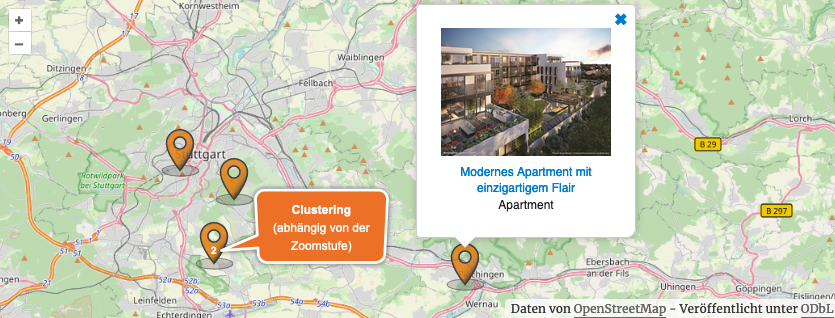

# Einrichtung

Bei aktiviertem Kickstart-Plugin sind die zugehörigen Inhalte und Optionen in der Hauptnavigation des WordPress-Admin-Backends unter ***immonex*** zusammengefasst.

Der hier enthaltene Link ***Einstellungen*** führt zur zentralen Optionsseite für Kickstart und - sofern installiert - hierauf aufbauende [Add-ons](../add-ons.html):

## Einstellungen

Die Einstellungsseite ist in mehrere Tabs mit thematisch gruppierten Optionen unterteilt, wobei die vorderen das Kickstart-Plugin selbst betreffen. Sind [Add-ons](../add-ons.html) installiert, folgt jeweils ein zusätzlicher Tab pro Erweiterung.

Die meisten Optionen sind selbsterklärend oder mit einer Beschreibung versehen. Hier einige ergänzende Details zu zentralen Einstellungsmöglichkeiten:

### Allgemein

#### Skin

Ein so genanntes [Skin](../anpassung-erweiterung/skins.html) bildet die Grundlage für individuelle Anpassungen und umfasst alle Dateien, die für die **Ausgabe und Darstellung** der vom Plugin bereitgestellten Komponenten im **Website-Frontend** maßgeblich sind (Layoutvorlagen, Stile, Ausgabelogik etc.).

Die Auswahl eines alternativen Skins kann also eine vollkommen andere Form der Ausgabe von Immobilienlisten und -detailseiten bewirken. Hierunter fällt nicht nur die grundlegende Optik, sondern u. a. auch der Umfang der angezeigten Daten sowie die Interaktionsmöglichkeiten der Website-Besucher.

Das aktuell mitgelieferte [Standard-Skin "Quiwi"](../anpassung-erweiterung/standard-skin.html) basiert auf dem optisch ansprechenden und "leichtgewichtigen" Frontend-Framework [UIkit](https://getuikit.com/). [Kickstart-Add-ons](../add-ons.html) können wiederum Skins für ihre eigenen Frontend-Module mitbringen, die dann in den jeweiligen Add-on-Options-Tabs zur Auswahl stehen.

Detaillierte Infos zur Anpassung vorhandener und Entwicklung eigener Skins sind unter [Anpassung & Erweiterung](../anpassung-erweiterung/skins.html) zu finden.

#### Immobilien-Übersicht

Enthält eine Seite ein Immobilien-Suchformular, aber **keine** Listenausgabe und **keine** Angabe einer Zielseite für die Ausgabe der Ergebnisse ([Attribut des Suchformular-Shortcodes](../komponenten/index.html#Attribute)), wird hierfür normalwerweise die [Standard-Archivseite](../beitragsarten-taxonomien.html#Immobilien-Beitrage) verwendet.

Hier kann **alternativ** eine beliebige andere Seite ausgewählt werden, die den Shortcode `[inx-property-list]` enthält.

#### Immobilien-Detailseite

Das [Standard-Skin](../anpassung-erweiterung/standard-skin.html) enthält bereits eine **auf Code-Basis anpassbare** Seitenvorlage, in der alle verfügbaren Elemente für die Immobilien-Detailansicht (Beschreibungstexte, Grunddaten, Preise, Ausstattungsmerkmale, Lage, Fotogalerie, Grundrisse etc.) zusammengefasst sind.

Soll hierfür **alternativ** eine **Seite als Vorlage** verwendet werden, die mit [Gutenberg oder einem Page-Builder](einbindung.html#Immobilien-Details) erstellt wurde, wird diese hier ausgewählt.

### Immobiliensuche

Enthält eine Seite neben einem [Immobilien-Suchformular](../komponenten/index.html) auch eine zugehörige [Listenansicht](../komponenten/liste.html) (inkl. Seitennavigation und Auswahl der Sortierreihenfolge) und/oder [Standortkarte](../komponenten/karte.html), können die Inhalte dieser Komponenten dynamisch aktualisiert werden, wenn die Suchparameter verändert werden (standardmäßig aktiv ab Plugin-Version 1.6.2).

Ist diese Option aktiviert, gilt sie global: Auf allen Seiten mit Suchformular wirken sich Änderungen der Parameter auf alle anderen hier enthaltenen Kickstart-Frontend-Komponenten aus. Sollen stattdessen nur bestimmte Listen oder Karten auf einzelnen Seiten dynamisch aktualisiert werden, kann hierfür das Attribut `dynamic-update` des [Suchformular-Shortcodes](../komponenten/index.html) mit den IDs der entsprechenden Elemente verwendet werden:

`[inx-search-form dynamic-update="inx-property-list, inx-property-map"]`

### Karten & Umkreissuche

Kickstart unterstützt zwei Plattformen für die Darstellung (Karten) und Auswahl (Umkreissuche/Autovervollständigung) von Immobilienstandorten: [OpenStreetMap](https://www.openstreetmap.de/) (per [OpenLayers-Bibliothek](https://de.wikipedia.org/wiki/OpenLayers)) in der Standardeinstellung sowie [Google Maps](https://cloud.google.com/maps-platform/) und die [Google Places API](https://developers.google.com/maps/documentation/places/web-service/autocomplete) als Alternative **in Suchformularen und Detailseiten**.

### Titelformen (Slugs)

Die im gleichnamigen Tab anpassbaren **Slugs** bilden die Basis für die Generierung "suchmaschinenfreundlicher" URLs (Permalinks) von Immobilien-Archiv- und Detailseiten (z. B. `domain.tld/immobilien/` oder `domain.tld/immobilien/eine-wahrhaft-schraege-villa/`) sowie von Taxonomie-Archiven. Sind [Kickstart-Add-ons](../add-ons.html) installiert, die eigene Beitragsarten (*Custom Post Types*) und/oder Taxonomien ergänzen, sind deren Slugs ebenfalls hier anpassbar.

Es handelt sich hierbei um Angaben in der **Hauptsprache** der Website. In [mehrsprachigen Umgebungen](../anpassung-erweiterung/uebersetzung-mehrsprachigkeit.html#Mehrsprachige-Websites) kann eine Übersetzung mit dem hierfür eingesetzten Erweiterung erfolgen. Von Kickstart unterstützt werden hier Polylang (Pro) und WPML.

> Die Änderung der vorgegebenen Slugs ist normalerweise nur in Sonderfällen notwendig, bspw. bei einer Umstellung der (Haupt)Sprache der Website.

#### Karten in Immobilien-Listenseiten

Übersichtskarte mit Immobilien-Standortmarkern

Die kartenbasierte Darstellung der Immobilienstandorte in der [Standard-Übersichtsseite (Archiv)](../beitragsarten-taxonomien.html#Immobilien-Beitrage) kann in den Plugin-Optionen aktiviert oder deaktiviert werden. Zudem können hier die initiale **Zoomstufe** sowie die **Koordinaten des Kartenmittelpunkts** festgelegt werden. (Letztere sind allerdings nur dann relevant, wenn der Kartenausschnitt nicht anhand der vorhandenen Immobilien automatisch ermittelt werden kann.)

Weitere Infos hier: [Immobilien-Übersichtskarten](../komponenten/karte.html)

#### Karten in Immobilien-Detailseiten

Die Plugin-Optionen sehen bei Karten mit **Standortmarkern** zwei Infotexte für die Ausgabe in einem **Infofenster-Overlay** innerhalb der Karte oder in Form eines kurzen **Hinweises unterhalb der Karte** vor. (Normalerweise ist einer hiervon ausreichend.)

Bei Google Maps, die per iFrame eingebunden werden und nur einen Ort bzw. Stadtteil zeigen (Embed API), ist nur der *Ortsteilkarten-Hinweis* relevant.

OpenStreetMap/OpenLayers-basierte Karte mit Standortmarker

Google-Maps-Karte mit Standortmarker

Google-Maps-Karte mit Ort oder Stadtteil (iFrame)

#### Autovervollständigung

Wird die Google Places API für die Auswahl der Standorte für die **Umkreissuche** im erweiterten [Immobilien-Suchformular](../komponenten/index.html) verwendet, beschränkt sich die Suche nach bzw. Autovervollständigung von Ortsnamen standardmäßig auf folgende Länder: Deutschland, Österreich, Schweiz, Belgien, Niederlande, bei Nutzung der alternativen [Photon](https://photon.komoot.io/)-Variante kommen noch folgende Länder hinzu: Luxemburg, Frankreich, Dänemark, Polen, Spanien, Portugal, Italien, und Griechenland. Eine Anpassung der Länderlisten ist per Attribut `autocomplete-countries` des [Suchformular-Shortcodes](../komponenten/index.html#Attribute) `[inx-search-form]` oder über den Filter-Hook [inx-search-form-elements](../anpassung-erweiterung/filter-inx-search-form-elements.html) möglich.

Die Umkreissuche kann generell deaktiviert werden, indem bei *Autovervollständigung* die Option `keine` ausgewählt wird.

#### Google Maps

Für die Nutzung der Google-Maps-Dienste ist ein passender API-Schlüssel erforderlich, der im gleichnamigen Abschnitt hinterlegt wird. Für diesen müssen neben der **Maps-JavaScript-API** auch die **Places- und Embed-APIs** aktiviert sein.

#### Benutzer-Zustimmung

Da die Nutzung externer Geo-Dienste hinsichtlich der [EU-DSGVO](https://de.wikipedia.org/wiki/Datenschutz-Grundverordnung) problematisch sein **kann**, kann hierfür eine explizite Zustimmung des Nutzers per Klick auf einen entsprechenden Button angefordert werden (standardmäßig aktiviert).

Zustimmung zur OpenStreetMap-Nutzung (passender Alternativtext bei Google Maps)

Die Zustimmung zur Nutzung eines Dienstes gilt für alle Geo-Dienste und wird in Form eines **Cookies** gespeichert, das - abhängig von den Browser-Einstellungen des Nutzers - für 24 Stunden gültig ist.

>**Keine Panik!** Hierbei handelt es sich **nicht** um ein <i>Tracking-Cookie</i>, für das gemäß DSGVO eine separate Einwilligung einzuholen ist!