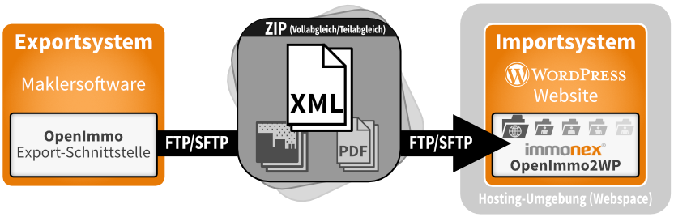

# OpenImmo-Datenimport

Kickstart ist **ausschließlich** für die Präsentation von Immobilien ausgelegt und optimiert, die per **OpenImmo®-Schnittstelle** importiert werden. Eine manuelle Erfassung oder Bearbeitung der Objekte im WordPress-Backend ist zwar grundsätzlich (in begrenztem Umfang) möglich, in der Praxis aber nicht relevant.

Eine Ausnahme stellt nur die Markierung bestimmter Immobilien als [Referenzobjekte](/referenzen-status-flags) dar, die auch direkt im WP-Backend vorgenommen werden kann. (Nicht jede für die Objektverwaltung eingesetzte Maklersoftware bietet diese Möglichkeit auf der Exportseite.)

?> [OpenImmo®-XML](http://openimmo.de/) ist der De-facto-Standard für den Austausch von Immobiliendaten im deutschsprachigen Raum, der quasi von allen gängigen Immobilienportalen und Branchen-Softwarelösungen unterstützt wird.

Die [OpenImmo-Import-Lösung für WordPress](https://plugins.inveris.de/shop/immonex-openimmo2wp/), die Kickstart "out of the box" unterstützt, ist **immonex OpenImmo2WP** (→ [Dokumentation](https://docs.immonex.de/openimmo2wp/)). Die jeweils aktuellste Version dieses und weiterer immonex-Plugins sowie passende Beispieldaten können für *Test- und Entwicklungszwecke* nach einer kurzen Registrierung im [immonex-Entwicklerportal](https://immonex.dev/) **kostenlos und unverbindlich** heruntergeladen werden.

Sofern Kickstart vor OpenImmo2WP installiert wurde, ist nach der Installation des Plugins unter ***OpenImmo2WP → Einstellungen***¹ direkt der passende *Mapping-Typ* eingestellt. (Mittels individuell anpassbarer [Mapping-Tabellen](https://docs.immonex.de/openimmo2wp/#/mapping/tabellen) werden die OpenImmo-Angaben beim Import den passenden WordPress/Theme/Plugin-Feldern und Taxonomien zugewiesen.)

Sollen zunächst nur Beispieldaten importiert werden, muss das entsprechende ZIP-Archiv in den unter ***OpenImmo2WP → Import***¹ genannten [globalen Importordner](https://docs.immonex.de/openimmo2wp/#/grundlagen/ordner?id=global) übertragen werden (`.../wp-content/uploads/immonex-openimmo-import`). Hier kann auch die Verarbeitung manuell gestartet werden. (Im laufenden Betrieb werden diese Daten von der Immobilien-Verwaltungssoftware hierher übertragen und automatisiert verarbeitet.)

Nach dem erfolgreichen Abschluss des Importvorgangs werden die verarbeiteten Objekte unter ***immonex → Immobilien*** aufgeführt. Im Frontend kann die [Standard-Archivseite für Immobilienbeiträge](/beitragsarten-taxonomien#immobilien-beiträge) via `.../immobilien/` bzw. `.../properties/` aufgerufen werden.

---
¹ vor Version 5.0 von OpenImmo2WP: ***Einstellungen → OpenImmo Import*** bzw. ***Einstellungen → OpenImmo Import → Verzeichnisse / Manueller Import***