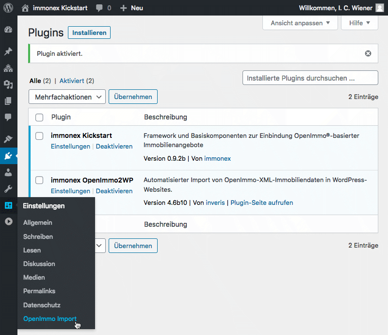
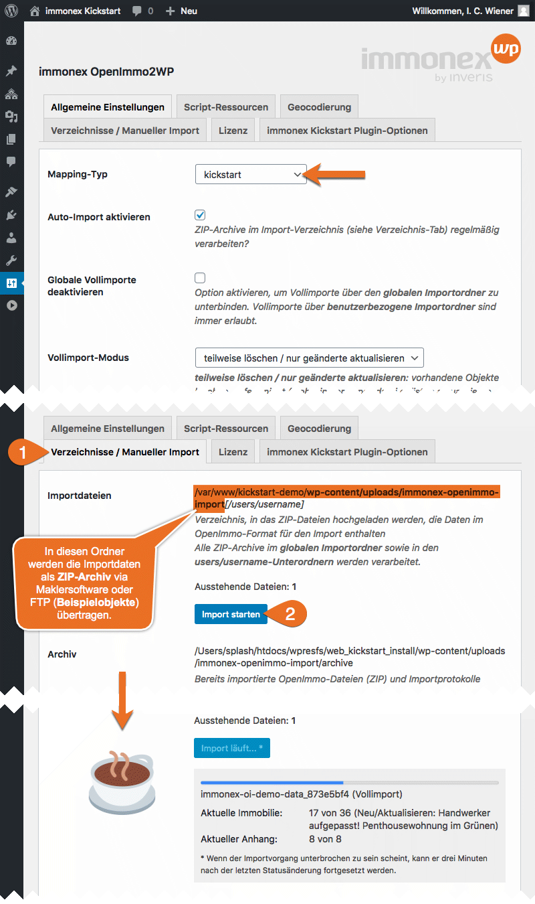
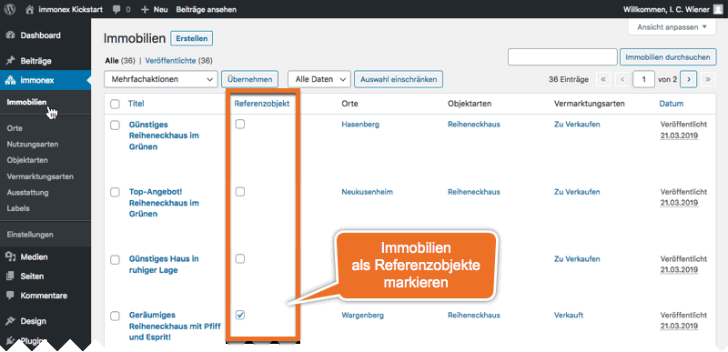

# OpenImmo-Datenimport

Kickstart ist **ausschließlich** für die Präsentation von Immobilien ausgelegt und optimiert, die per **OpenImmo®-Schnittstelle** importiert werden. Eine manuelle Erfassung oder Bearbeitung der Objekte im WordPress-Backend ist zwar grundsätzlich (in begrenztem Umfang) möglich, aber nicht praxisrelevant.

Eine Ausnahme stellt nur die Markierung bestimmter Immobilien als [Referenzobjekte](/referenzen-status-flags) dar, die auch direkt im WP-Backend vorgenommen werden kann. (Nicht jede für die Objektverwaltung eingesetzte Maklersoftware bietet diese Möglichkeit auf der Exportseite.)

> [OpenImmo®-XML](http://openimmo.de/) ist der De-facto-Standard für den Austausch von Immobiliendaten im deutschsprachigen Raum, der quasi von allen gängigen Immobilienportalen und Branchen-Softwarelösungen unterstützt wird.

Die OpenImmo-Lösung für WordPress, die Kickstart "out of the box" unterstützt, ist [immonex OpenImmo2WP](https://plugins.inveris.de/de/shop/immonex-openimmo2wp/) ([Dokumentation](https://plugins.inveris.de/de/shop/immonex-openimmo2wp/?target=dokumentation)). Eine **kostenlose, voll funktionsfähige Demoversion** dieses und weiterer Plugins für Test- und Entwicklungszwecke sowie passende Beispieldaten können nach einer kurzen Registrierung im [immonex-Entwicklerportal](https://immonex.dev/) unverbindlich heruntergeladen werden.

Sofern Kickstart vor OpenImmo2WP installiert wurde, ist nach der Installation des Plugins unter ***Einstellungen → OpenImmo Import*** direkt der passende <i>Mapping-Typ</i> eingestellt. (Mittels individuell anpassbarer <i>Mapping-Tabellen</i> werden die OpenImmo-Angaben beim Import den passenden WordPress/Theme/Plugin-Feldern und Taxonomien zugewiesen.)

Sollen zunächst nur Beispieldaten importiert werden, muss das entsprechende ZIP-Archiv manuell in den im Tab "Verzeichnisse / Manueller Import" genannten globalen Importordner übertragen werden. Im laufenden Betrieb werden diese Daten von der Immobilien-Verwaltungssoftware hierher übertragen und anschließend automatisiert verarbeitet.

Nach dem erfolgreichen Abschluss des Importvorgangs werden die verarbeiteten Objekte unter ***immonex → Immobilien*** aufgeführt. Im Frontend kann die [Standard-Archivseite für Immobilienbeiträge](/beitragsarten-taxonomien#immobilien-beiträge) via `.../immobilien/` bzw. `.../properties/` aufgerufen werden.

