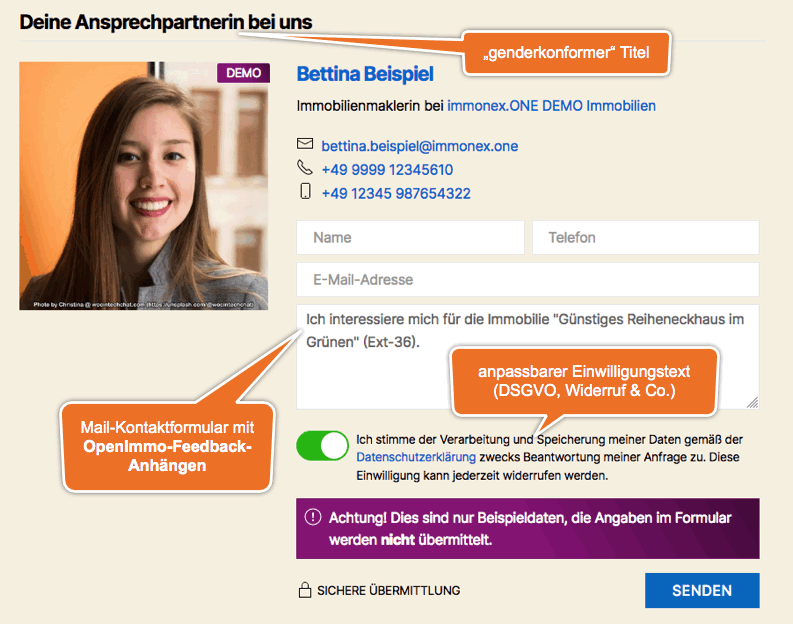
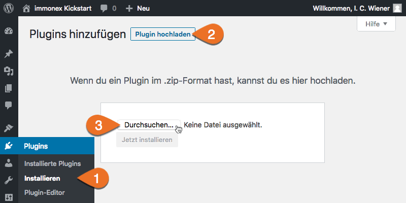

# Installation

## Automatisch

Kickstart ist im [WordPress-Plugin-Repository](https://de.wordpress.org/plugins/immonex-kickstart/) verfügbar und kann unter ***Plugins → Installieren*** per Suche/Klick automatisiert heruntergeladen und installiert werden.

### Team Add-on

Eine sinnvolle Erweiterung ist das – ebenfalls frei verfügbare – [Team Add-on](https://de.wordpress.org/plugins/immonex-kickstart-team/), das zusätzliche Komponenten für die automatisierte Verarbeitung und Darstellung der Daten von Immobilienmakler-Agenturen und Kontaktpersonen sowie objektbezogene Kontaktformulare bereitstellt.

## Manuell

Das Plugin kann alternativ auch via ***Plugins → Installieren → Plugin hochladen*** als ZIP-Datei manuell installiert oder aktualisiert werden (bspw. eine noch nicht im WordPress-Plugin-Repository verfügbare Beta-Version, die via [immonex.dev](https://immonex.dev/) heruntergeladen wurde).

Soll eine vorhandene Version von Kickstart manuell aktualisiert werden, muss diese zunächst in der Liste der installierten Plugins deaktiviert und dann gelöscht werden.

?> Alle Immobiliendaten und Plugin-Einstellungen bleiben auch beim Deaktivieren/Löschen erhalten und werden bei der Installation der neuen Version übernommen.

Im Anschluss an den Upload und die Installation muss das Plugin noch per Klick auf den angezeigten Button oder den entsprechenden Link in der Plugin-Liste **aktiviert** werden.

Nach erfolgreicher Installation und Aktivierung sind eine immobilienspezifische [Beitragsart sowie zugehörige Taxonomien](/beitragsarten-taxonomien) verfügbar und es geht weiter mit der [grundlegenden Einrichtung](einrichtung)...
