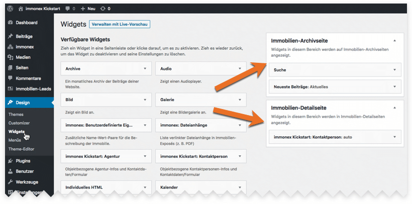

# Sidebars

Kickstart registriert zwei Seitenleisten (<i>Sidebars</i>) für die [Immobilien-Archivseite](/beitragsarten-taxonomien#immobilien-beiträge) und die [Detailansicht](/komponenten/detailansicht#standard-template), die via ***Design → Widgets*** oder per **Customizer** mit Widgets befüllt werden können.



Voraussetzung ist, dass die Standard-Templates für die Listen- und Detailansicht zum Einsatz kommen oder die Sidebars per [dynamic_sidebar](https://developer.wordpress.org/reference/functions/dynamic_sidebar/) entsprechend in eigenen Vorlagen eingebunden werden. Die zugehörigen IDs lauten `inx-property-archive` und `inx-property-details`.

Beispiel: Einbinden der Archiv-Sidebar-Inhalte in eigene [Templates/Skins](/anpassung-erweiterung/skins)

```php
<?php if ( is_active_sidebar( 'inx-property-archive' ) ) : ?>
<div>
	<ul>
		<?php dynamic_sidebar( 'inx-property-archive' ); ?>
	</ul>
</div>
<?php endif; ?>
```