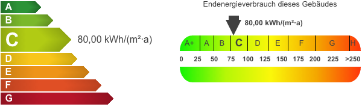

# Systemvoraussetzungen

- selbst-gehostete [WordPress-Installation](https://de.wordpress.org/download/)1 ab Version 4.7 (empfohlen: 5.1 oder höher)
- PHP ab Version 5.6 (empfohlen: 7.2 oder höher)
- mindestens 128 MB Arbeitsspeicher pro PHP-Prozess (OpenImmo-Import)

## Datenimport & Energieskalen

Für den [Import von OpenImmo-Immobiliendaten](schnellstart/import.html) wird das Zusatzplugin [immonex OpenImmo2WP](https://plugins.inveris.de/de/shop/immonex-openimmo2wp) **ab Version 4.6** benötigt.

Kickstart unterstützt die automatisierte Einbidung von grafischen Energieskalen, die mit dem Plugin [immonex Energy Scale Pro](https://plugins.inveris.de/de/shop/immonex-energy-scale-pro) anhand der übermittelten Energieeffizenz-Daten generiert werden.

> Aktuelle, **kostenlose Versionen** von OpenImmo2WP und Energy Scale Pro mit **vollem Funktionsumfang** für Test- und Entwicklungszwecke sowie passende **OpenImmo-Demodaten** sind unter [immonex.dev](https://immonex.dev/) verfügbar!

---

1 Eingeschränkte Installationen bei **WordPress.com** oder vergleichbaren Anbietern werden **nicht** unterstützt.